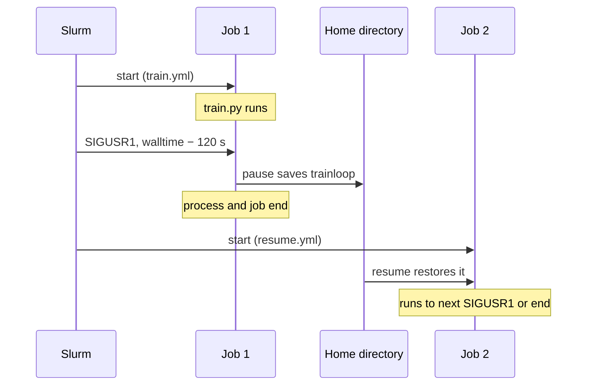

# Checkpoint/Restore

This page shows how to run Linkspan, the Cybershuttle agent, from your own `sbatch` script so that a long computation
is checkpointed before the walltime and resumed in the next job, with no checkpoint code of its own.

:status[development] Available from your own script in Linkspan 0.19.0 and later. No Cybershuttle client drives
checkpoints, and the interface can change between Linkspan releases.

Two terms:

| Term | Meaning |
|---|---|
| **Workflow** | A YAML file of steps that Linkspan runs at **moments** in the job's life, such as its start or the arrival of a signal; the format is in [Linkspan workflow format](./linkspan-workflow-format.md) |
| **CRIU** | Checkpoint/Restore In Userspace: writes a running Linux process to disk and restores it later |

The method is a chain of ordinary jobs. Slurm signals Linkspan shortly before each walltime; Linkspan writes the
process tree under `~/.cybershuttle/checkpoints/`, and the next job restores it:



## Prerequisites

| Need | Where from |
|---|---|
| `criu` 3.18 or newer on `PATH` on the compute node, allowed to run without root | Your site |
| `~/.cybershuttle/bin/linkspan` | Installed by the first VS Code or Jupyter session on the cluster, or by you as below |
| Free space in your home directory for the process's memory | The checkpoint is written to `~/.cybershuttle/checkpoints/` |

To confirm the first row, run `criu --version` in a job on a compute node. To install Linkspan yourself on an `x86_64`
cluster (on `arm64`, use `linkspan_Linux_arm64.tar.gz`):

```bash
mkdir -p ~/.cybershuttle/bin
curl -fsSL https://github.com/cyber-shuttle/linkspan/releases/latest/download/linkspan_Linux_x86_64.tar.gz |
  tar -xz -C ~/.cybershuttle/bin linkspan
```

## Write the workflows

The first job starts the computation as a process with the `ref` `trainloop`, and pauses it when `SIGUSR1` arrives:

```yaml title="train.yml"
name: train
tasks:
  - on: start
    steps:
      - name: Training loop
        ref: trainloop
        action: shell.exec
        params:
          command: python /home/me/train.py
  - on: SIGUSR1
    steps:
      - name: Checkpoint before the walltime
        action: checkpoint.pause
        params:
          id: trainloop
```

Each later job resumes the process, and pauses it again if the walltime comes first:

```yaml title="resume.yml"
name: resume
tasks:
  - on: start
    steps:
      - name: Resume the training loop
        action: checkpoint.resume
        params:
          id: trainloop
  - on: SIGUSR1
    steps:
      - name: Checkpoint before the walltime
        action: checkpoint.pause
        params:
          id: trainloop
```

Every `ref` and `id` in both files must be the same name.

## Submit the jobs

```bash title="train.sbatch"
#!/bin/bash
#SBATCH --time=04:00:00
#SBATCH --signal=B:USR1@120
exec ~/.cybershuttle/bin/linkspan --port 0 --workflow "${1:-train.yml}"
```

| Line | Effect |
|---|---|
| `--signal=B:USR1@120` | Slurm sends `SIGUSR1` two minutes before the walltime. Allow more for a process with much memory; a checkpoint cut short does not replace the previous one |
| `exec` | Linkspan replaces the batch shell, so the signal reaches it |
| `--port 0` | Linkspan picks a free loopback port; the default, `8080`, can clash with another job |

On a node you share with other users, replace `--port 0` with
`--socket "$HOME/.cybershuttle/linkspan-$SLURM_JOB_ID.sock"`: any user on the node can reach a loopback port and run
commands as you.

1. Submit the first job:

   ```bash
   sbatch train.sbatch
   ```

2. Submit each further job with `resume.yml`:

   ```bash
   sbatch --dependency=afterany:<previous job ID> train.sbatch resume.yml
   ```

   Repeat this step until a job's log shows that the process finished ([Confirm it worked](#confirm-it-worked)).

Each paused job ends before its walltime; the resumed process writes to the new job's output file.

## Confirm it worked

The job's output file carries Linkspan's log. A paused job logs:

```text
checkpoint: pausing trainloop to /home/me/.cybershuttle/checkpoints/trainloop
workflow: "Training loop" paused; no more start steps
workflow: start and ready done, ending the job
```

A job whose process finished logs only the last line; both exit `0`.

The checkpoint stays on disk after the process finishes. Remove `~/.cybershuttle/checkpoints/trainloop` before
reusing the `ref`.

## Fix a failed step

A job that exits `1` with a line starting `fatal: workflow:` failed a step:

| Line ends with | Cause |
|---|---|
| `shell.exec: 500 …` | The command exited with a non-zero status |
| `checkpoint.pause: 501 criu is not on PATH` | The compute node has no `criu`, or the job's `PATH` lacks it |
| `checkpoint.pause: 500 …` | CRIU could not write the checkpoint; its messages are just above. The site may not allow CRIU without root |
| `checkpoint.resume: 404 no checkpoint trainloop` | No earlier job wrote a checkpoint under that name |
| `checkpoint.resume: 500 …` | CRIU could not restore the process, or the restored process exited with a non-zero status |
