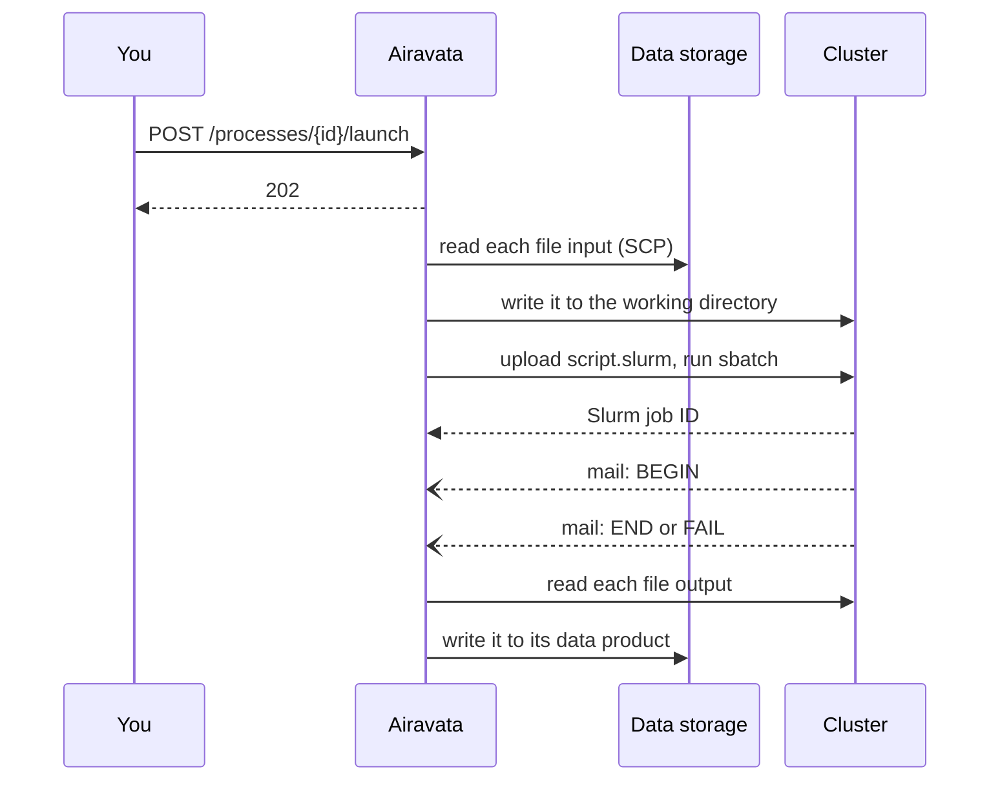

# CS Batch

**CS Batch** is an Airavata-backed portal for launching registered applications as Slurm jobs. Airavata's batch
server stages files, submits each run and records its progress; its REST interface is the **batch API**. This page is
for researchers and PIs who launch runs or share an allocation, and assumes you know what an `sbatch` script is.

:status[available] Version `master` · [Try it out](https://gateway.cybershuttle.org) · [Self-hosting](/setting-up/hosting-airavata)

The steps below call the batch API directly; every route, with a `curl` example, is in
[`docs/api.md`](https://github.com/apache/airavata/blob/master/docs/api.md) in the Airavata repository.

## Concepts

An application is registered once and deployed to a cluster; each run of it is a **process**. The identity a job runs
under is kept in a separate **cluster configuration**, which its owner can share with a group. These must exist before
a run:

| Resource | Holds | Registered by |
|---|---|---|
| Slurm cluster | Login host and port, Slurm location, partitions and their limits | An administrator |
| Cluster configuration | Login user, working directory and SSH key that runs submit under | Any user; shareable |
| Application template | The application's typed inputs and outputs | An administrator |
| Batch deployment | The template on one cluster: a Jinja run section for the job script, default partition and resources | An administrator |
| Data storage, data product | A host reachable by SCP, and a file or directory on it | Any user; shareable |
| Process | One run: deployment, cluster configuration, resources, a data product per file input and output | Any user, who owns it |

A run names data products, not paths, for its files.

## Sign-in and sharing

Sign-in is through CILogon. Every call that creates or launches something carries the resulting token as
`Authorization: Bearer <token>`.

A PI can share a cluster configuration with a user or a group:

| Share | Grantee may |
|---|---|
| `READ` | Launch runs under it |
| `WRITE` | Also edit it |

Only the owner or a platform administrator can delete a configuration or change its shares; no API call returns its
SSH key.

Runs under a shared configuration are submitted as its cluster account; each run records the user who created it. A
job is charged to the Slurm account in the run's `allocation`,
or else to the login user's default account. [Cluster security](/planning/cluster-security) states what Airavata
holds on your behalf.

## Launch a run

You need the server's base URL, a token, a batch deployment ID, and a cluster configuration you own or that is
shared with you.

| Step | Call | Result |
|---|---|---|
| 1. Without a shared configuration, register your own | `POST /api/v1/ssh-keys`, then `POST /api/v1/slurm-cluster-configs` | A configuration ID |
| 2. Register where file inputs come from and outputs go | `POST /api/v1/scp-data-storages`, then `POST /api/v1/data-products` per file | A data product ID per file |
| 3. Create the run | `POST /api/v1/processes` with the deployment, configuration, resources and a value per input and output | A process ID, status `CREATED` |
| 4. Launch it | `POST /api/v1/processes/{id}/launch` | `202` with the process; the work continues in the background |

Only the run's owner or a platform administrator may launch it. A second launch of the same run is refused with
`409`; create a new process to run again.

## Launch sequence

After the launch returns:

| Stage | Detail |
|---|---|
| Working directory | The run's `baseWorkDir`, or else the configuration's work root, with the process ID beneath it |
| Inputs | Named after the input in the working directory |
| Job script | Rendered from the run's resources, the deployment's default partition and its run section |
| Submission | `sbatch` over SSH as the configuration's login user, from the working directory |
| Job name | The process ID |
| Outputs | Taken from the file named after the output in the working directory, so the application must write it there |
| Retries | A failed copy is retried up to three times; a failed `sbatch` is not retried |

## Follow a run

`GET /api/v1/processes/{id}` returns the run. Under `batchProcess`:

| Field | Shows |
|---|---|
| `jobId` | Slurm's job ID once `sbatch` accepted the script; use it with `squeue` and `sacct` |
| `batchJobStatuses`, `latestBatchJobStatus` | `SUBMITTED` from Airavata, then one entry per Slurm mail: `BEGIN`, `END`, `FAIL`, `REQUEUE`, `TIME_LIMIT`, and the 50, 80 and 90 per cent warnings |

The job's standard output and error are `<process ID>.stdout` and `<process ID>.stderr` in the working directory on
the cluster. They are not copied back; read them over SSH.

When a run does not progress, its record points to the cause:

| Symptom | Likely cause | Do |
|---|---|---|
| `jobId` still empty minutes after the launch | A copy or `sbatch` failed; the reason is only in the server's log | Check the inputs' data products and the configuration's login, or ask your Airavata administrator |
| `sacct` shows the job finished, but the run has neither `END` nor `FAIL` | The cluster's mail is not reaching Airavata; outputs are not copied back | Fetch the outputs from the working directory |

## Limitations

| Area | Current behaviour |
|---|---|
| Schedulers | Slurm only, reached over SSH |
| Job status | From Slurm's notification e-mails only; a cluster that sends no Slurm mail reports nothing |
| Run status | Stays `CREATED`; Slurm events are recorded as batch job statuses |
| Cancelling | Not implemented; use `scancel` on the cluster |
| File staging | `FILE` only; `FILE_LIST` and `DIRECTORY` inputs and outputs are skipped |
| Transfer path | Every file passes through Airavata's server; large data is slow |
| Partition | The deployment's default; a run cannot choose another |
| Resource limits | Not checked against the registered partition limits; Slurm and the site's submit filter decide |
| Reading a run | Needs no token: anyone with the process ID can read the run's record |

For interactive work use [VS Code](/vscode) or [Jupyter](/jupyter) sessions; for pipelines see
[Nextflow pipelines](./nextflow-pipelines.md).
