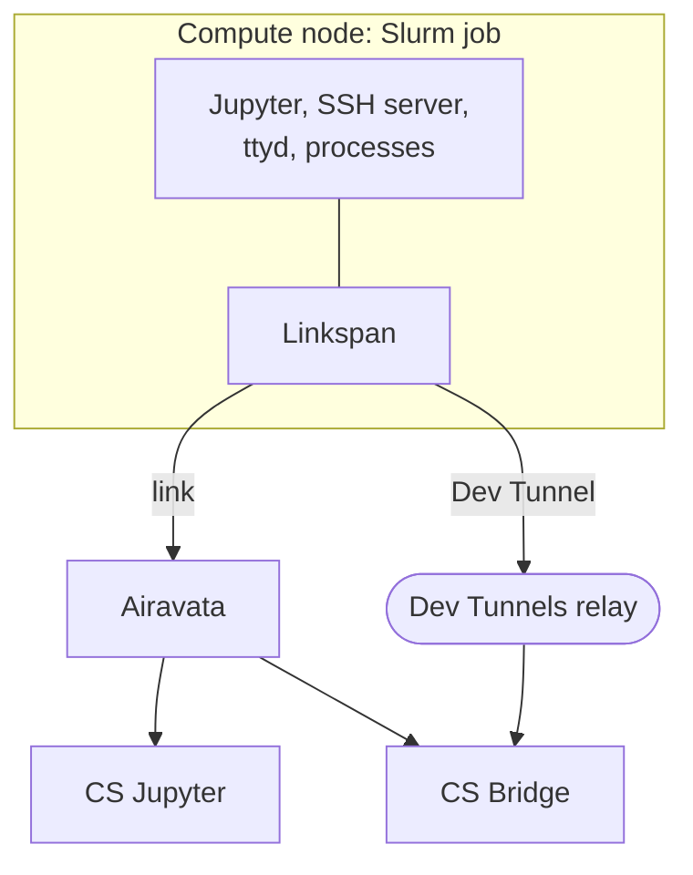
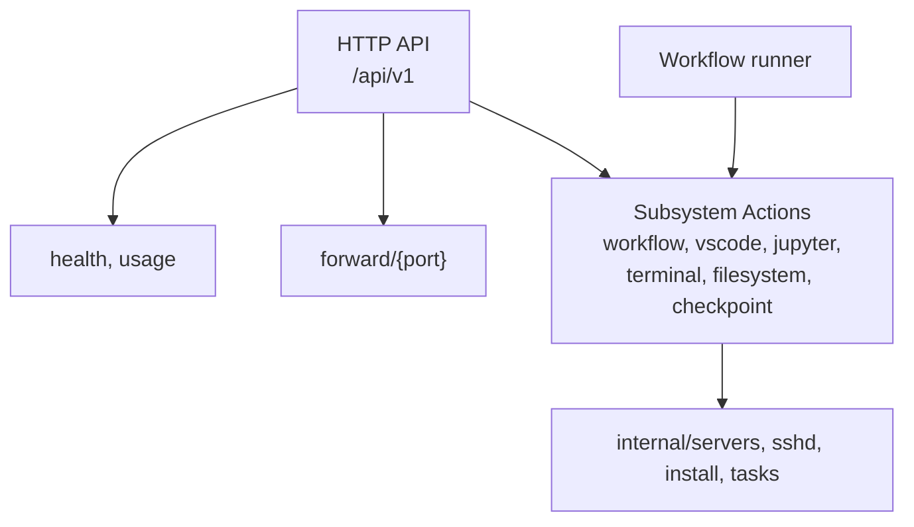
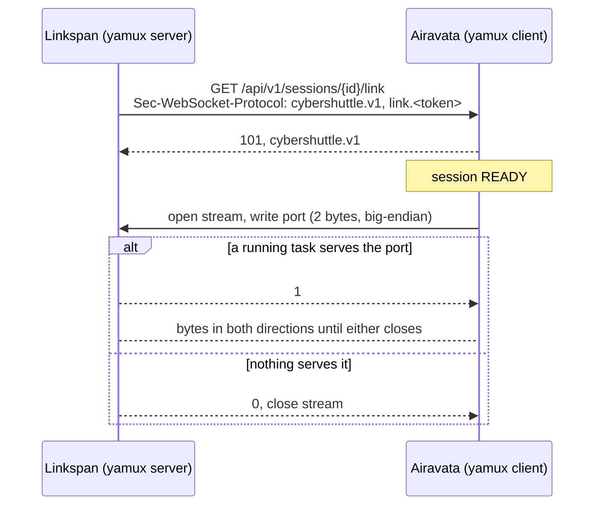
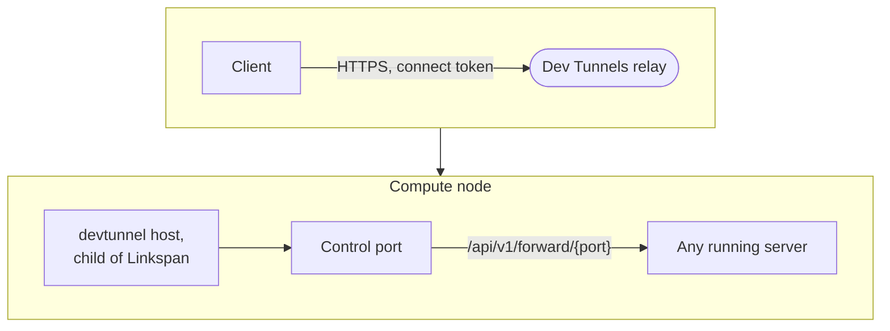

# Linkspan architecture

Linkspan is the agent that runs as a Slurm job's main process. It starts servers and processes inside the job and
carries connections to them off the compute node. This page is for developers of Linkspan and of its clients, and
assumes familiarity with Slurm jobs and HTTP APIs.

| Item | Value |
|---|---|
| Repository | [cyber-shuttle/linkspan](https://github.com/cyber-shuttle/linkspan) |
| Version documented | 0.22.1 (`b90dee7`) |
| Language | Go 1.27; static binary (`CGO_ENABLED=0`) |
| Platforms | Linux and macOS on `x86_64` and `arm64`; usage, terminals and checkpoints need Linux |
| Scheduler | Slurm |
| License | Apache-2.0 |

Linkspan serves an HTTP API on the **control port**, a loopback TCP port, and optionally on a Unix socket. Compute
nodes are assumed to accept no inbound connections from off the cluster, so Linkspan dials out over one or both
**transports**:

| Transport | Is |
|---|---|
| **Link** | A WebSocket to [Airavata's session server](/setting-up/airavata-architecture) |
| **Dev Tunnel** | A Microsoft relay endpoint that Linkspan hosts |

## Features

| Feature | Provides | Status |
|---|---|---|
| Jupyter | A Jupyter Server in a folder of the job, in a Python environment built with `uv` | Available |
| VS Code | An SSH server admitting one public key, for VS Code Remote-SSH | Available |
| Usage | The job's CPU, memory and GPU use, sampled every five seconds | Available |
| Workflows | Steps at set points in the job's life, from a YAML file | Available |
| Terminals | A `ttyd` terminal in a browser tab | Available |
| Pause and resume | A `shell.exec` process checkpointed with CRIU and resumed, in this job or a later one | Ongoing |
| Filesystem | Mount, copy and sync routes, answering `501` | Ongoing |

Airavata starts Jupyter through a workflow. No client uses terminals or pause and resume; pause and resume works
from a workflow in your own job ([Checkpoint/Restore](./checkpoint-restore.md)).

## Related components

Linkspan and its servers run inside the job; clients reach them through Airavata or the Dev Tunnels relay:



Three launchers start Linkspan:

| Launcher | How |
|---|---|
| [Airavata](/setting-up/airavata-architecture) | Installs it into `~/.cybershuttle/bin`, writes a workflow that starts Jupyter, and submits a job that `exec`s it with the session's transports |
| [CS Bridge](/vscode/architecture) | Installs it the same way, runs it with a Dev Tunnel or the link, and asks it for an SSH server |
| You | By hand in any job; see [Running Linkspan by hand](./running-linkspan-by-hand.md) |

Linkspan does not register with anything and sends no heartbeat. A client knows it is alive because the link is
connected or the Dev Tunnel answers `/api/v1/health`. Its only state between jobs is the files under
`~/.cybershuttle/`, so a job that ends takes its servers with it and the next job starts clean.

## Structure

Three ideas decide where a change goes:

| Idea | Consequence |
|---|---|
| Everything that runs is a **task** | The listeners, transports, usage sampler, workflow, servers and processes share one registry, one lifecycle and one shutdown |
| An **action** is both a route and a workflow step | `POST /api/v1/jupyter/sessions` and a `jupyter.sessions.start` step run one function, so the HTTP API and the workflow never diverge |
| Building blocks are composed where used | `internal/` holds primitives with no routes; a subsystem composes them into a task when it starts one |

### Tasks

`internal/tasks` is the process model. A **task** is a unit of background work with an ID, a kind, an address, a
state, an error, optional attributes, and exactly one kind of work. An error in Linkspan's own code or in a listener
ends Linkspan. A child process is only observed: its end is recorded in its state for the client to read.

| Work | Is | Lifecycle | On error |
|---|---|---|---|
| `Run` | Linkspan's own code: the usage sampler, each transport, the workflow | `running` until it returns | Fatal unless the task was cancelled |
| `Server` | An in-process server on a pre-bound listener: the HTTP listener, each SSH server | `running` until it returns | Fatal unless cancelled, so a failed listener or SSH server ends Linkspan with exit `1` |
| `Spawn(ctx, port)` | An external server; the port is bound so the reply can name it, then handed to the child | `starting` until a TCP dial to the port succeeds (polled every 500 ms), then `running` | `failed`; never fatal |
| `Child(ctx)` | A plain process with no port | `starting` until the process starts, then `running`, with its `pid` | `failed`; never fatal |

The registry applies the same rules to every task:

| Rule | Detail |
|---|---|
| IDs | `h-8080`, `s-<port>`, `j-<port>`, `t-<port>`, `h-<path>`: a task with an address, by the kind's first letter and its port or socket path. `p-<Unix time in nanoseconds>`: a process. Otherwise the kind (`usage`, `link`, `devtunnel`, `workflow`). A `ref` overrides all of these |
| Replacement | A repeated ID cancels and replaces the earlier task, whatever its kind |
| Binding first | Starting a task binds its address first, so the port is reserved before the reply; a failed bind registers nothing |
| Children | One fork path, `tasks.Exec`: each child gets its own process group, and cancellation sends `SIGKILL` to the group. A 2-second wait delay stops an orphan holding the child's pipes from blocking |
| Sockets | An address that is not `host:port` is a Unix socket: an existing socket at the path is removed, any other file refused, mode `0600` |
| Ended tasks | Stay listed as `exited` or `failed` until stopped, replaced, or removed by whoever waits on them |
| Shutdown | `StopAll` cancels every task and waits for each |

A task's JSON object has the fields `id`, `addr`, `state`, `error`, `pid` (when set) and its attributes.

### Routes and actions

An **action** is `func(ctx, params map[string]any) (status, body, errMsg)`. Each subsystem exports `Actions`, a map
from name to function, and `Router`, whose routes point at the same functions. `TestRoutesCoverActions` fails if an
action has no route.

| Caller | Passes as `params` | Uses the result as |
|---|---|---|
| Router | The JSON body, plus the path's `{id}` | The response: status and body, or `{"error": errMsg}` for a non-empty `errMsg` |
| Workflow runner | The step's `params` | Success on a `2xx` status |

Both callers reach the same subsystem actions, which compose the internal packages:



### Subsystems

Every subsystem is always on; no flag disables one. An action's workflow name is `<subsystem>.<action>`, except
`shell.exec`, which has no subsystem prefix.

| Subsystem | Actions | Routes |
|---|---|---|
| `workflow` | `shell.exec` | `POST /workflow/shell/exec` |
| `vscode` | `vscode.sessions.select`, `vscode.sessions.start` | `GET`, `POST /vscode/sessions` |
| `jupyter` | `jupyter.setup`, `jupyter.sessions.select`, `jupyter.sessions.start`, `jupyter.sessions.stop` | `POST /jupyter/setup`; `GET`, `POST /jupyter/sessions`; `DELETE /jupyter/sessions/{id}` |
| `terminal` | `terminal.sessions.select`, `terminal.sessions.start`, `terminal.sessions.stop` | `GET`, `POST /terminal/sessions`; `DELETE /terminal/sessions/{id}` |
| `filesystem` | `filesystem.mount`, `filesystem.unmount`, `filesystem.copy`, `filesystem.sync` | `POST /filesystem/<verb>`, answering `501` |
| `checkpoint` | `checkpoint.pause`, `checkpoint.resume` | `POST /checkpoint/pause`, `POST /checkpoint/resume` |

### Internal packages

The packages under `internal/` are the primitives the subsystems compose. None owns a route except `forward`, whose
handler `main.go` mounts directly.

| Package | Holds |
|---|---|
| `tasks` | The registry and the single fork path |
| `router` | The action type, JSON decoding and responses, and route trees |
| `servers` | The shared list and stop actions, starting a server, starting and waiting on a process, and pause bookkeeping |
| `usage` | The five-second cgroup and `nvidia-smi` sampler |
| `sshd` | The single-key SSH server (gliderlabs/ssh, pkg/sftp) |
| `tunnel`, `tunnel/link`, `tunnel/devtunnel` | Transport parsing and redial, and the two transports |
| `forward` | `/api/v1/forward/{port}`, and the dial the link uses, both limited to ports a running task serves |
| `install` | The `~/.cybershuttle` root, platform asset lookup, and HTTPS downloads through a `.part` file |

### Extension points

`main.go` builds the routes, the workflow's actions and the transport flags from tables, so each addition is one
package or function and one table entry:

| To add | Do |
|---|---|
| A subsystem | One package under `subsystems/` exporting `Actions` and `Router`, plus one line in `main.go`'s `subsystems` map |
| An action | One function, and one entry in its subsystem's `Actions` and `Router` |
| A transport | A package under `internal/tunnel/` exporting `Usage`, `Env` and `New(args, token)`, plus one line in `tunnel.Transports`; the `--tunnel-<name>-args` flag follows |

### Consequences

These behaviours follow from the design and are the ones most likely to surprise a client author:

| Behaviour | Consequence |
|---|---|
| IDs share one namespace across kinds | A `ref` equal to another task's ID replaces that task, including a listener or transport |
| `DELETE /jupyter/sessions/{id}` and `/terminal/sessions/{id}` stop any task by ID | Including a process, the listener or a transport |
| No write timeout on the HTTP server | `shell.exec` and `checkpoint.resume` hold the request until the process ends |
| Setup runs on every Jupyter start | `uv` checks the environment each time; concurrent starts wait for one setup at a time |
| Children are killed with `SIGKILL` | Jupyter and ttyd get no graceful shutdown when Linkspan stops them |

## Transports

Linkspan listens only on loopback and, with `--socket`, on a `0600` Unix socket; nothing listens off the node.
`--tunnel-enable` carries the control port off the node over the transports that `--tunnel-mode` names: `link`,
`devtunnel` or both. The code is in `internal/tunnel/`, `internal/tunnel/link/`, `internal/tunnel/devtunnel/` and
`internal/forward/`.

Each transport is a task that redials with backoff: one second, doubling to a minute, reset to one second after an
attempt that lasted over a minute. A transport failure is logged as `<transport>: <err>` and is never fatal; the other
transport and the job's servers outlive it. The two transports differ in who creates them and what they reach; a Dev
Tunnel needs no Airavata, only a Dev Tunnels account:

| Aspect | `link` | `devtunnel` |
|---|---|---|
| Direction | Linkspan dials Airavata | Linkspan hosts a Dev Tunnel; clients connect through Microsoft's relay |
| Args | `--tunnel-link-args "--url <ws or wss URL>"` | `--tunnel-devtunnel-args "--id <id> --cluster <region>"` |
| Secret | `LINKSPAN_LINK_TOKEN`, the **link token** | `LINKSPAN_TUNNEL_HOST_TOKEN`, a **host token** with the `host` scope |
| Reaches | Any port a running task serves, one yamux stream per connection | The control port; other ports through [`/api/v1/forward/{port}`](./linkspan-http-api.md#forward) |
| Created by | Airavata, per run | Whoever launches Linkspan; Linkspan never creates, refreshes or deletes it |

### The link

The link is one WebSocket from Linkspan to Airavata's session server, carrying [yamux](https://github.com/hashicorp/yamux) in
binary frames. yamux multiplexes many streams over the one connection; each stream carries one TCP connection to a
port in the job. The yamux roles are the reverse of the dial. Linkspan opens the WebSocket, because only it can
connect outwards; the session server opens every stream, because its clients ask for the ports.



| Aspect | Contract |
|---|---|
| URL | `--url`, `ws` or `wss` with a host; Airavata issues `wss://<public host>/api/v1/sessions/<id>/link` |
| Handshake | 30-second timeout; subprotocols exactly `cybershuttle.v1` then `link.<token>`; Airavata compares the token in constant time |
| Proxy | None: the link dials directly and ignores `HTTPS_PROXY`, so the compute node must reach Airavata's host itself |
| Roles | Linkspan is the yamux server; Airavata is the yamux client and opens every stream |
| Stream header | Airavata writes the target port as two big-endian bytes; Linkspan answers one byte, `1` if it connected to that loopback port, else `0` and closes the stream |
| Reachable ports | Only a port that a task in state `running` is bound to: the control port, or an SSH, Jupyter or terminal server |
| Closing | Closing either end of a stream closes both |
| Liveness | yamux's default keepalive, every 30 seconds, detects a dead link; Linkspan redials, and on Airavata a newer link replaces the older one |
| Airavata restart | Airavata holds links in memory; Linkspan redials |

Airavata uses the link for everything it does in the job: usage polls, starting SSH servers, the Jupyter proxy
and port forwards. Its HTTP client addresses the control port as host `<id>.<seq>.session:<port>`, over connections
pooled per run.

### The Dev Tunnel

Whoever launches Linkspan creates the tunnel, declares the control port on it
(`devtunnel port create <tunnel ID> -p <port>`) and mints a host token; Linkspan runs the host process. A client
calls `https://<id>-<port>.<region>.devtunnels.ms` with the header `X-Tunnel-Authorization: tunnel <connect token>`,
and reaches every other server through the control port:



On first use Linkspan downloads Microsoft's CLI from
`https://tunnelsassetsprod.blob.core.windows.net/cli/<platform>-devtunnel` (`linux-x64`, `linux-arm64`, `osx-x64` or
`osx-arm64`) into `~/.cybershuttle/bin/devtunnel`, then runs:

```bash
devtunnel host <id>.<cluster> --access-token <LINKSPAN_TUNNEL_HOST_TOKEN>
```

The log shows this command with the token redacted. Any exit of the host process, even with status 0, fails the
attempt with the last 64 KB of its output, and the transport reruns it with backoff.

Linkspan publishes no port, so the host token needs only the `host` scope. CS Bridge binds a local port per forwarded
server and opens one `/api/v1/forward/{port}` WebSocket per connection.

## Security

The repository's `SECURITY.md` is the source for this section. [Cluster security](/planning/cluster-security) covers
the whole system for providers.

### Access control

Access control lives at the transport. Linkspan's API carries no credential: reaching the port or socket is the
authorization.

| Surface | Who can reach it |
|---|---|
| Control port on loopback | Any user on the compute node |
| Unix socket (`0600` from the bind) | Only the job's user |
| Link | Airavata, which may open a stream to any port a running task serves, including the control port, and to nothing else on the node. The link token, a per-run secret, admits the link |
| Dev Tunnel | Holders of a connect token for the tunnel, through Microsoft's relay |
| `/api/v1/forward/{port}` | Whoever reaches the control port; only ports a running task serves. A browser request from another origin is refused with `403` |

Airavata does not request `--exclusive`, so on a shared node another user could reach the control port and start an
SSH server for their own key that runs as the job's user. Behind those surfaces, each server has its own admission:

| Server | Admits |
|---|---|
| SSH server | One public key, without `authorized_keys` options; no passwords |
| Jupyter server | Whoever holds its token; it runs kernels and terminals as the job's user, with `allow_origin=*` |
| Terminal (`ttyd`) | Anyone who reaches its port; ttyd has no authentication of its own |

An SSH connection gets commands through `sh`, SFTP, and TCP and Unix-socket forwarding from the node; PTYs and reverse
forwarding are refused, and each server generates its own host key ([VS Code (SSH)](./linkspan-http-api.md#vs-code-ssh)).

### Secrets

| Secret | Handling |
|---|---|
| `LINKSPAN_LINK_TOKEN` | Read from the environment, so it is off Linkspan's command line. Sent as a WebSocket subprotocol, in clear over `ws://`; use `wss://` |
| `LINKSPAN_TUNNEL_HOST_TOKEN` | Read from the environment, but passed as `--access-token` to `devtunnel host`, the only form its CLI documents. The host process's command line shows it to every user on the node; Linkspan's log redacts it |
| `JUPYTER_TOKEN` | Passed to Jupyter Server in its environment |

Every child process, including SSH commands, Jupyter kernels and `shell.exec` commands, inherits Linkspan's
environment and with it both transport tokens. The children run as the job's user, who already holds them.

### Trust

- Linkspan holds no privilege: it runs as the submitting user and writes only under `~/.cybershuttle/`.
- Fetched binaries run unverified: HTTPS is the only integrity check. Linkspan downloads the `devtunnel` CLI, ttyd at
  a pinned version, and `uv` through Astral's installer; `uv` then fetches Python and PyPI packages.
- Other programs run as the job's user from `PATH`: `nvidia-smi`, `criu`, `sh`, and `$SHELL` for terminals.
- A workflow file is trusted input from whoever submitted the job.
- Dev Tunnel traffic terminates at Microsoft's service and is not end-to-end encrypted; SSH carries its own encryption
  end to end.
- Airavata's session server opens a forward into the job only for a client presenting the session's Jupyter token.
  That token already grants code execution as the user, so reaching Linkspan's API through a forward adds nothing.

### Reporting a vulnerability

Report privately through the repository's **Security** tab, **Report a vulnerability**, never in a public issue.
Include what an attacker can reach, steps to reproduce, and the output of `linkspan --version`. Fixes go into the
latest release only. A useful report shows one of the boundaries above failing. A finding that requires already
holding the job's credentials or the job user's account describes a boundary, not a way through it.
