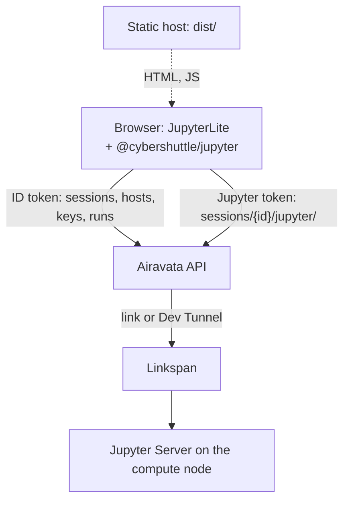
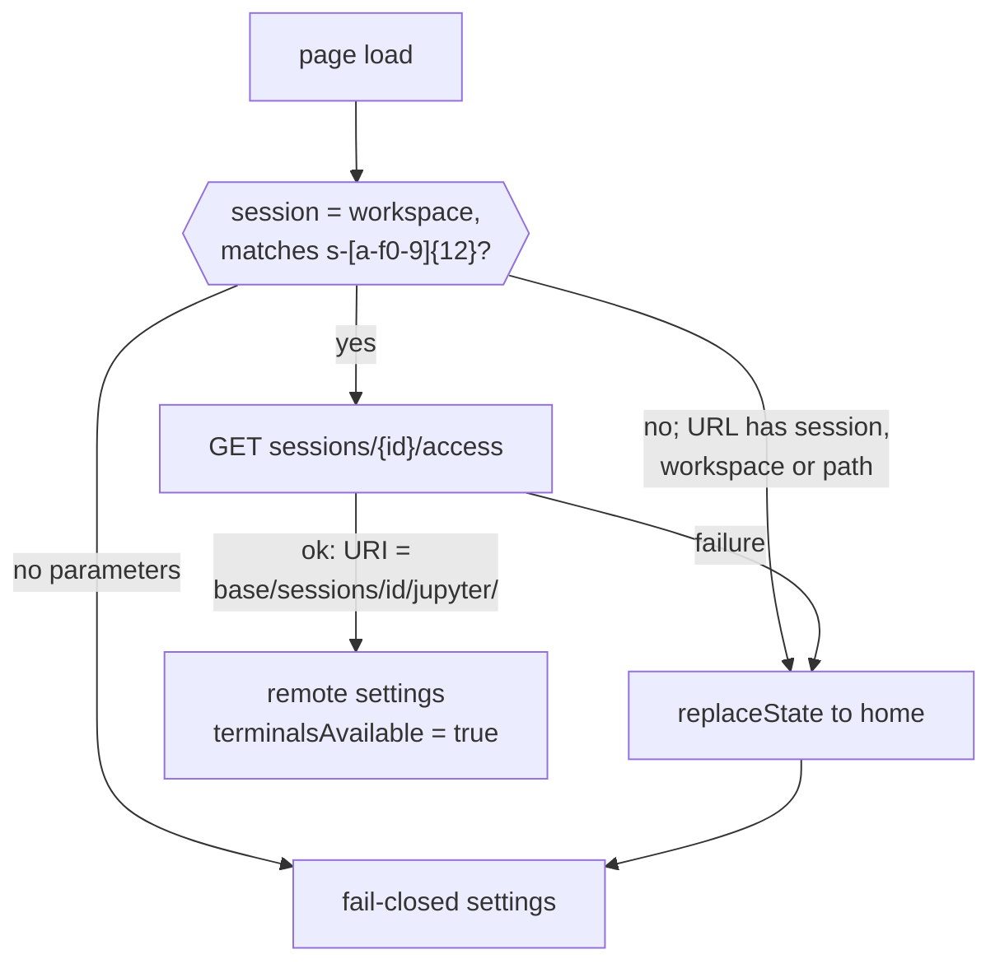
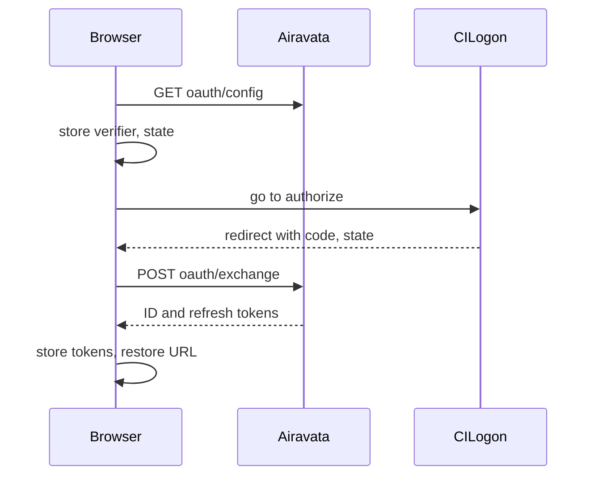

# Architecture

This page explains cs-jupyter, the browser client behind CS Jupyter, for developers and operators. It assumes
familiarity with JupyterLab plugins and service managers.

cs-jupyter is a static [JupyterLite](https://github.com/jupyterlite/jupyterlite) distribution whose file browser,
kernels and terminals run on a Slurm compute node. The user signs in and asks the session server of
[Apache Airavata](/setting-up/airavata-architecture) for a session; JupyterLab then talks to the Jupyter Server inside
that Slurm job. Nothing computes in the browser. Until a session is `READY`, the application **fails closed**: it
refuses every compute request instead of falling back to a local kernel.

| Item | Value |
|---|---|
| Repository | [cyber-shuttle/cs-jupyter](https://github.com/cyber-shuttle/cs-jupyter) |
| Version documented | 0.1.1, pre-release (`339050e`) |
| What ships | A static site (`dist/`) plus one federated JupyterLab extension, `@cybershuttle/jupyter` |
| Entry point | `src/index.ts`; no Python package or server extension; Python is build tooling only |
| Built with | JupyterLab 4.6.3, JupyterLite 0.8.1, TypeScript, Bun, uv |
| Backend | One origin: Airavata's HTTP API, named by the page setting `cybershuttlePlaneApiUrl` |
| Public instance | `https://jupyter.cybershuttle.org`, driving `https://jupyterapi.cybershuttle.org` |
| License | Apache-2.0 |

Identifiers that contain "plane", such as `cybershuttlePlaneApiUrl`, `PlaneClient` and the Go module
`github.com/cyber-shuttle/cs-plane`, name Airavata's HTTP API; this page quotes them as the code spells them.

## How it works

The diagram shows what the browser loads and the two credentials it sends to Airavata:

- The site is plain static files; all state lives in Airavata or the browser tab. Every call is cross-origin, so
  Airavata's session server must list the site's origin in `--allowed-origin`.
- The extension replaces JupyterLite's in-browser contents, kernels, sessions and terminals with managers that point
  at `sessions/<id>/jupyter/` on Airavata's API. Airavata proxies that path to the Jupyter Server that
  Linkspan starts in the job.
- The site ships no Pyodide, xeus or JavaScript kernel; `test:dist` (`tests/distribution.mjs`) fails if one appears
  in `dist/`.
- Nothing from this repository runs on the compute node, and the browser never talks to the cluster.

## Requirements

| Requirement | Notes |
|---|---|
| Airavata's session server, release 0.4.0 or newer | Owns every API this client calls |
| A CILogon identity | The only sign-in path |
| A Dev Tunnels account (Microsoft or GitHub) | Optional; enables the Dev Tunnel transport |
| A current browser | No polyfills ship |

## Related components

| Component | Relation |
|---|---|
| [Airavata](/setting-up/airavata-architecture) | The only backend; the client's wire types are generated from its `wire.go` files |
| [Linkspan](/batch/linkspan-architecture) | Indirect; Airavata launches it in the job, and it builds the Python environment and starts Jupyter Server |
| [CS Bridge](/vscode/architecture) | No code link; its runs, platform `vscode`, appear under Run History's **VS Code** filter |

## Service plugins

The extension replaces JupyterLite's in-browser service managers with its own, which send every compute request to the
session or refuse it. All start automatically, and their IDs are prefixed `@cybershuttle/jupyter:`. Source:
`src/index.ts`.

| Plugin | Provides |
|---|---|
| `plane-client` | `IPlaneClient`: one shared Airavata API client (`PlaneClient.ts`) |
| `remote-server-settings` | `IRemoteServerSettings`: the selected `READY` session's settings, or the fail-closed bootstrap |
| `default-drive` | `IDefaultDrive` |
| `contents-manager` | `IContentsManager` |
| `kernel-manager` | `IKernelManager` |
| `kernel-spec-manager` | `IKernelSpecManager` |
| `session-manager` | `ISessionManager` |
| `terminal-manager` | `ITerminalManager`: a real manager only when a session is active, else `NoopManager` |
| `workspace-manager` | `IWorkspaceManager`, implemented by `RemoteWorkspaces` |
| `service-manager` | `IServiceManager`; on standby when the page is hidden, and always with no session, so JupyterLab's own polling stops |
| `remote-terminal-ui` | Activates the deferred terminal extension only if terminals are available |
| `session-ui` | Mounts the Cybershuttle panel into the Launcher; adds **Select Session…**; installs the command guard; on a session page, registers the status-bar countdown |

`jupyter-lite.json` disables the JupyterLite and JupyterLab plugins that would compute in the browser, store the
workspace locally or compete with these replacements, and defers the terminal plugin. JupyterLab's `server-settings`
and JupyterLite's `settings`, `user-manager`, `event-manager` and `nbconvert-manager` stay enabled, so JupyterLab
settings are still kept in the browser. `tests/distribution.mjs` checks both lists.

`RemoteWorkspaces` replaces JupyterLite's browser-local workspace store, so a session's layout follows it across
browsers and runs. It saves the layout through the Contents API at `.cybershuttle/workspaces/<id>.json`, relative to
the Jupyter Server's root. `list()` is empty, and with no
session every call is a no-op. Source: `src/workspaces.ts`.

## Page load

At load, the extension decides whether the page belongs to a session and builds the server settings every manager
uses: a session's Jupyter Server, or fail-closed settings.

### Session selection

A page is a *session page* when its URL carries `?session=<id>&workspace=<id>`. `workspace` is JupyterLab's own
parameter naming the layout to restore, so each session gets its own layout. Airavata issues access only once a session
is up, so a successful access response is the readiness signal; nothing is carried over from the page that navigated
here. Source: `src/index.ts`, `src/session.ts`.

On success, every manager points at `access.jupyter.uri` with `access.jupyter.token` (`appendToken: true`; the
WebSocket URL is the same with `ws`). The grant is held in memory only.

A `401` or `403` from Jupyter reloads the page once, which requests fresh access. If another arrives before a Jupyter
request next succeeds, the client answers `Jupyter refused this session's access again; reopen the session from the
Launcher.` instead of reloading again. Kernel spec `resources` are emptied, because logos behind the proxy cannot load
in an ``.

### Fail-closed services

Without a `READY` session, the bootstrap settings answer `GET` on exact paths, so JupyterLab starts cleanly and empty
instead of falling back to an unauthenticated default server:

| Request | Response |
|---|---|
| `GET api/contents` | An empty read-only directory |
| `GET api/kernels`, `api/sessions`, `api/terminals` | `[]` |
| `GET api/kernelspecs` | `{"default": "", "kernelspecs": {}}` |
| Anything else, including other methods and sub-paths | `503 {"message": "Select a READY CyberShuttle session first."}` |

Terminals use `NoopManager` with `terminalsAvailable` false.

## Sign-in

Sign-in is the OAuth authorization-code flow with PKCE against CILogon; Airavata finishes it, because only it holds
the client secret. **Sign in** is the only trigger. Sign-in navigates the whole tab, so the client keeps the verifier,
and then the tokens, in per-tab `sessionStorage`, which survives the navigation and ends with the tab. Source: `src/AuthClient.ts`.

| Item | Value |
|---|---|
| Verifier | 32 random bytes; the challenge is its SHA-256 (`S256`) |
| State | 16 random bytes, checked on return |
| `sessionStorage` keys | `cybershuttle.oauth.pkce.v1` (verifier, state), `cybershuttle.oauth.v1` (tokens) |
| Exchange body | `{code, codeVerifier, redirectUri}` |
| Exchange response | `{idToken, refreshToken, expiresInSeconds}` |
| Redirect URI | The current URL without query or hash |

A call made within 60 seconds of the ID token's expiry first refreshes it through `oauth/refresh`, when a refresh token
exists. If the refresh fails, the old token is used until it expires, then dropped. A `401` from Airavata drops
the ID token; a `403` does not.

## Launcher integration

The client's interface lives inside JupyterLab's Launcher. From there, a command guard and **Connect** take the user to a
session page.

### Launcher panel

The Cybershuttle UI is a guest inside JupyterLab's Launcher, so it appears wherever the user starts work. JupyterLab
disposes a Launcher as soon as anything is launched from it, so the panel moves to the next one in three phases, which
anything else mounted into the Launcher must follow. Source:
`src/session-ui.ts`, `src/dom.ts`.

| Phase | Behaviour |
|---|---|
| Mount | The header widget joins the Launcher's `contentHeader` at 46 px. After `ReactWidget.renderPromise`, the body attaches as the first child of `.jp-Launcher-content`, which React renders |
| Observe | One `MutationObserver` per Launcher re-mounts the body when a React re-render drops it, only while that Launcher is current |
| Release | On `launcher.disposed`, which fires while the DOM is still whole, the observer disconnects and header and body detach. A detach of a node already gone from the document sends the Lumino detach messages itself |

Without a clean release, the body stays marked attached to a node that has left the document. The next Launcher's
detach then throws `Widget is not attached`, and the section never returns: the header renders with nothing below it.

### Command guard

With no session, the commands below would only fail against the fail-closed services. `installSessionCommandGuard`
therefore wraps `app.commands.execute`: with no active session, it runs `select-session` in their place and remembers their `path`
argument, which **Connect** then opens. Source: `src/SessionController.ts`.

- `notebook:create-new`, `notebook:open`, `console:create`, `console:open`, `terminal:create-new`, `terminal:open`,
  `terminal:open-folder-in-terminal`;
- `docmanager:open` and `filebrowser:open-path` on a path ending `.ipynb`;
- any `notebook:` or `console:` command with a segment starting `run` or `execute`, such as `notebook:run-cell`.

### Session navigation

**Connect** (`SessionActions.connect`, then `SessionController.select`) requires that Airavata has granted
access for the session's current run, and requests it if no poll has. If another session is active, it runs
`docmanager:save-all`, because the navigation discards unsaved documents.

It then re-reads the session and requires the same run, still `READY`, because the save can outlast the run, and
navigates to `?session=<id>&workspace=<id>[&path=<document>]`, where the document is the remembered path or the one
open. Only the session ID enters the URL.

## Runtime state

The panel holds the client's view of Airavata, keeps it current by polling and reacts to Airavata's errors.

### Polling

While signed in, the panel polls once a second, because Airavata has no push channel to the browser. A tick is
skipped while the previous one is still running. Source: `src/CyberShuttlePanel.ts`.

1. `GET sessions` with `If-None-Match`. Usage samples have their own route, so they do not change this `ETag`.
2. On a session page, if that session has finished or its walltime has run out, leave for the address without a
   session and stop the tick.
3. In parallel: `GET sessions/{id}/usage` for every `STARTING` or `READY` session, and `GET runs` when the list
   changed, Run History is open or a run's accounting is pending.
4. Retry pending deletes.
5. `GET sessions/{id}/access` for each `READY` session not yet granted access for its run. Failures back off per
   session and run, from one second, doubling to 30. Only the fact that Jupyter is up is recorded; the grant is
   discarded.

SSH hosts are read at sign-in and whenever the SSH Hosts dialog closes. Countdowns are computed locally from
`startedAt + wallMinutes`. The panel is created once and lives as long as the page.

### Panel state

`CyberShuttlePanel` holds sessions, log tails, usage samples, runs, loading and error state, busy sessions, the
connecting session, the sessions whose Jupyter access is granted, and the account. A Lumino signal announces each
change. Views rebuild their whole DOM on it and restore focus by `data-session-action`; a view with a live countdown
also rebuilds every second. Change detection compares serialized state. Sign-out increments an epoch that discards
in-flight results. If the active session is still `READY` but its run number changed, the page reloads.

### Errors and retries

The client acts on two Airavata error codes and shows any other with Airavata's message:

| Code | Client behaviour |
|---|---|
| `ssh_authentication_required` | Opens the SSH authentication console and retries once. Applies to Slurm discovery, script validation, start (including the one **Submit** sends) and stop, not the final `DELETE` |
| `session_access_unavailable` | The `409` a session answers while leaving `READY`. Not shown; access is retried with backoff |

Airavata refuses to delete a session whose job has not ended (`session_not_stopped`), so deleting a live session stops
it and queues the delete until a poll sees it `STOPPED` or `FAILED` (`src/session-actions.ts`). A `404`
or `session_not_found` counts as success; `session_not_stopped`, `408`, `429`, `5xx` and network errors leave the
delete pending.

## Airavata API

The client calls the routes below on one Airavata origin and validates every response before acting on it.

### Routes

Paths are relative to `cybershuttlePlaneApiUrl`, which ends in `/api/v1`. Source: `src/PlaneClient.ts`,
`src/AuthClient.ts`. Bearer is the header `Authorization: Bearer <ID token>`.

| Route | Use | Credential |
|---|---|---|
| `GET oauth/config`, `POST oauth/exchange`, `POST oauth/refresh` | Sign-in | None |
| `GET sessions` (with `ETag`), `POST sessions`, `POST sessions/validate` | List, create, validate | Bearer |
| `GET`, `DELETE sessions/{id}`; `POST sessions/{id}/start`, `sessions/{id}/stop` | Read, delete, start, stop | Bearer |
| `GET sessions/{id}/usage`, `GET runs` | Usage samples, run history | Bearer |
| `GET sessions/{id}/access` | Run-bound Jupyter URI and token | Bearer |
| `GET`, `POST hosts`; `PUT`, `DELETE hosts/{alias}`; `GET hosts/{alias}/health`, `hosts/{alias}/slurm` | SSH hosts, health check, Slurm discovery | Bearer |
| WebSocket `hosts/{alias}/ssh` | SSH authentication console | ID token as a subprotocol |
| `GET`, `POST keys/ssh`; `DELETE keys/ssh/{id}` | SSH keys | Bearer |
| `GET`, `DELETE devtunnels`; `POST devtunnels/authorizations` and `…/{handle}/poll` | Dev Tunnels account | Bearer |
| `sessions/{id}/jupyter/` | Jupyter REST and WebSocket | Jupyter token |

[Security](./security.md#transport-rules) gives the request rules for each credential.

### Wire validation

tygo generates `src/api/{session,ssh,devtunnels,oauth,frames}.ts` from Airavata's `wire.go` files, at the
Airavata version pinned as the Go module `github.com/cyber-shuttle/cs-plane` in `tools/go.mod`. Types are erased at run
time, so every response also passes a validator before the client acts on it. The validators are built in `src/PlaneClient.ts` and `src/AuthClient.ts` from the
vocabulary in `src/Common.ts`. An object validator fails on a missing or mistyped field and ignores unlisted ones, so a
newer Airavata release still validates. The token, stored-credential, pending sign-in and session access validators are
strict and refuse unknown keys.

A response outside these limits is an error, not a rendered value:

| Checked | Limit |
|---|---|
| Session ID | `^s-[a-f0-9]{12}$` |
| `cores`, `memoryMb`, `wallMinutes` | Positive integers; the create form's minimums do not apply to a listed session |
| `tunnelModes` | Non-empty subset of `link`, `devtunnel` |
| `seq` (run number) | At least 0 on a session; at least 1 on a run or grant |
| Jupyter token, Dev Tunnels handle | 43 characters, base64url |
| `expiresInSeconds` of a token | 1 to 86400 |
| Live log tail | At most 100 lines |
| Any log, live or in a run | Each line at most 4096 bytes, 64 KiB in total, no control characters |

## Related pages

| Page | Kind | Covers |
|---|---|---|
| [User interface](./user-interface.md) | Reference | Every dialog, field, state and message |
| [Security](./security.md) | Reference | Security properties and transport rules |
| [Development](./development.md) | How-to | Setup, scripts, tests, CI, generated types |
| [Hosting the Jupyter site](/setting-up/hosting-the-jupyter-site) | How-to | Build, deploy, configuration keys, URL parameters |
