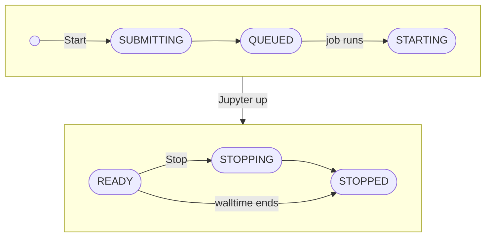

# Sessions and runs

This page assumes you have completed [Getting started](./getting-started.md).

A **session** is a saved set of resources on one cluster. Each **Start** submits a new Slurm job, called a **run**. A
session's resources are fixed when it is added; to change them, add another session.

## Session states

Clicking a session card opens the session dialog: its resources, live CPU, memory and GPU plots, and the startup log.
The diagram shows the usual path of one run through the states:

| State | Meaning |
|---|---|
| `SUBMITTING` | Airavata prepares the cluster and submits the job |
| `QUEUED` | Waiting in the Slurm queue; the job holds no resources yet |
| `STARTING` | Running; the walltime counts from here. Linkspan builds the environment and starts Jupyter Server |
| `READY` | Reachable; **Connect** appears |
| `STOPPING` | Airavata runs `scancel` |
| `STOPPED`, `FAILED` | Finished; **Start** submits a new run with the same resources |

**Stop** works from every state before `STOPPING`, and any of them can end in `FAILED`. A `FAILED` session shows its
error in the session dialog; [Troubleshooting](./troubleshooting.md) lists the common causes.

**Delete** removes a session, stopping its job first if it is live. Its runs stay in Run History, and its files on the
cluster are not touched.

## Walltime

A session runs until you stop it or its walltime ends; closing the tab or signing out does not stop it. The status bar
shows the time left and turns to a warning colour at ten minutes. The walltime cannot be extended, so save your work
before it ends. At the end, the page opens **Run History** on that run. Saved files remain on the cluster; kernel state
is lost.

## Switching sessions

Several sessions can run at once; a browser tab is connected to one of them. To switch, run **Select Session…** from
the command palette (**Switch Session…** once a session is connected) and click **Connect** on another `READY`
session. Open documents are saved and the page reloads. The session you leave keeps running and is charged until you
stop it.

Each session's JupyterLab layout is stored on the cluster, so the same tabs and panels reopen from another browser or
after a new run.

## Run history

**Run History** in the Sessions section lists each run with:

- its outcome, any error, and the startup log as it stood at the end;
- its duration and the cores Slurm granted;
- peak memory, and CPU and memory used as a share of the request.

Use it to see why a run ended and to size the next request. The list also holds runs of deleted sessions and, under
the **VS Code** filter, runs started from [CS Bridge](/vscode).

The figures come from Slurm accounting and can take up to ten minutes after the run ends to appear; a cluster without
accounting shows none.

## Dev Tunnels

A **transport** is how traffic travels between Airavata and the compute node.

| Transport | Path | Needs |
|---|---|---|
| **Link** (default) | A connection Linkspan opens from the node to Airavata | Nothing else |
| **Dev Tunnel** | Microsoft's Dev Tunnels relay, which can read the traffic; see [Cluster security](/planning/cluster-security) | A Microsoft or GitHub account; each run's tunnel is created in it and removed when the run stops |

The session form's **Transport** field has a box for each. With both ticked, Airavata uses the link and falls back to the Dev Tunnel while the link is down.

To use a Dev Tunnel:

1. Open the account menu, then **Dev Tunnels**, and click **Connect Microsoft** or **Connect GitHub**.
2. Open the sign-in page shown and enter the one-time code. The code dialog closes and the account appears with a
   check mark.

   
   

   
   

3. When you add a session, tick **Dev Tunnel** under **Transport**.

The session dialog's **Transport** row then reads `Dev Tunnel` or `Link + Dev Tunnel`.

## Removing CS Jupyter data

Signing out deletes nothing, and a running session keeps running. To remove what Airavata and the cluster hold for
you:

1. Open each session and click **Delete**, then **Stop and delete** if it is live. Airavata stops the Slurm job and
   removes the session once the job ends; keep the page open until its card disappears. Its runs stay in Run History,
   and nothing on the cluster is touched.
2. Open the account menu, then **SSH Keys**, and **Delete** each key. Airavata deletes the stored private key and
   unassigns it from every SSH host.
3. Click **SSH Hosts** in the Sessions section and **Delete** each entry. Only entries added there can be deleted.
4. Open the account menu, then **Dev Tunnels**, and click **Disconnect**. Airavata deletes the stored token; it does
   not revoke the sign-in at Microsoft or GitHub.
5. If you added the uploaded key's public half to `~/.ssh/authorized_keys` on the cluster, remove that line. An open
   SSH connection outlives the key; see [Cluster security](/planning/cluster-security#airavata).
6. Delete what remains on the cluster, once no session runs: `~/.cybershuttle/` holds the environment (`bin/`,
   `python/`, `cache/uv/`, `jupyter-env/`), each run's logs in `logs/` and each session's workflow in `sessions/`;
   each session's JupyterLab layouts are in `.cybershuttle/workspaces/` under its **Root folder**. Nothing prunes
   them.

Run History entries and the account itself cannot be deleted.
