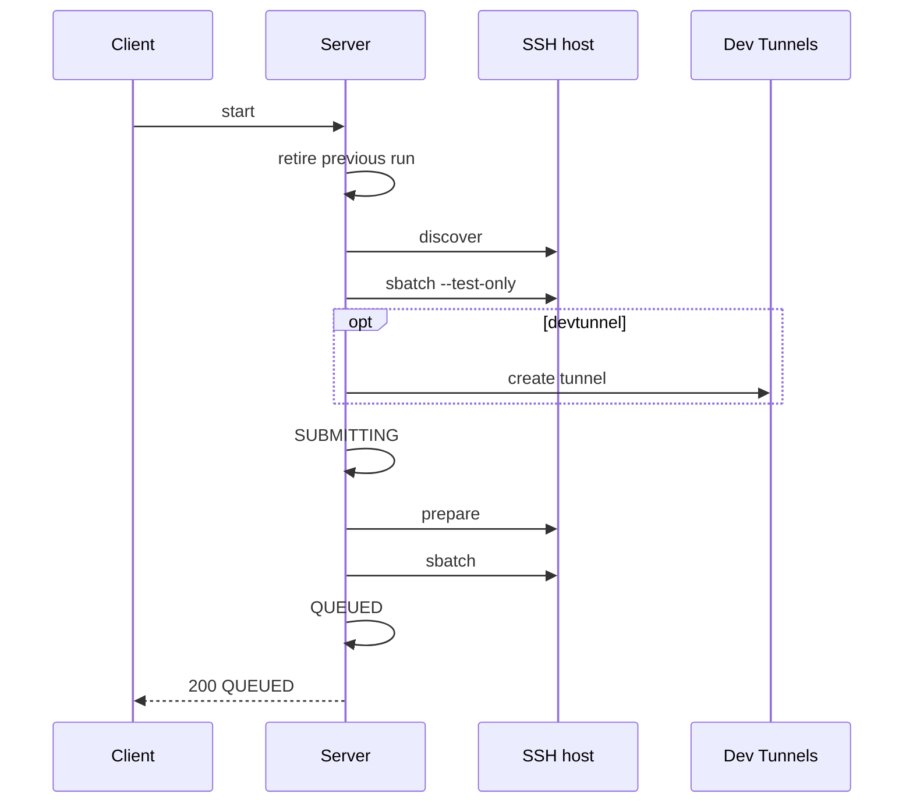
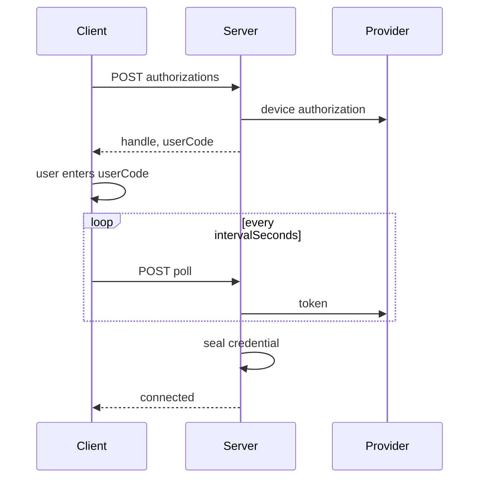

# Airavata sessions and runs

How Airavata's session server turns a session into Slurm jobs, tracks them and uses Microsoft Dev Tunnels. To
diagnose a session, start at [States](#states) and [Logs](#logs). The page assumes the
[session lifecycle](../overview/how-it-works.md#jupyter-path); routes are in the [HTTP API](./airavata-http-api.md).

| Term | Meaning |
|---|---|
| Session | The durable record of what a user asked for: a cluster, a partition, resources and a folder |
| Run | One Slurm job serving a session; `seq` counts a session's runs |
| Linkspan | The agent each job runs |
| Link | The WebSocket Linkspan dials back to the server, over which the server reaches the job |
| Transport | How a run's traffic leaves the compute node: `link`, `devtunnel` or both, listed in the session's `tunnelModes` |

`POST /sessions` records a session at `seq` 0. Each `start` launches the next run, one Slurm job named
`cs-<session id>-<seq>`; `attach` takes the next `seq` for a job the client submits itself. A job name, a log file and
a token identify one run, except that a session deleted and defined again with the same `idempotencyKey` restarts at
`seq` 0 and repeats them.

| Platform | Runs come from | The server |
|---|---|---|
| `jupyterlab` | `start` | Discovers, prepares, submits, reconciles, fetches accounting and cancels |
| `vscode` | `attach` | Runs nothing on the cluster; CS Bridge submits the job, and `stop` retires the run locally; see [CS Bridge path](../overview/how-it-works.md#cs-bridge-path) |

Identifiers, ports and tokens:

| Value | Derivation |
|---|---|
| Session ID | `s-` + hex of the first 6 bytes of `sha256(principal hash + "\0" + idempotencyKey)` |
| Job name | `cs-<id>-<seq>` |
| Dev Tunnel ID | `<id>-<seq>` |
| Control port | `20000 + (first two bytes of sha256("<id>/<seq>")) mod 20000` |
| Jupyter port | Control port + 1 |
| Jupyter and link tokens | 32 random bytes per run, unpadded base64url (43 characters) |

Derived ports let a Dev Tunnel declare the control port before the job starts.

## States

A session is in one of seven states: `SUBMITTING`, `QUEUED`, `STARTING`, `READY`, `STOPPING`, `STOPPED` and
`FAILED`. Client requests, the link and reconciliation against Slurm move it between them.

### Transitions

A session that stays in a state is waiting for one of the triggers in that state's rows. `STOPPED` and `FAILED` are
terminal.

| From | Trigger | To |
|---|---|---|
| none | `POST /sessions` | `STOPPED`, `seq` 0 |
| terminal | `start`, after discovery, `sbatch --test-only`, Dev Tunnel and tokens | `SUBMITTING`, `seq` + 1 |
| `SUBMITTING` | `sbatch` returns a job ID | `QUEUED` |
| `SUBMITTING` | Conclusive failure: preparation fails, or `sbatch` refused | `FAILED` (`STOPPED` if a stop arrived) |
| `SUBMITTING` | Ambiguous submission: ssh exit 255, a timeout or killed `ssh`, or an unparsable job ID | Unchanged until reconciliation finds the job by name |
| terminal | `attach` | `QUEUED`, platform `vscode` |
| `QUEUED`, `STARTING` | The link connects for the current `seq` | `READY`, setting `startedAt` |
| any live | Slurm `PENDING`, `REQUEUED`, `SUSPENDED`, `STOPPED`, … | `QUEUED` (a linked session goes to `READY`) |
| any live | Slurm `RUNNING`, `CONFIGURING`, `COMPLETING`, … | `STARTING` (a linked session goes to `READY`) |
| `STARTING` | No link, but the job's log has output | `READY` |
| `QUEUED`, `vscode` with `devtunnel` | Linkspan's `/api/v1/health` answers through the Dev Tunnel | `READY` |
| any | Slurm `COMPLETED`, `CANCELLED`, `TIMEOUT` | `STOPPED` |
| any | Slurm `BOOT_FAIL`, `DEADLINE`, `FAILED`, `NODE_FAIL`, `OUT_OF_MEMORY`, `PREEMPTED`, `REVOKED`, `SPECIAL_EXIT` | `FAILED` |
| any | A Slurm state outside the vocabulary | Unchanged; treated as no observation |
| non-terminal | `stop` | `STOPPING`; `scancel` runs with the next status script |
| `STOPPING` | Slurm still pending or active | Unchanged; `error` holds the `scancel` message |
| `STOPPING`, `vscode` | Reconciliation | `STOPPED` locally |
| unknown to Slurm | More than 2 minutes since `updatedAt` (5 minutes without a job ID) | `STOPPED` |
| scheduler unreachable | `STARTING` or `READY` past `startedAt + wallMinutes + 10 minutes` | `STOPPED`, "Session reached its walltime" |

Reconciliation never demotes a linked `READY` session; otherwise Slurm is authoritative, so an administrator's
`scancel` needs no further step in Airavata. A client-launched `vscode` run stays `READY` until someone calls `stop`.
When the cluster cannot be reached, the state is kept and the SSH failure goes to the session's `error`, with the
narration "Session status check failed".

### Reconciliation

Every 30 seconds, with a 60-second timeout, a login node sees one status round per user and SSH host, however many
sessions the user has; a `STARTING` session adds a read of its log tail. The round runs as that user:

| Section | Command |
|---|---|
| `__CS_SCANCEL__` | `scancel <job id>` or `scancel --name=<job name>` for `STOPPING` sessions |
| `__CS_SQUEUE__` | `squeue --me --noheader --format='%i\|%T\|%N\|%j'` |
| `__CS_SACCT__` | `sacct --noheader -X --starttime=now-<N>seconds --name=<names> --format=JobIDRaw,State,NodeList,JobName,ElapsedRaw --parsable2` |

The `sacct` lookback reaches the oldest session's creation plus an hour, at most 30 days. A `stop` reconciles that
one session synchronously. Between rounds, `QUEUED`, `STARTING` and the end of a job can lag `squeue` by up to 30
seconds; `READY` from the link is set at once.

## Start sequence

The calls `start` makes, in order:



1. **Retire.** Claim the terminal session, release the previous run's Dev Tunnel and freeze the previous run.
2. **Serialize.** Start and attach are serialized per session ID by a process mutex slot and a file lock.
3. **Credential.** With `devtunnel`, load the owner's Dev Tunnels credential (`409 devtunnels_account_required`
   otherwise).
4. **Discover and validate.** One SSH round runs `id -un`, `sacctmgr show associations`,
   `sinfo -h -o '%P|%c|%m|%G'` and `printenv HOME`; the request must fit; `rootFolder` is resolved; then
   `sbatch --test-only` (`400 slurm_validation_failed`).
5. **Claim the run.** Issue new tokens, create the Dev Tunnel `<id>-<seq>`, write the credential file, and persist
   `SUBMITTING`.
6. **Prepare the SSH host** in one SSH call with a 5-minute timeout. A concurrent start for the same caller and alias
   is refused `session_provisioning_in_progress`.
7. **Submit** and record the job ID as `QUEUED`. If a stop won the race, the new job is cancelled.

`start` answers after submission, normally `QUEUED`; meanwhile `GET /sessions` shows `SUBMITTING` and the
preparation narration. A refusal before step 5 leaves the session terminal at its old `seq`. After it, a conclusive
failure marks the session `FAILED` at the new `seq`; an ambiguous submission is left for reconciliation to find by
name.

## Cluster preparation

Everything the server writes on the cluster before submitting, as the user, under `$HOME/.cybershuttle`. One
installation serves every session and CS Bridge.

### Linkspan installation

| Situation | Action |
|---|---|
| No Linkspan installed | Download `linkspan_Linux_<arch>.tar.gz` from the latest GitHub release |
| Installed is older than the latest release | Replace it |
| Installed is newer than the latest release | Keep it |
| Installed is a hand build `X.Y.Z.<commit>` and release `X.Y.Z` exists | Replace it |
| Installed version is unparsable | Replace it |
| Latest release unreachable | Keep the installed one if its version parses |
| Resulting Linkspan older than `0.22.0` | Refuse: `session_provisioning_failed`, "…older than 0.22.0…" |

CS Bridge installs by the same rule, so neither undoes the other. Versions are compared with `sort -V`; the download
is staged and moved into place. The architecture is the login node's `uname -m`: `x86_64`, or `aarch64` and `arm64`
as `arm64`.

### Workflow document

Written to `$HOME/.cybershuttle/sessions/<id>/workflow.yaml`, it carries only validated paths and the Jupyter port:

```yaml
name: cs-session
tasks:
  - on: start
    steps:
      - name: Start Jupyter Server
        action: jupyter.sessions.start
        params:
          root_dir: "/home/alice/project"
          addr: "127.0.0.1:<jupyter port>"
```

The job lives as long as that Jupyter server. See [Linkspan workflow format](/batch/linkspan-workflow-format).

### Job script

The script a submit filter sees, and `POST /sessions/validate` returns:

```bash
#!/bin/bash
#SBATCH --nodes=1
#SBATCH --ntasks=1
#SBATCH --cpus-per-task=<cores>
#SBATCH --mem=<memoryMb>M
#SBATCH --time=<D-HH:MM:00 or HH:MM:00>
#SBATCH --partition=<partition>
#SBATCH --account=<account>                 # when set
#SBATCH --gres=gpu[:<type>]:<count>         # when GPUs are requested
set -eu
umask 077
LOG_DIR="$HOME/.cybershuttle/logs"
install -d -m 700 "$LOG_DIR"
exec >"$LOG_DIR/<id>-<seq>.out" 2>"$LOG_DIR/<id>-<seq>.err"
unset XDG_RUNTIME_DIR TMPDIR
LINKSPAN_BIN='<path>'
exec "$LINKSPAN_BIN" --port "$CS_CONTROL_PORT" --tunnel-enable --tunnel-mode <link|devtunnel|devtunnel,link> \
  [--tunnel-devtunnel-args "--id $CS_DEVTUNNEL_ID --cluster $CS_DEVTUNNEL_CLUSTER"] \
  [--tunnel-link-args "--url $CS_LINK_URL"] \
  --workflow '<private root>/workflow.yaml'
```

A GPU type of literally `gpu` yields `--gres=gpu:<count>`. The `--tunnel-*-args` flags follow the order of
`tunnelModes`. The script never asks for `--exclusive`, so the partition's policy decides whether a session shares its node; see
[Node sharing](../setting-up/preparing-the-cluster.md#node-sharing).

### Job environment

Secrets never enter script text or an argument list. A program read from stdin (`sh -s -- cs-submit <job name>`) exports the environment, then runs
`exec sbatch --job-name="$2" --export=ALL --parsable` with the script as a here-document.

| Variable | When |
|---|---|
| `JUPYTER_TOKEN`, `CS_CONTROL_PORT` | Always |
| `CS_LINK_URL`, `LINKSPAN_LINK_TOKEN` | `link` |
| `CS_DEVTUNNEL_ID`, `CS_DEVTUNNEL_CLUSTER`, `LINKSPAN_TUNNEL_HOST_TOKEN` | `devtunnel` |

`CS_LINK_URL` is `--public-url` with `https` replaced by `wss`, plus `/api/v1/sessions/<id>/link`.

### Root folder

`rootFolder` is where Jupyter opens, restricted to a plain path and resolved on the SSH host:

| Form | Resolves to |
|---|---|
| `.`, `~`, `$HOME`, `${HOME}` | The home directory |
| `/abs/path` | Itself; clean, `^/[A-Za-z0-9._/-]+$`, not `/` |
| `~/x`, `x/y`, `$HOME/x` | Under home |
| `$VAR`, `$VAR/x`, `${VAR}/x` | Under `printenv VAR` over SSH, which must be one safe absolute path; `VAR` at most 64 characters |

It must not resolve inside `$HOME/.cybershuttle/sessions/<id>`. It may contain that directory only when written as
one of the home forms in the first row.

## Communication with Linkspan

Linkspan opens every connection; the server opens no port and no SSH forward on the cluster. The server reaches
Linkspan over the link, or through the Dev Tunnel when there is no link.

| Call | When |
|---|---|
| `GET /api/v1/usage` | Every five seconds for each `READY` session |
| `GET /api/v1/health` | To promote a client-launched `devtunnel` run to `READY` |
| `POST /api/v1/vscode/sessions` `{"authorized_key", "ref": "ssh-<16 hex of sha256(key)>"}` → `bind_port` | `POST /sessions/{id}/ssh` |
| A stream to the Jupyter port | The Jupyter proxy |
| A stream to any served port | `GET /sessions/{id}/forward/{port}` |

On the link, the server is the yamux client. For each stream it writes the target port as two big-endian bytes, and
Linkspan answers `1` (connected) or `0` (nothing serves that port) within 30 seconds. To open the link, Linkspan
offers exactly the subprotocols `cybershuttle.v1` and `link.<token>`, in either order. See
[the link](/batch/linkspan-architecture#the-link).

The server keeps the last 20 usage samples per `READY` session for `GET /sessions/{id}/usage`.

## Dev Tunnels

A [Microsoft Dev Tunnel](https://learn.microsoft.com/en-us/azure/developer/dev-tunnels/overview) is a relay endpoint
Linkspan hosts from inside the job:

| Transport | Traffic passes through | Needs |
|---|---|---|
| `link` (default) | The Airavata host | Nothing more |
| `devtunnel` | Microsoft's relay, under the user's own account | A connected Dev Tunnels account |

### Account connection

The broker runs a Microsoft or GitHub device-code authorization bound to the caller's principal, under
`/api/v1/devtunnels/authorizations`:



| Provider | `microsoft` | `github` |
|---|---|---|
| Client | `c0df98ca-23b4-4bce-bb9f-72039b28d3a5`, common authority | `Iv1.e7b89e013f801f03` |
| Scope | `openid profile offline_access 46da2f7e-b5ef-422a-88d4-2a7f9de6a0b2/.default` | |
| Account | From `preferred_username` | From `api.github.com/user` `login` |

| Broker rule | Value |
|---|---|
| Handle | 32 random bytes, base64url; the device code never leaves the server |
| Pending authorizations | At most 256, in memory |
| Starts | At most one per second per principal |
| Polling faster than `intervalSeconds` | `429 rate_limited` |
| Provider `slow_down` | Adds 5 seconds, up to 60 |

The credential is sealed with `nacl/secretbox` under the 32-byte `devtunnels-account.key` into
`hosts/<principal>/devtunnels-account`. It is refreshed within two minutes of expiry when it has a refresh token. No response carries the account's token.

### Per-run Dev Tunnels

Each run with the `devtunnel` transport gets one Dev Tunnel, made with the owner's account:

```http
PUT /tunnels/<id>-<seq>?api-version=2023-09-27-preview&tokenScopes=host&tokenScopes=connect
If-None-Match: *
```

```json
{
  "tunnelId": "<id>-<seq>",
  "customExpiration": <seconds: walltime + 15 minutes, clamped to 1 hour … 30 days>,
  "options": { "isInspectionEnabled": false },
  "ports": [{ "portNumber": <control port>, "protocol": "http", "description": "cybershuttle-control" }]
}
```

- Only the control port is declared; every other port is reached through Linkspan's `/api/v1/forward/{port}`.
- Traffic inspection is disabled; no access-control entries are set, so the service's default applies.
- A Dev Tunnel the server failed to delete expires by `customExpiration`.
- Any create error deletes the deterministic ID before returning.
- The host token goes to the job as `LINKSPAN_TUNNEL_HOST_TOKEN` (or, for `attach`, to the client) and is not
  stored; the connect token is kept in the run's credential file.
- `stop` releases the Dev Tunnel best-effort; a failure is recorded in the session's `error`.

The management endpoint defaults to `https://global.rel.tunnels.api.visualstudio.com`; get and delete then go to
`<cluster>.rel.tunnels.api.visualstudio.com`.

### Fallback dial

While a run has no link, the server dials through its Dev Tunnel:

1. Read the Dev Tunnel with `Authorization: tunnel <connect token>` and take the control port's `http` forwarding URI
   on `*.devtunnels.ms`.
2. Open the WebSocket `<uri>/api/v1/forward/<port>` with `X-Tunnel-Authorization: tunnel <connect token>`.

This path serves every call in [Communication with Linkspan](#communication-with-linkspan).

## Logs

`GET /sessions` returns a log tail per session:

| Stream | Source | Bounds |
|---|---|---|
| `status` | The server's narration, for example `Preparing session`, `Validating session with Slurm`, `Installed Linkspan`, `Submitting Slurm job`, `Session is queued`, `Compute node assigned: <node>`, `Linkspan connected to cs-plane`, `Session reached its walltime` | 100 lines, 64 KiB; lines up to 4 KiB; consecutive duplicates dropped |
| `stdout`, `stderr` | The job's `.out` and `.err`, read hex-encoded through `od` | Last 100 lines or 16 KiB per stream, then 100 lines for both together |

The tail is the first thing to ask for when a session fails. Job output is fetched only while the session is
`STARTING`, so a run the link moves straight from `QUEUED` to `READY` shows none; the full files stay on the cluster.
Tails live in memory and vanish on restart. Redacted: `#!` and `#SBATCH` lines, per-run paths, `Bearer …`,
`token|secret|password|api_key` assignments, JWT-like strings, 32- and 64-hex strings, and paths under
`.cybershuttle/sessions/s-…`.

## Run history

When a session first reaches a terminal state, the server **freezes** the run:

1. Delete `credentials/<id>-<seq>.token`. If that fails the session stays `STOPPING` with
   "session cleanup pending: …".
2. Prepend a run keyed by `(session id, seq)` with the final log tail and usage samples.
3. Keep the newest 200 runs across all users, and drop the in-memory buffers.

For non-`vscode` runs that ended less than ten minutes ago, the server fetches accounting every 5 seconds until
`MaxRSS` appears:

```bash
sacct -P -n --units=K --starttime=… --name=cs-<id>-<seq> \
  --format=JobID,AllocCPUs,ReqMem,ElapsedRaw,CPUTimeRAW,MaxRSS,TotalCPU
```
