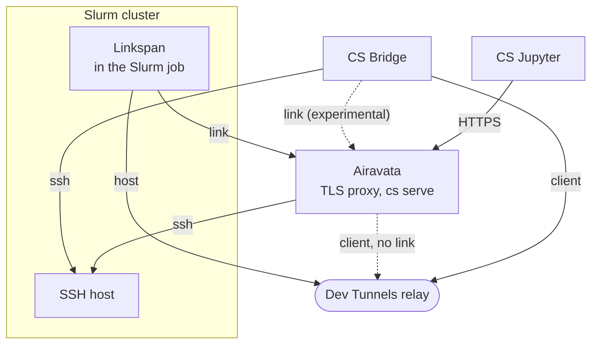

# Architecture

This page explains how the Cybershuttle components divide the work of running an interactive session on a Slurm
compute node. It assumes the sequence in [How it works](./how-it-works.md); the [Glossary](./glossary.md) defines the
terms.

## Roles

| Role | Component | Runs on |
|---|---|---|
| Client | [CS Jupyter](/jupyter/architecture) (browser), [CS Bridge](/vscode/architecture) (VS Code) | The user's machine |
| Middleware | [Apache Airavata](/setting-up/airavata-architecture) | A service host |
| Agent | [Linkspan](/batch/linkspan-architecture), one per Slurm job | A compute node, as the user |
| Security component | [Apache Airavata Custos](/planning/managing-allocations) | A service host, plus optional extensions on cluster nodes |

[Compatibility](/operating/compatibility#documented-versions) gives each component's repository and the commit this
site documents.

Airavata is two Go servers with separate source trees, both keeping their state in Postgres:

| Server | Command | Listens on (default) |
|---|---|---|
| Session server | `cs serve` | `127.0.0.1:8045`, loopback only, reached through a TLS proxy |
| Batch server | `airavata-server` | `:9095` |

Only the session server takes part in interactive sessions, so the rest of this page describes it.
[Airavata architecture](/setting-up/airavata-architecture) compares the two and describes their code.

Each arrow points from the side that opens the connection; a dashed arrow applies only in the case its label names.

Only SSH to the SSH host, the cluster's login node, enters the cluster. The diagram omits Airavata's Postgres
database, its CILogon sign-in, and the SSH or Jupyter server that Linkspan starts in the job.

## Responsibilities

CS Bridge runs on a machine with the user's `ssh`, so it logs in and submits by itself. CS Jupyter is a browser page
without `ssh`, so Airavata holds the SSH hosts and keys and submits for it.

| Concern | CS Jupyter path | CS Bridge path |
|---|---|---|
| Sign-in | Airavata relays CILogon with PKCE | Airavata relays CILogon with the device flow; link only |
| SSH hosts and keys | Stored by Airavata, with uploaded keys | The user's own `~/.ssh/config` |
| Session records | Airavata, in Postgres | `sessions/<id>.json` in VS Code's extension storage, plus Airavata with the link |
| Slurm submission | Airavata | CS Bridge, even with the link |
| Reachability | Link, or a Dev Tunnel | Dev Tunnel, or the link |
| Server in the job | Stock Jupyter Server in a `uv`-built Python environment | SSH server that accepts one key |
| Observation | Airavata polls Slurm every 30 seconds and usage of `READY` runs every 5 seconds | CS Bridge polls every 5 seconds: Slurm until the job runs, then Linkspan |

The submitting component installs Linkspan into `~/.cybershuttle/bin`; both require Linkspan 0.22.0 or newer.
Airavata's session server holds the CILogon client secret (`CS_OIDC_CLIENT_SECRET`); clients hold the ID and refresh
tokens.

## Principles

Every component follows these rules; check a change against them.

- **No inbound ports on the cluster.** The compute node only dials out, so a site opens nothing in its firewall.
  `cs serve` accepts only a loopback address and sits behind a TLS proxy; Linkspan listens on loopback, a `0600` Unix
  socket, or both.
- **Cluster work runs as the user.** Jobs run under the user's own Slurm account, through the user's own SSH login,
  so the site's permissions, limits and accounting apply unchanged. Nothing runs as root. Linkspan installs what it
  downloads under `$HOME/.cybershuttle`.
- **Secrets reach the job through its environment.** The submitter sends a script on the SSH session's standard input
  that exports the tokens and runs `sbatch --export=ALL`, so no token appears in `sbatch`'s arguments or the job
  script.
- **Per-run credentials.** Each run gets a fresh Jupyter token and link token and, when the `devtunnel` transport is
  requested, a fresh Dev Tunnel, so a credential of an earlier run opens nothing in a later one.
- **Only served ports are reachable.** Every connection into the job passes Linkspan's forward check. It reaches only
  a port one of Linkspan's tasks serves, the control port included, so a transport cannot reach another service on the
  node. A link stream names its port in its first two bytes; a Dev Tunnel connection enters the control port and
  continues through `/api/v1/forward/{port}`.
- **Fail closed.** CS Jupyter offers no kernels, terminals or files until a `READY` session is selected, rather
  than falling back to an unauthenticated default server.

## Paths into a job

Each row is the chain of hops one connection takes from the client to the server in the job. Both transports end at
Linkspan, which applies the forward check above.

| Client | Transport | Path |
|---|---|---|
| CS Jupyter | link | Browser → Airavata `/api/v1/sessions/{id}/jupyter/` → yamux stream on the link → Jupyter Server |
| CS Jupyter | Dev Tunnel, when the run has no link | Browser → Airavata → Dev Tunnels relay → Linkspan `/api/v1/forward/{port}` → Jupyter Server |
| CS Bridge | Dev Tunnel | Remote-SSH → local `127.0.0.1:N` → Dev Tunnels SDK → relay → Linkspan `/api/v1/forward/{sshPort}` → SSH server |
| CS Bridge | link (experimental) | Remote-SSH → local `127.0.0.1:N` → WebSocket to Airavata `/api/v1/sessions/{id}/forward/{port}` → yamux stream on the link → SSH server |

## Security component

Custos is our view of what a control plane for HPC operators should look like. It is architected as that control
plane: a separate service whose database holds the allocation state, with an API for operators and connectors that apply that state to
each cluster's own account, Slurm and SSH services. It adds two extensions on cluster nodes: an
SSH certificate signer, and a PAM module that lets `sshd` accept a CILogon device-flow login.
[Managing allocations](/planning/managing-allocations) describes Custos's functions.

## Deployment

The reference deployment, `deployment-csvm` in [cyber-shuttle/cs-infra](https://github.com/cyber-shuttle/cs-infra),
runs on one VM: nginx terminates TLS for both host names, and Postgres runs on the same VM. It runs neither
`airavata-server` nor Custos. A centre hosting its own Airavata instance runs the same parts;
[Hosting Airavata](/setting-up/hosting-airavata) gives the steps.

| Host name | Serves |
|---|---|
| `jupyter.cybershuttle.org` | The static CS Jupyter site |
| `jupyterapi.cybershuttle.org` | `cs serve` on port 8045, including the link endpoint every run dials |

CS Bridge is installed from the Visual Studio Marketplace; the component that submits a job fetches Linkspan from its
GitHub releases.
