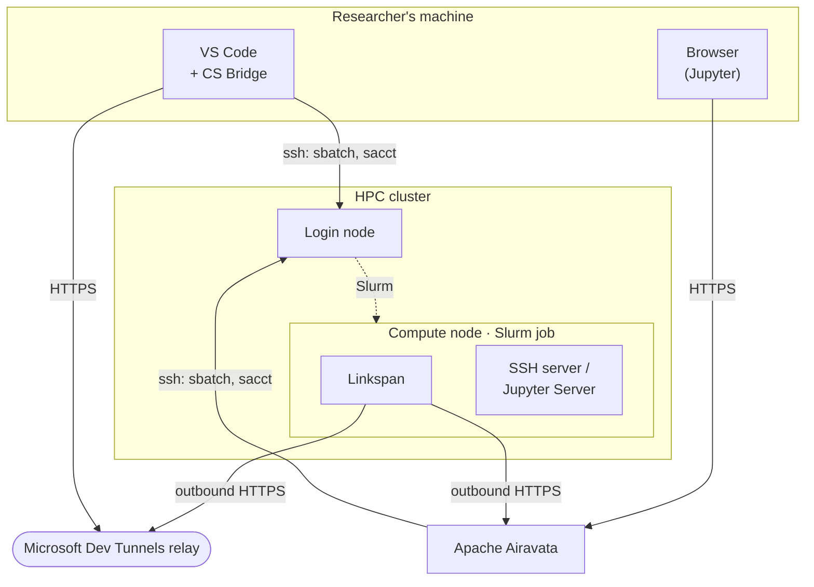
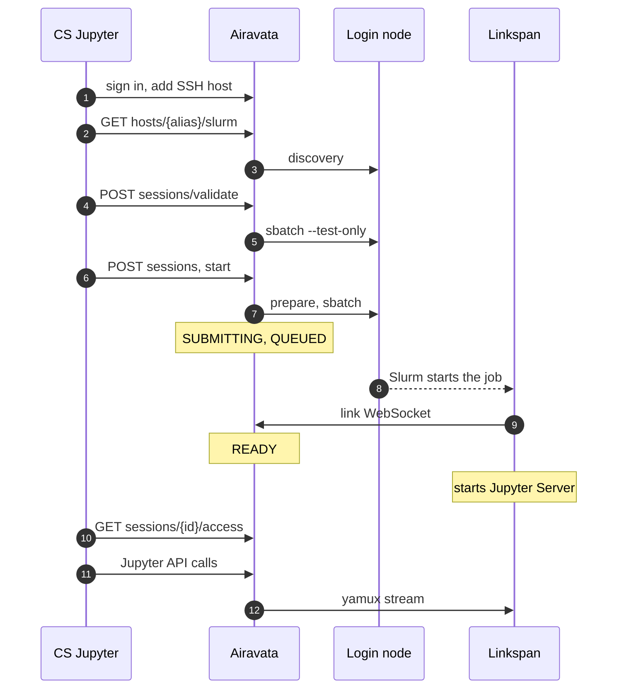

# How it works

This page follows a Cybershuttle session from a form in VS Code or JupyterLab to an editor or notebook connected to a
Slurm compute node, and assumes user-level knowledge of `ssh` and `sbatch`. The
[Introduction](./index.md#components) names the components and [Architecture](./architecture.md) states what each owns.

Five terms recur. **Airavata** is the hosted service behind CS Jupyter and CS Batch.
**Linkspan** is the agent that runs as the main process of each session job. A **transport** is the outbound
connection through which a client reaches Linkspan. A **session** is a durable definition: SSH host, Slurm account and
partition, resources, root folder and transports. It is defined once and started many times. Each start creates a
**run**: one Slurm job, numbered by `seq` from 1. The [Glossary](./glossary.md) defines the other terms.

Each arrow points from the side that opens the connection; only Slurm reaches into the compute node.

## Session sequence

Both interactive clients take a session through the same steps; they differ in who runs the login-node commands
([Credentials](#credentials)).

| Step | What happens | Where |
|---|---|---|
| 1. Discover | `sacctmgr` lists the user's Slurm accounts; `sinfo` lists partitions, CPUs, memory and GPUs | Login node |
| 2. Validate | `sbatch --test-only` runs the site's submit filter on the generated script without queueing a job | Login node |
| 3. Install | Linkspan is installed into `~/.cybershuttle/bin/` on first use; no privilege needed | The user's home directory |
| 4. Submit | `sbatch` submits a one-node, one-task job under the user's login and Slurm account | Slurm |
| 5. Start | Linkspan starts an SSH server (VS Code) or Jupyter Server (Jupyter) on `127.0.0.1` | Compute node |
| 6. Connect | Linkspan dials out to a relay; the editor or browser reaches the node through it | Outbound HTTPS |
| 7. End | **Stop** runs `scancel`, or Slurm ends the job at its walltime | Slurm |

From step 4 the job is visible with `squeue -u $USER` on the login node. It is named `linkspan-session` for VS Code
and `cs-<session id>-<seq>` for Jupyter, and writes its output under `~/.cybershuttle/logs/`. Between steps 4 and 7
the job holds its resources and is charged for them, whether or not a client is connected.

## Credentials

CS Bridge runs every Slurm command over the user's own `ssh`, while CS Jupyter and CS Batch have Airavata run them,
under the user's login for Jupyter and a cluster configuration's login for Batch. For Jupyter, Airavata keeps the SSH
connection open after the first login, so an MFA answer is given once and the connection serves later commands.
[Credentials and data](./index.md#r-credentials-and-data) summarises this per client, and
[Security model](/planning/security-model#credentials) lists every credential and where it is held.

## Transports

Compute nodes are assumed to accept no inbound connections, so Linkspan opens the connection outward and the client
meets it at a relay.

| Transport | Path | Used by | Account needed | Traffic carried by |
|---|---|---|---|---|
| Dev Tunnel | Linkspan hosts a Microsoft Dev Tunnel; the client connects through Microsoft's relay | VS Code (default), Jupyter (optional) | Microsoft (VS Code); Microsoft or GitHub (Jupyter) | Microsoft's relay; for Jupyter, also Airavata |
| Link | Linkspan opens a WebSocket to Airavata, which forwards the client's traffic over it | Jupyter (default), VS Code (experimental) | None | Airavata; on the public instance, `jupyterapi.cybershuttle.org` |

[Requirements](/planning/requirements#network-egress) lists the outbound hosts of each, and
[Architecture](./architecture.md#paths-into-a-job) the full path.

## States

A session defined through Airavata is in one of seven states, which tell where its current run stands and are shown
in [CS Jupyter](/jupyter). A run normally goes `SUBMITTING` → `QUEUED` → `STARTING` → `READY`, then `STOPPING` →
`STOPPED` on **Stop**, or straight to `STOPPED` at its walltime. [Session states](/jupyter/sessions-and-runs#session-states)
gives each state's meaning for researchers, and [Airavata sessions and runs](/operating/airavata-sessions-and-runs#states)
gives every transition and how reconciliation decides it. CS Bridge keeps its own status model; see
[CS Bridge architecture](/vscode/architecture#status-model).

## Jupyter path

The sequence and steps below trace one Jupyter session through every component. Every Airavata route is under the session server's `/api/v1`. PKCE is the OAuth sign-in flow for a client that cannot
keep a secret, such as a browser page. yamux carries many independent streams over the one link WebSocket.

### Sequence

### Steps

Cluster paths are under `~/.cybershuttle/`.

| Step | CS Jupyter | Airavata | Cluster |
|---|---|---|---|
| Sign in | PKCE with CILogon (`oauth/config`, `oauth/exchange`); tokens in `sessionStorage` | Adds the client secret; checks the ID token's signature, issuer and audience on every call | |
| SSH host | Posts the user's `ssh` command (`POST hosts`) and optionally a key uploaded under SSH Keys (`POST keys/ssh`) | Parses the command, stores the host, renders a per-user SSH config | |
| Authenticate | On `409 ssh_authentication_required`, opens a terminal over the SSH authentication WebSocket | Runs `ssh` in a PTY to establish a control master | The user answers MFA once; later commands reuse the master |
| Discover | Shows accounts, partitions and home | Runs `id -un`, `sacctmgr show associations`, `sinfo` and `printenv HOME` in one SSH call | |
| Validate | **Review Slurm job** | `sbatch --test-only` on the exact script | The site's submit filter runs |
| Define and start | `POST sessions`, then `sessions/{id}/start` | Next `seq`, fresh Jupyter and link tokens, a Dev Tunnel only if `devtunnel` is requested; `SUBMITTING` | |
| Prepare | Shows the status log | One SSH call | Linkspan installed or updated in `bin/`; `sessions/<id>/workflow.yaml` written |
| Submit | | Runs `sbatch --export=ALL` from a script on standard input that exports the tokens, keeping them out of arguments and the job script; `QUEUED` | Job queued |
| Start | Polls every second | Reconciles with Slurm every 30 seconds; `STARTING` once the job runs | The job execs Linkspan; logs go to `logs/<id>-<seq>.{out,err}` |
| Link | | `READY` when Linkspan's link connects | Linkspan dials Airavata's `…/sessions/<id>/link` WebSocket |
| Jupyter | | | Linkspan runs the workflow step `jupyter.sessions.start`: builds `jupyter-env/` with `uv`, starts Jupyter Server on a loopback port derived from the session ID and `seq` |
| Access | Requests the grant for this run and keeps it in memory only | Returns the Jupyter URI and token; refuses until `READY` | |
| Connect | Reloads with the `session` and `workspace` URL parameters set to the session ID; points JupyterLab at the proxy | Proxies REST and WebSockets over the link | |
| Use | Kernels, terminals, files | Samples Linkspan's usage every 5 seconds | Code runs on the compute node, as the user |
| Stop | **Stop** | Sets `STOPPING` and runs `scancel` on the job | Slurm cancels the job |
| End | Returns to the session home and opens the run's report in Run History | Freezes the run with its log tail and usage; fetches `sacct` accounting, retrying for up to 10 minutes | At cancellation or walltime, Linkspan gets `SIGTERM`, runs its `stop` steps and stops every server |

## CS Bridge path

CS Bridge submits the job itself over the user's own SSH. It uses a Dev Tunnel by default, or the link with the
settings `csbridge.transport: "link"` and `csbridge.experimentalFeatures: true`. Its jobs are named
`linkspan-session`, log to `~/.cybershuttle/logs/linkspan-session-<job id>.{out,err}` and run no workflow document.
Each **Start** is a new run of the same local session. With a Dev Tunnel, Airavata takes no part and records
nothing.

With the link, CS Bridge registers its job with Airavata through `attach`, which gives the run the platform
`vscode`. Airavata then carries the link and forwards, samples usage and freezes the run into history. It does
not submit, reconcile or cancel a job the client launched: an Airavata `stop` only marks the session `STOPPED`, and
CS Bridge runs `scancel` itself. [Transports](/vscode/architecture#transports) gives each step of both transports.

## Batch runs

A [CS Batch](/batch/cs-batch) run uses neither Linkspan nor a transport. Airavata's batch server copies each input
file to the cluster by SCP, renders the job script from the application's template, submits it with `sbatch` over SSH, and copies each output file
back when the job ends. [Launch sequence](/batch/cs-batch#launch-sequence) gives each step.

The batch server learns the job's state only from the e-mail Slurm sends. On a site that delivers no job e-mail, a run
is submitted but never reported as started or ended, and its outputs are not copied back; fetch them from the working
directory on the cluster. A run cannot be cancelled through Airavata; use `scancel` on the cluster.
