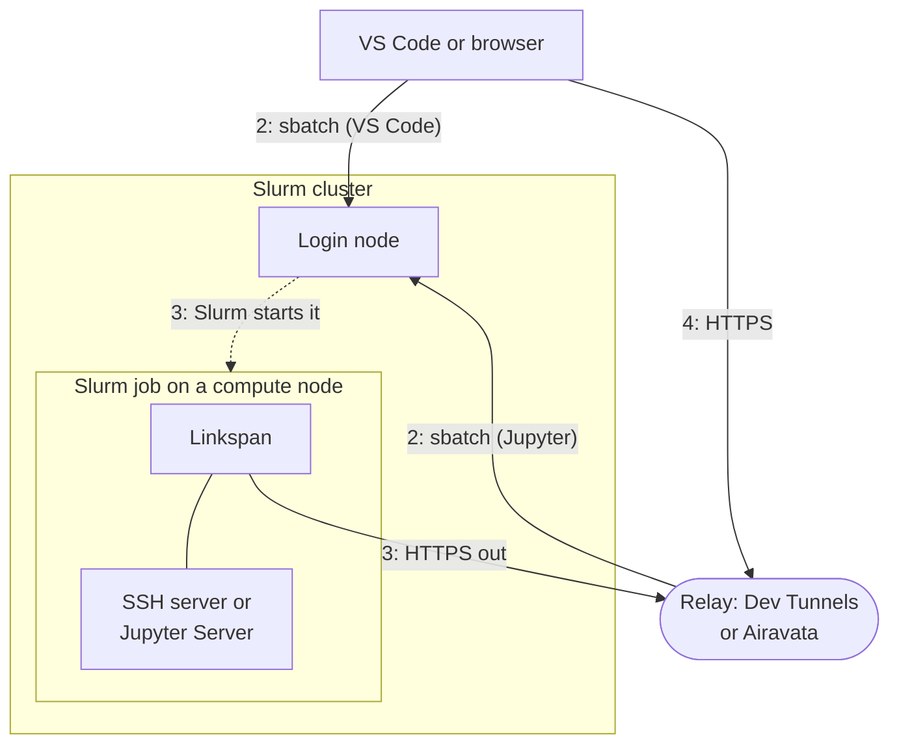

# Cybershuttle

Cybershuttle runs interactive sessions and batch jobs on Slurm clusters where a researcher already holds an account.
The researcher works from VS Code or a web browser. Cybershuttle submits the work as an ordinary Slurm job under the
researcher's cluster login and allocation, and connects the researcher's tools to it. It is based on
[Apache Airavata](https://airavata.apache.org/).

A compute node is normally reachable only from inside its cluster, and only while a job runs there. Running an
editor or notebook on one takes a job script and an SSH tunnel; Cybershuttle writes the script, submits it and makes
the connection.

The **Researcher** and **Provider** selector at the top of the page switches the material shown.

## How a session runs

Each arrow points from the side that opens the connection.

1. **Choose resources.** The researcher picks a cluster, Slurm account, partition, CPUs, memory, GPUs and walltime in
   a form. `sbatch --test-only` checks the generated script against the site's limits before anything is queued.
2. **Submit.** The script is submitted with `sbatch` over SSH under the researcher's login. For VS Code the
   researcher's machine submits it. For Jupyter, the hosted Airavata service logs in as the researcher and submits
   it.
3. **Start.** When Slurm starts the job, the job runs Linkspan, the Cybershuttle agent. Linkspan starts an SSH server
   (VS Code) or a Jupyter Server (Jupyter) listening only on `127.0.0.1`, then opens an outbound HTTPS connection to
   a relay: Microsoft Dev Tunnels for VS Code, Airavata for Jupyter.
4. **Connect.** The editor or browser reaches the server through the relay. The session lasts until **Stop**, which
   cancels the job, or until the walltime.

A batch run, launched from [CS Batch](/batch/cs-batch), the Airavata-backed portal for registered applications, uses
neither the agent nor a relay: Airavata copies the input files to the cluster, submits the job over SSH and copies the
outputs back. [How it works](./how-it-works.md) gives each step in full.

## Components

| Component | Role | Runs on |
|---|---|---|
| CS Bridge | VS Code extension; submits a session over the researcher's own `ssh` and opens a Remote-SSH window on it | The researcher's machine |
| [CS Jupyter](/jupyter) | JupyterLab whose files, kernels and terminals are on the compute node | The researcher's browser |
| Apache Airavata, the middleware | Sign-in, SSH hosts and keys, sessions, links to jobs, batch runs | A service host: the public instance, or one a centre hosts |
| Linkspan, the agent | Main process of each session job; starts the SSH or Jupyter server and connects outward | The compute node, inside the job |
| Apache Airavata Custos, the security component | A control plane for HPC operators: identity, allocation-driven accounts, SSH certificates, audit | A service host, plus extensions on cluster nodes; ongoing |

[Architecture](./architecture.md) states what each component owns, the [Glossary](./glossary.md) defines the terms, and
the [Roadmap](./roadmap.md) gives the status of each capability.

::::researcher

## Capabilities

| Capability | Choose it for | Status |
|---|---|---|
| [VS Code sessions](/vscode) | Editing, debugging and terminals on a compute node; your own `ssh` submits the job, with no Cybershuttle server involved | :status[available] |
| [Jupyter sessions](/jupyter) | Notebooks from any browser with nothing installed; Airavata logs in to the cluster for you | :status[available] |
| [CS Batch](/batch/cs-batch) | Unattended runs of a registered application from an Airavata-backed portal; files copied in and out; no cancellation | :status[available] |
| [Nextflow pipelines](/batch/nextflow-pipelines) | Pipelines launched and tracked through Airavata | :status[planned] |

The **Power user** switch at the bottom of the left sidebar adds detail most readers can skip.

## Requirements

- An account on a Slurm cluster that you reach with `ssh`, and a Slurm account (allocation) where the site requires
  one. Cybershuttle provides no cluster account, allocation or compute time.
- Compute nodes that can open outbound HTTPS connections. If a session never connects, send the host list in [Requirements](/planning/requirements#network-egress) to the site's
  support staff.
- For VS Code: VS Code 1.101 or newer, OpenSSH, a Remote-SSH extension, and a Microsoft account to create the Dev
  Tunnel, the Microsoft relay that carries the connection.
- For Jupyter and CS Batch: a current browser or HTTP client, and an identity accepted by CILogon, a federated login
  service for institutional credentials.

## Credentials and data

| Client | Cluster login | Session traffic |
|---|---|---|
| [VS Code](/vscode#credentials-and-data) | Your own `ssh` and keys, which stay on your machine | Through Microsoft's relay, inside SSH encrypted between your machine and the node |
| [Jupyter](/jupyter#credentials-and-data) | Airavata logs in as you, with an SSH key you upload or a password or MFA prompt you answer in the browser | Through Airavata, which can read it |

A [CS Batch](/batch/cs-batch#sign-in-and-sharing) run is submitted by Airavata under the login and SSH key of a
cluster configuration, which its owner may share.

On the cluster, the agent and everything it starts run as you; the agent writes its own files only under
`~/.cybershuttle`.

## Charging and limits

A session or batch run is an ordinary Slurm job. The site's partition limits, QOS and submit filters apply, and the
chosen Slurm account is charged until **Stop** or the walltime. Closing the window or tab does not stop the job.

Start with [Getting started](/vscode/getting-started) for VS Code or [Getting started](/jupyter/getting-started) for
Jupyter.

::::

::::provider

## Footprint

Each Cybershuttle job is an ordinary Slurm job of a cluster account, under the site's policies, limits and accounting.
Sessions run on compute nodes, not login nodes. The site installs nothing and opens no inbound port.

| Question | Answer | Detail |
|---|---|---|
| What runs on the cluster | Sessions: one-node, one-task jobs running Linkspan unprivileged as the researcher, writing only under `~/.cybershuttle`. Batch runs: jobs under a cluster configuration's login, which its owner may share | [Resource providers](/planning) |
| What crosses the boundary | In: SSH to the login node, from the researcher's machine (VS Code) or Airavata (Jupyter, batch). Out: HTTPS from compute nodes to the Dev Tunnels relay or Airavata | [Requirements](/planning/requirements) |
| What Airavata holds | Jupyter: uploaded SSH private keys and an open SSH connection as the user. Batch: cluster configurations' keys. VS Code: nothing by default | [Cluster security](/planning/cluster-security) |
| What the site can see and stop | Marked by job names, the `linkspan` process and `~/.cybershuttle` paths; limited or blocked by `scancel`, QOS, submit filters and egress rules | [Visibility and control](/operating/visibility-and-control) |
| What the site runs | Nothing, with the public Airavata instance; a centre may host its own | [Hosting Airavata](/setting-up/hosting-airavata) |

Apache Airavata Custos, the security component, is our view of what a control plane for HPC operators should look
like. It applies ACCESS allocation decisions to a cluster as POSIX accounts, Slurm associations, revocation, charging and
audit. Its development is ongoing, with no hosted deployment.
[Managing allocations](/planning/managing-allocations) lists its functions and what is unimplemented.

Start with [Resource providers](/planning), which lists the pages by stage: planning, setting up and operating.

::::

## Project

[Project and funding](./project-and-funding.md) gives the project's awards, objectives, research codes and
publications, and how to cite it.
