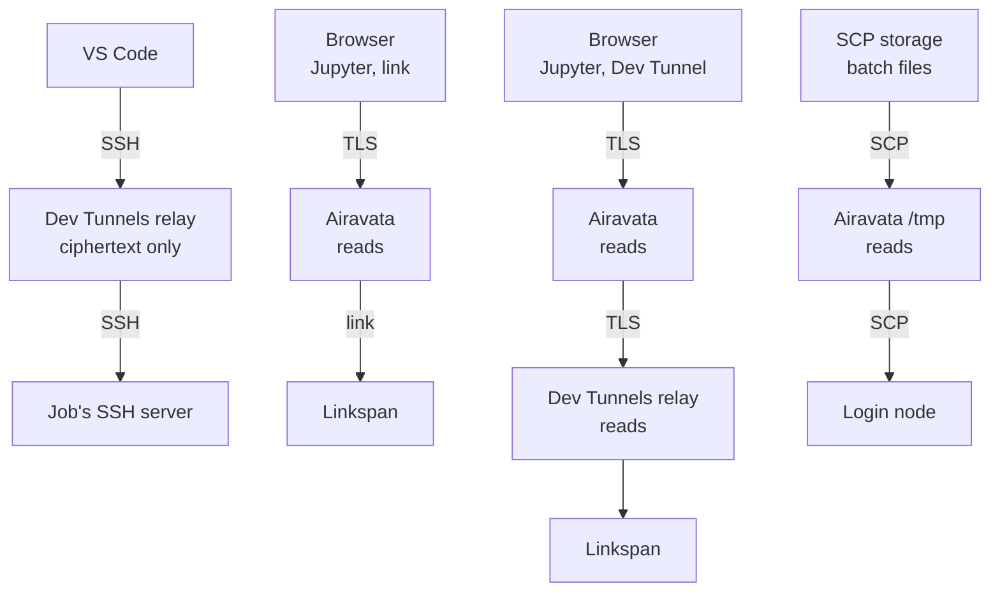

# Cluster security

This page states what Cybershuttle runs on compute nodes, what Airavata holds and can do on the cluster, and who can
read session traffic. Each statement can be checked on a test session with the commands in
[Verify the setup](../setting-up/preparing-the-cluster.md#verify-the-setup). The [Security model](./security-model.md)
explains trust boundaries and credentials across components; the [Linkspan](/batch/linkspan-architecture#security)
page gives Linkspan's detail.

## Compute nodes

Each session is a Slurm job whose script runs `~/.cybershuttle/bin/linkspan` as the submitting user. Linkspan starts
the session's server (SSH for VS Code, Jupyter Server for Jupyter) and holds the outbound connection to it. A batch run
places nothing of Cybershuttle's on a compute node.

| Item | Detail |
|---|---|
| Privilege | None; Linkspan and everything it starts run as the job's user, inside the job |
| Files | Only under `$HOME/.cybershuttle`; CS Bridge also installs the VS Code server in `/tmp/cs-vscode/<session id>` |
| Listeners | `127.0.0.1` only: Linkspan's control API and the servers it starts. Traffic from off the node arrives only over the outbound connection |
| Downloads | Linkspan, uv, Python, PyPI packages, `ttyd` and the `devtunnel` CLI; checked only by HTTPS, with no checksum or signature |

A binary already under `~/.cybershuttle/bin` is not fetched again, except Linkspan, which CS Bridge and Airavata
replace when a newer release is published.

## Known limitations

Both limitations expose a session to other users of the same compute node while its job runs; neither is reachable
from another node or from outside the cluster.

| Limitation | Effect | Mitigation |
|---|---|---|
| Linkspan's control API has no password | Another user on the node can call it, for example to start an SSH server that admits their key, and so run commands as the job's user | Whole-node or `ExclusiveUser=YES` allocation for sessions; see [Node sharing](../setting-up/preparing-the-cluster.md#node-sharing) |
| The Dev Tunnel host token is an argument of `devtunnel host`, the only form that CLI documents | Visible in `ps` to other users on the node | As above, or `/proc` mounted with `hidepid=2`; the token is scoped to one tunnel and one run |

Neither client requests `--exclusive`, so the exposure follows the partition's sharing policy.

## Airavata

Airavata, the public instance or one a centre [hosts itself](../setting-up/hosting-airavata.md), runs off the cluster
and acts on it only over SSH to the login node, with what it holds:

| Client | Airavata holds | Consequence for the cluster |
|---|---|---|
| Jupyter | The user's uploaded SSH private key; an SSH connection to the login node, kept open after MFA | While the connection is open, Airavata can run commands on the cluster as the user |
| Batch runs | The SSH private keys of cluster configurations and data storages | Runs log in as the configuration's login user; everyone it is shared with submits as that user, charged to its allocation |
| VS Code | Nothing, unless the experimental link transport is on | The researcher's own SSH login submits the job; CS Bridge keeps a per-session key on the researcher's machine |

How long Airavata can act as a Jupyter user depends on the login node's policy:

| Login node accepts | Airavata can act |
|---|---|
| The uploaded key alone | For as long as the key is stored |
| The key plus a password or second factor | Only over the connection the user opened in a browser terminal |

The connection is kept open so the user answers MFA once; it closes after three missed 15-second keep-alives or when
the server restarts. Over either connection Airavata runs only the commands listed in
[Requirements](./requirements.md#login-node), as constant scripts that take validated arguments. It starts no
long-lived process on the login node.

Uploaded keys are files of mode `0600` on the Airavata host; batch keys are plain text in the batch server's database
(see [known gaps](./security-model.md#batch-known-gaps)). To revoke Airavata's access, either side can act:

| Who | Action |
|---|---|
| User | Delete the key from Airavata, or remove its public half from `~/.ssh/authorized_keys` |
| Centre | Remove that `authorized_keys` line, or refuse the Airavata host's address at the login node |

An open SSH connection outlives the removal of its key. To cut it at once, end the user's `sshd` processes from the
Airavata host's address.

Custos, the security component, issues short-lived SSH certificates that a centre can accept in place of long-lived
keys; see [SSH login extensions](./managing-allocations.md#ssh-login-extensions).

## Data paths

Session traffic travels over Linkspan's outbound connection, not through the login node. A node marked **reads** sees
the content in clear.

| Client | Traffic | Readable by |
|---|---|---|
| VS Code | SSH from the researcher's machine to the job's SSH server, through the Dev Tunnels relay | The endpoints only; the relay carries ciphertext |
| Jupyter, link transport (default) | TLS to Airavata, then the link to the node | Airavata, where the browser's TLS ends |
| Jupyter, Dev Tunnel | Airavata, then Microsoft's relay | Airavata and the relay, where the tunnel's TLS ends |
| Batch runs | Input and output files by SCP, each copied through a temporary file on the Airavata host | Airavata |

## Reporting a vulnerability

Use the **Security** tab of the affected repository under [cyber-shuttle](https://github.com/cyber-shuttle); report
batch-server issues through the [Apache Software Foundation's security process](https://www.apache.org/security/).
