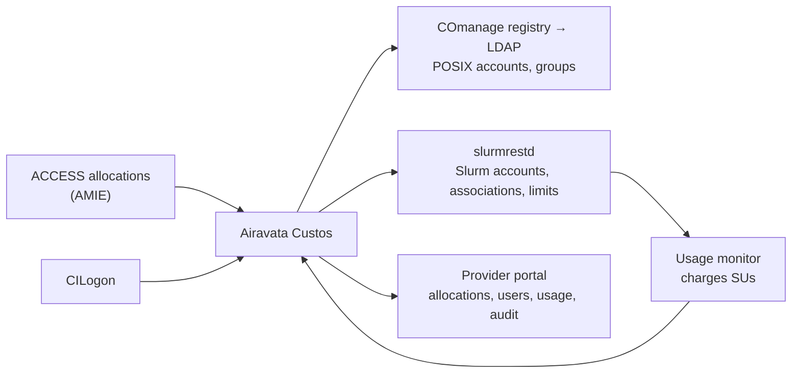

# Managing allocations

This page is for allocations and user-support staff: what Apache Airavata Custos, Cybershuttle's security component,
would take over from a centre's account process and what would stay manual. Without it, sessions and batch runs use
the accounts and Slurm associations the centre's own process creates.

[Custos](https://github.com/apache/airavata-custos) is our view of what a control plane for HPC operators should look like. Operators decide who may use a cluster and on which
allocation. Custos records those decisions, takes them from their source, such as ACCESS, and applies them to each
cluster as POSIX accounts, Slurm accounts and associations, usage charges and SSH login.

It is architected as that control plane. One server holds the desired state: users, projects, allocations, their members and cluster accounts. Connectors apply
that state through systems the centre already runs (the ACCESS allocation feed, COmanage and LDAP, `slurmrestd`).
Extensions on login nodes admit SSH logins, and the Slurm connector's reconciler repairs drift in associations. Each
cluster keeps running on its own services and stays in step with the operators' decisions.

:status[development] Implemented and tested on `master`; only development deployments exist.

Custos is designed as a single shared instance, like CILogon, that records each researcher's accounts across
participating clusters.

The diagram shows where Custos takes its decisions from, the services it acts through and its portal.

Custos changes a cluster only through services the centre runs and exposes to it:

| Service | Custos manages through it |
|---|---|
| COmanage registry, publishing to LDAP | POSIX accounts and groups |
| `slurmrestd` | Slurm accounts, associations and limits; reads job records |

The optional CILogon PAM module is the one part installed on login nodes. [Connecting Custos](../setting-up/connecting-custos.md)
covers running it.

## Implemented functions

| Function | Implementation |
|---|---|
| Sync allocations from ACCESS | Polls AMIE every 30 seconds; handles project and account create, inactivate and reactivate, user modify and person merge; replies to AMIE |
| Track projects and allocations | Projects with PI, co-PI and allocation-manager roles; compute allocations with an SU budget and a start and end date; per-member caps and resource overrides; change requests with an approval history |
| Provision POSIX accounts | Creates the person, a per-user group with a GID, and a Unix cluster account in COmanage, which publishes them to LDAP; cluster administrators are added to an admin group |
| Provision Slurm access | Through `slurmrestd`: one Slurm account per allocation, one association per member, with `GrpTRES` and `GrpTRESMins` limits from the member's caps |
| Revoke access | When a membership or allocation ends, removes the association, so a Slurm that enforces associations refuses the member's new jobs. Running jobs are not cancelled; the Slurm account is kept for job history |
| Stay consistent | A reconciler compares Slurm with Custos at start and every 5 minutes, writes missing associations and removes stale ones, repairing provisioning events lost to a restart or a failed call |
| Charge usage | Reads finished jobs every 30 seconds; charges `billing` TRES × hours × the resource's rate, in SUs, to the job's allocation. A job that ends outside every rate period is not charged |
| Report | Per-allocation usage summaries and job lists; Prometheus metrics and a Grafana dashboard for AMIE traffic |
| Audit | Administrative actions recorded with trace IDs, readable through the API and the portal |
| Link identities | One person may hold several identities (ACCESS, CILogon, COmanage and others); duplicates can be merged |

Usage charging needs `TRESBillingWeights` and `PriorityFlags=MAX_TRES` on the partitions. Without them `billing` is
the CPU count, and memory and GPU use go uncharged.

Sign-in to Custos is OpenID Connect, with CILogon as the intended issuer. Roles separate researchers, allocation managers, portal administrators and cluster administrators.

## SSH login extensions

Two optional extensions replace long-lived SSH keys for login to the cluster. The centre installs them.

| Extension | Function | Status |
|---|---|---|
| SSH certificate signer | Issues short-lived OpenSSH user certificates from a per-tenant Ed25519 CA held in Vault; policy on lifetime, key types and principals; an issuance log | Implemented as a service separate from the rest of Custos; revocation is recorded but not enforced through a revocation list |
| CILogon PAM module | `ssh` login by a CILogon device-code sign-in instead of a password or key; an Ansible playbook enrols RHEL 9 and 10 nodes with SSSD against the COmanage LDAP | Implemented |

## Known gaps

A centre running Custos today still acts by hand at these points.

| Gap | Effect |
|---|---|
| Removing accounts from COmanage when access ends | Slurm associations are revoked; the POSIX account remains until COmanage marks the person inactive |
| Multiple clusters per deployment | Onboarding a user outside an allocation works only with exactly one cluster registered |
| Durable event delivery | Provisioning events are in memory; the reconciler covers Slurm, not COmanage |
| Retrying and resolving failed AMIE packets from the portal | Returns "not implemented"; handled by operators |
| Checking `email_verified` when linking a new sign-in to an invited user | Not checked; a new sign-in links to the invited user whose e-mail matches the token's |
