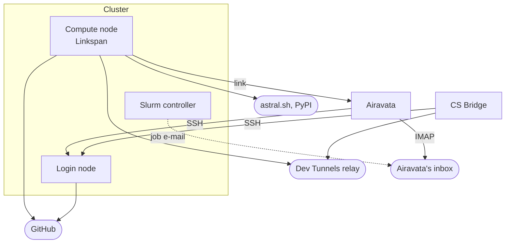

# Requirements

This page lists what a Slurm cluster must provide for Cybershuttle. The centre installs nothing: CS Bridge and Airavata download Linkspan into each user's home directory on first use, and
everything runs as that user.
[Preparing the cluster](../setting-up/preparing-the-cluster.md) shows how to meet each requirement and
[verify it](../setting-up/preparing-the-cluster.md#verify-the-setup).

CS Bridge is tested on the clusters in [Tested clusters](/vscode/architecture#tested-clusters). [CS Jupyter](/jupyter) and batch runs have no list of tested clusters.

The figure shows every connection that crosses the cluster's boundary. Each arrow points from the side that opens the
connection; none points into a compute node. Unlabelled arrows are HTTPS; the **link** is the WebSocket that Linkspan
dials to Airavata, which the Jupyter client uses by default.

## Login node

Cybershuttle drives Slurm from the login node over SSH. For interactive sessions, CS Bridge and Airavata's session
server log in as the user and run the commands below; a missing command fails the step that uses it.

| Command | Used for |
|---|---|
| `sacctmgr` | Listing the user's Slurm associations |
| `sinfo` | Listing partitions, CPUs, memory and GPU GRES |
| `sbatch` | Validating (`--test-only`) and submitting |
| `squeue`, `sacct` | Job state and accounting |
| `scancel` | Stopping a session |
| `srun --overlap` | Sampling usage in a running job (VS Code, when the tunnel is not attached) |
| `curl`, `tar`, `base64`, `od`, `install`, `printenv`, `sed`, `sort -V`, standard POSIX tools | Installing Linkspan and writing job files |

Where `/usr/local/etc/project.map` exists, as on TACC systems, CS Bridge reads it to spell Slurm account names as the
site's submit filter expects. Airavata runs these commands without a login profile, so they must be on the `PATH` of a
non-interactive shell; [Accounts and SSH login](../setting-up/preparing-the-cluster.md#accounts-and-ssh-login) gives the
check, what batch runs need and how each login authenticates.

## Compute nodes

A session job runs Linkspan, which starts the SSH or Jupyter server and takes usage readings. Batch runs need nothing
on compute nodes beyond what the application itself uses.

| Requirement | Needed for |
|---|---|
| Linux on `x86_64` or `arm64` | Running Linkspan; no other architecture is released |
| `$HOME` shared with the login node | Running Linkspan and job files installed from the login node; reading the job's logs there |
| A writable `$HOME` | Everything under `$HOME/.cybershuttle`; with a full quota the job exits before Linkspan starts |
| `curl` | Installing uv for Jupyter |
| cgroup v2 | CPU and memory readings; optional, empty without it |
| `nvidia-smi` | GPU readings; optional, empty without it |

## Network egress

No inbound port to a compute node is needed. Apart from job e-mail, every connection from the cluster is outbound HTTPS
(TCP 443), so an allowlist of these names suffices.

| From | To | For |
|---|---|---|
| Login node | `github.com`, `release-assets.githubusercontent.com` | Downloading Linkspan |
| Compute node | `jupyterapi.cybershuttle.org` | The link transport (Jupyter default) |
| Compute node | `*.devtunnels.ms`, `*.rel.tunnels.api.visualstudio.com`, `tunnelsassetsprod.blob.core.windows.net` | The Dev Tunnel transport (VS Code default) |
| Compute node | `release-assets.githubusercontent.com`, `github.com`, `astral.sh`, `pypi.org`, `files.pythonhosted.org` | Building the Jupyter environment on first use |

`jupyterapi.cybershuttle.org` is the public Airavata instance; a centre that
[hosts its own](../setting-up/hosting-airavata.md) allows its own public name instead. Airavata also
reaches each login node on its SSH port.

CS Bridge and Airavata check GitHub for the latest Linkspan release before each start. When GitHub is unreachable they
keep an installed `~/.cybershuttle/bin/linkspan` of version 0.22.0 or newer; with none installed, the
start fails.

Compute nodes need direct egress or NAT; the link transport ignores `HTTPS_PROXY`.
[Network egress](../setting-up/preparing-the-cluster.md#network-egress) gives the check.

## Job e-mail

Batch runs only. Airavata's batch server learns a job's state only from Slurm's job e-mail, not from `squeue` or
`sacct`. Every batch job script sets:

| Option | Value |
|---|---|
| `--mail-user` | The batch server's mailbox, a Gmail inbox it reads over IMAP |
| `--mail-type` | `BEGIN`, `END`, `FAIL`, `REQUEUE`, `INVALID_DEPEND`, `STAGE_OUT` and the `TIME_LIMIT` events |

Slurm's `MailProg` must deliver job e-mail to external addresses. Without it, runs are submitted but never reported as
started or ended, and their outputs are not copied back.
[Job e-mail for batch runs](../setting-up/preparing-the-cluster.md#job-e-mail-for-batch-runs) gives the steps.
