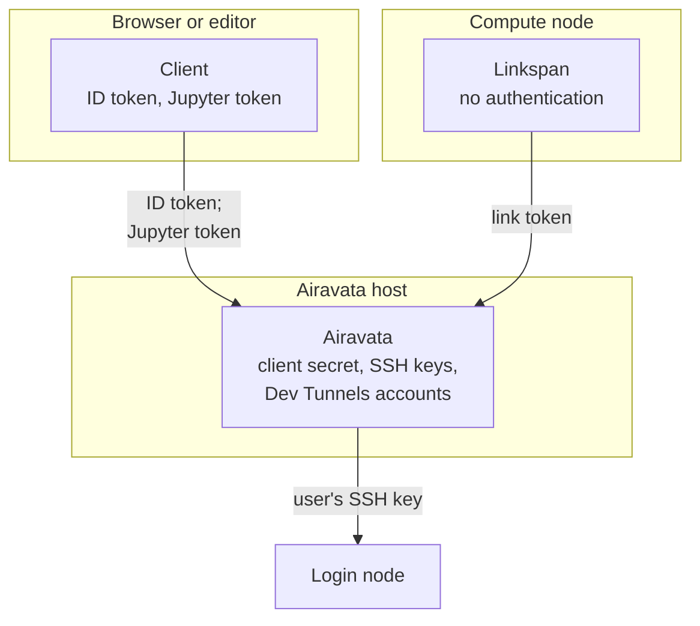

# Security model

This page explains how Cybershuttle decides who may reach what, for a security officer assessing the service, an
operator assessing a deployment, and a developer changing a trust boundary.

[Cluster security](./cluster-security.md) is the provider summary, with limitations and mitigations.
[CS Jupyter](/jupyter) and Linkspan document their own details: [CS Jupyter security](/jupyter/security) and
[Linkspan security](/batch/linkspan-architecture#security).

Two ideas carry the model:

- Airavata holds the long-lived secrets: the CILogon client secret, users' SSH keys and Dev Tunnels accounts. It
  hands each run only per-run tokens, so a token leaked from a job opens that one run and dies with it.
- Linkspan authenticates nothing itself. Every path from off the node goes through a transport that Airavata or the
  Dev Tunnels service guards; the node's own users are kept out only by how the node is shared.

The session server states its rules as invariants in `docs/ARCHITECTURE.md` of its repository, and Linkspan in its
`SECURITY.md`. The batch server's rules are read from its code, in `internal/auth` and `internal/server`.

## Trust boundaries

The diagram shows where a session's credentials live and which credential each connection presents.

| Boundary | Guarded by |
|---|---|
| Client → Airavata | CILogon ID token as `Authorization: Bearer`, issuer and audience pinned; exact allowed origins; no cookies |
| Client → running session | The run's Jupyter token, returned by `/access` to the owner once the run is `READY` |
| Linkspan → Airavata | The run's link token, as the WebSocket subprotocol `link.<token>`, compared in constant time |
| Airavata → cluster | The user's uploaded SSH key and a control master the user opened interactively |
| CS Bridge → cluster | The user's own `~/.ssh/config` and keys; a per-session ed25519 key for the job's SSH server |
| Anything → Linkspan | Reaching its loopback port or `0600` socket; access control lives in the transport |
| Client → batch API | CILogon access token, which the batch server introspects at CILogon; writes need a platform role or ownership |

With no cookies, a page must hold the token to send it; the origin check keeps pages on other sites from calling the
API. A request without an `Origin` header counts as a native client and still needs its token.

A browser cannot set an `Authorization` header on a WebSocket, so WebSocket routes take tokens as subprotocols:
`bearer.<base64url>` for the ID token and `capability.<token>` for the Jupyter token on the forward route. The Jupyter
proxy also takes `?token=` or `Authorization: token`.

## Credentials

The table lists every credential and where it is held; a compromise of that place yields it. The first five outlive a
session; the rest are minted per run or per session.

| Credential | Minted by | Held by | Lifetime |
|---|---|---|---|
| CILogon client secret | CILogon | Airavata environment (`CS_OIDC_CLIENT_SECRET`) | The deployment |
| ID and refresh tokens | CILogon | CS Jupyter `sessionStorage`; CS Bridge `SecretStorage`; the refresh token is exchanged through `oauth/refresh` | The ID token's `exp`; issuer policy for the refresh token |
| SSH private keys | The user | Airavata, files of mode `0600`; never returned by the API | Until deleted |
| Dev Tunnels account | Microsoft or GitHub | Airavata, sealed with `nacl/secretbox` | Refreshed on use |
| Microsoft account | Microsoft | VS Code's `microsoft` authentication provider | VS Code policy |
| Jupyter token | Airavata, per run | Airavata credential file; job environment (`JUPYTER_TOKEN`); the client | The run |
| Link token | Airavata, per run | Airavata credential file; job environment (`LINKSPAN_LINK_TOKEN`); an attaching client | The run |
| Dev Tunnel host token | Dev Tunnels service | Job environment (`LINKSPAN_TUNNEL_HOST_TOKEN`); the `devtunnel host` command line | The Dev Tunnel |
| Per-session SSH key | CS Bridge | `ssh_keys/` in VS Code's extension storage on the user's machine | The session |

The host token's exposure on the `devtunnel host` command line is listed under [Known limitations](./cluster-security.md#known-limitations).

## Airavata servers

Airavata's two servers have separate identity checks, stores and boundaries; a centre that runs only one takes on only
that server's column.

| | Session server | Batch server |
|---|---|---|
| Accepted token | CILogon ID token (a JWT), validated locally | CILogon access token, introspected at CILogon on each request; or the root token |
| User identity | `sub` under tenant `cilogon` | `cilogon:<id>` from the token's username |
| Privileges | None beyond ownership | `SUPER_ADMIN`, `ADMIN`, `USER` from the `user_roles` table |
| Listens on | Loopback only; TLS at the reverse proxy | All interfaces, plain HTTP |
| Cluster credential | The user's uploaded key or interactive login, through OpenSSH | An SSH key stored in Postgres, through Go's SSH client |

## Session server

### Trust boundaries \{#session-trust-boundaries\}

Each rule is enforced in the server's code; none is a deployment setting.

| Boundary | Rule |
|---|---|
| Loopback only | `serve` refuses a non-loopback listen address before binding, because it speaks plain HTTP; TLS is the reverse proxy's job |
| Exact origins | `security.Origins` covers the bearer boundary, the Jupyter proxy and the forward and link upgrades. A present `Origin` must be allowlisted; an absent one is a native client, except on `oauth/config` and `oauth/exchange`, which require one |
| One bearer, one identity authority | The ID token is validated against the issuer's discovery document and JWKS, with the issuer and audience pinned; its `sub` names the principal under tenant `cilogon` |
| Ownership | Every session, log tail, run, SSH host, SSH key and Dev Tunnels account is scoped to the principal |
| No ambient authentication | No cookies and no static files. Only the Jupyter proxy takes its token in the URL, as Jupyter clients require |
| Token routes | Outside the bearer boundary are only the sign-in routes and the token routes: forward and Jupyter proxy by Jupyter token, link by link token. Token comparisons are constant-time |
| Sign-in | The client secret is held and never returned; `redirectUri` must be on an allowed origin; issuer errors are not echoed |
| Dev Tunnels broker | Device codes stay in bounded process memory; polling intervals are enforced; no response carries the account's token |
| OIDC key refresh | Coalesced and outside the cache lock; an unknown `kid` forces at most one refresh per 30 seconds |
| Validation precedes construction | Aliases, scheduler values, node names, paths, Dev Tunnel metadata and ports are validated before reaching a command line or state; remote scripts are constants that take arguments, so user input never becomes script text on the login node |
| Proxying | Forwards only to ports Linkspan serves, including its control port; opens no port forward on the SSH host. The Jupyter token that opens a forward already grants code execution as the user, so the control port adds no power |
| Per-user execution | Every cluster command runs through the user's own SSH configuration and key (`ssh -F <that user's file>`). Control masters are keyed by configuration and alias, so one user's login never serves another. The service account's `~/.ssh/config` is ignored |

### Secrets and redaction

The OIDC client secret is held only in process memory, from `CS_OIDC_CLIENT_SECRET`. The rest live here:

| Secret | Where it lives | Lifetime |
|---|---|---|
| Jupyter token | `credentials/<id>-<seq>.token`; job environment `JUPYTER_TOKEN`; the `/access` response | Until the run is frozen, stopped or deleted |
| Link token | The same file; job environment `LINKSPAN_LINK_TOKEN`; the `attach` response | Same |
| Dev Tunnel connect token | The same file | Same |
| Dev Tunnel host token | Job environment `LINKSPAN_TUNNEL_HOST_TOKEN`; the `attach` response; not stored | The Dev Tunnel's lifetime |
| Dev Tunnels account tokens | `hosts/<principal>/devtunnels-account`, sealed with `nacl/secretbox` under `devtunnels-account.key` | Refreshed within two minutes of expiry |
| SSH private keys | `hosts/<principal>/keys/<id>`, mode `0600`; never returned | Until deleted |

Paths are under the state directory `~/.cybershuttle/control`, created at mode `0700`. Whoever can read it, or a
backup, holds every secret above; protect both as credentials.

Job secrets reach `sbatch` through its environment, never its argument list, so they stay out of the login node's
process list; see
[job environment](../operating/airavata-sessions-and-runs.md#job-environment).

Dev Tunnels OAuth, host, connect, link and Jupyter tokens are redacted from errors, logs, scripts and responses,
outside the places listed above; the link token reaches the `attach` response only for a client-launched run. Log
tails additionally drop `#!` and `#SBATCH` lines and mask secrets; [Logs](../operating/airavata-sessions-and-runs.md#logs) lists the patterns.

### Known gaps

These are open at the commit recorded in [Compatibility](../operating/compatibility.md). The first two have a mitigation the centre or operator applies; the rest
have none outside the code.

| Gap | Detail |
|---|---|
| Shared compute nodes | Jobs are not `--exclusive`, so any user on the node can reach Linkspan's loopback control port; see [Linkspan security](/batch/linkspan-architecture#access-control). The partition's sharing policy is the mitigation; see [Node sharing](../setting-up/preparing-the-cluster.md#node-sharing) |
| `ForwardAgent` in pasted commands | On the `-o` allowlist, and child `ssh` processes inherit the server's environment, so a user's host could receive the service account's agent. Mitigation: run the server without `SSH_AUTH_SOCK` |
| Dev Tunnel access | The create request sets no access-control entries; anonymous access depends on the Dev Tunnels service's default |
| Health checks | A health check opens a TCP connection to the host a user registered. Only public addresses are dialled, so it cannot probe the server's network, but carrier-grade NAT (`100.64.0.0/10`) is not excluded |
| `--linkspan` | Names the Linkspan path on SSH hosts; an unsafe value silently falls back to the default instead of failing |
| Client-launched runs | A `vscode` run whose client cancels the job without calling `stop` stays `READY`, since the server never observes it |

## Batch server

### Trust boundaries \{#batch-trust-boundaries\}

The batch server checks identity per request and leaves authorization to each service method; a route is protected
only where its method checks.

| Boundary | Rule |
|---|---|
| Bearer validation | A present token is either the root token (constant-time comparison) or introspected at CILogon; a rejected token is `401`, an unreachable CILogon `502` |
| Authorities | Read from `user_roles` by user ID, never from the token |
| Anonymous reads | Catalogue reads (clusters, partitions, templates, deployments) need no token |
| Owned resources | SSH keys, cluster configurations, data storages, data products and processes belong to their creator; `/ssh-keys/{id}` is readable by its owner only, admins included |
| Sharing | A cluster configuration shared with a user or group at `READ` lets them run processes under it, as its login user with its SSH key |
| Launch | Only the process owner or an admin may launch; a second launch is `409` |
| Job script | Values containing a line break are refused before they reach an `#SBATCH` line; the working directory is shell-quoted |

### Known gaps \{#batch-known-gaps\}

Because of these gaps, run the batch server only behind a TLS proxy, on a host and database that few can read, with
its defaults changed. [Airavata configuration](../setting-up/airavata-configuration.md#batch-server-configuration)
lists the settings named below.

| Gap | Detail |
|---|---|
| SSH keys stored in plain text | `ssh_keys.private_key` and `ssh_keys.passphrase` are ordinary Postgres columns. Never returned in a response, but anyone who can read the database or a backup holds every user's cluster key |
| Host keys not verified | Every SSH and SCP connection uses `ssh.InsecureIgnoreHostKey()`, so a machine that intercepts the connection receives the submission, the staged files and a login with the user's key |
| Processes readable by anyone | `GET /api/v1/processes/{id}` and `GET /api/v1/processes?deploymentId=…` carry no authorization; any caller, without a token, reads any process with its batch section and job statuses |
| Bootstrap root token | Enabled by default. Printed to standard output at every start; authenticates as `root` with `SUPER_ADMIN`, bypassing CILogon; a fresh UUID each start unless `AIRAVATA_ROOT_ACCOUNT_TOKEN` pins it. Whoever reads the service's log holds it. Turn it off with `AIRAVATA_ROOT_ACCOUNT_ENABLED=false` once CILogon is configured |
| Plain HTTP on all interfaces | The server listens on `:<SERVER_PORT>` without TLS; bearer tokens need a TLS proxy in front |
| Permissive defaults | CORS `*` echoes any origin with credentials allowed, unless `AIRAVATA_CORS_ALLOWED_ORIGINS` lists origins. The database password defaults to `123456` with `sslmode=disable`, unless `AIRAVATA_DB_PASSWORD` and `AIRAVATA_DB_SSLMODE`, or `AIRAVATA_DB_DSN`, are set |
| Files on the server | Each job script is written to `/tmp/<process id>.slurm` with mode `0644` until submission ends; staged files pass through `/tmp` |
| Mail-driven status | Any message in the inbox whose subject matches Slurm's format records a status on the process its job name names; an `END` or `FAIL` subject starts output staging. Neither sender nor job ID is checked, so anyone who can mail the inbox and knows a process ID can do this |

## Reporting a vulnerability

Report session-server issues privately through the **Security** tab of
[`cyber-shuttle/cs-plane`](https://github.com/cyber-shuttle/cs-plane/security), not the issue tracker. Report
batch-server issues through the [Apache Software Foundation's security process](https://www.apache.org/security/).
