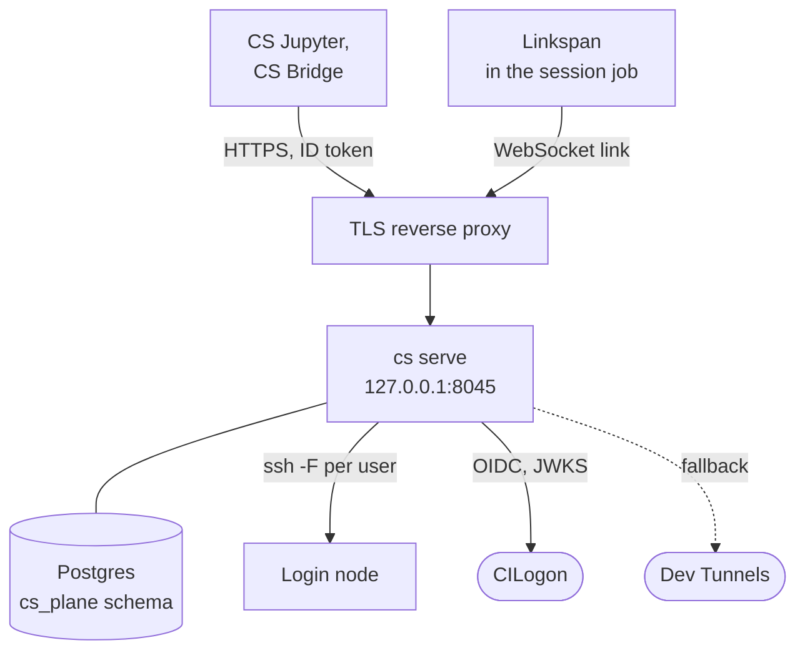
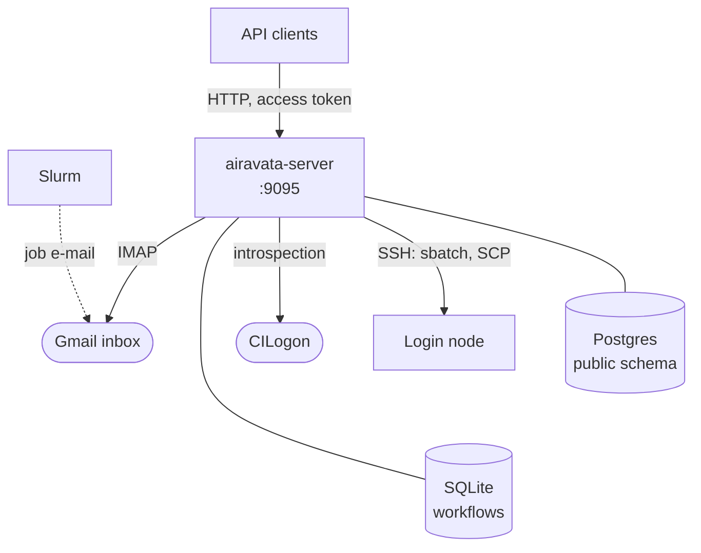
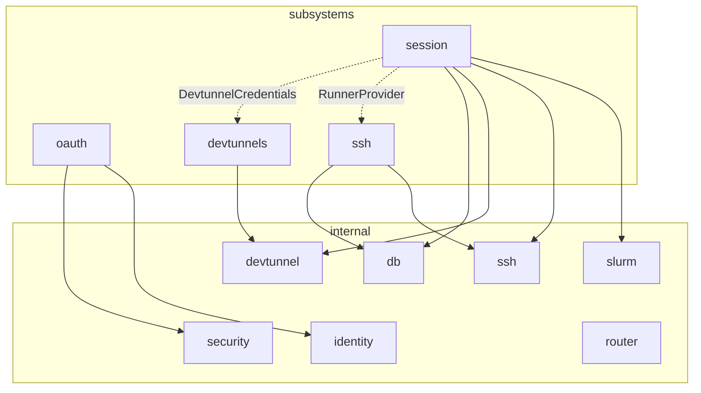
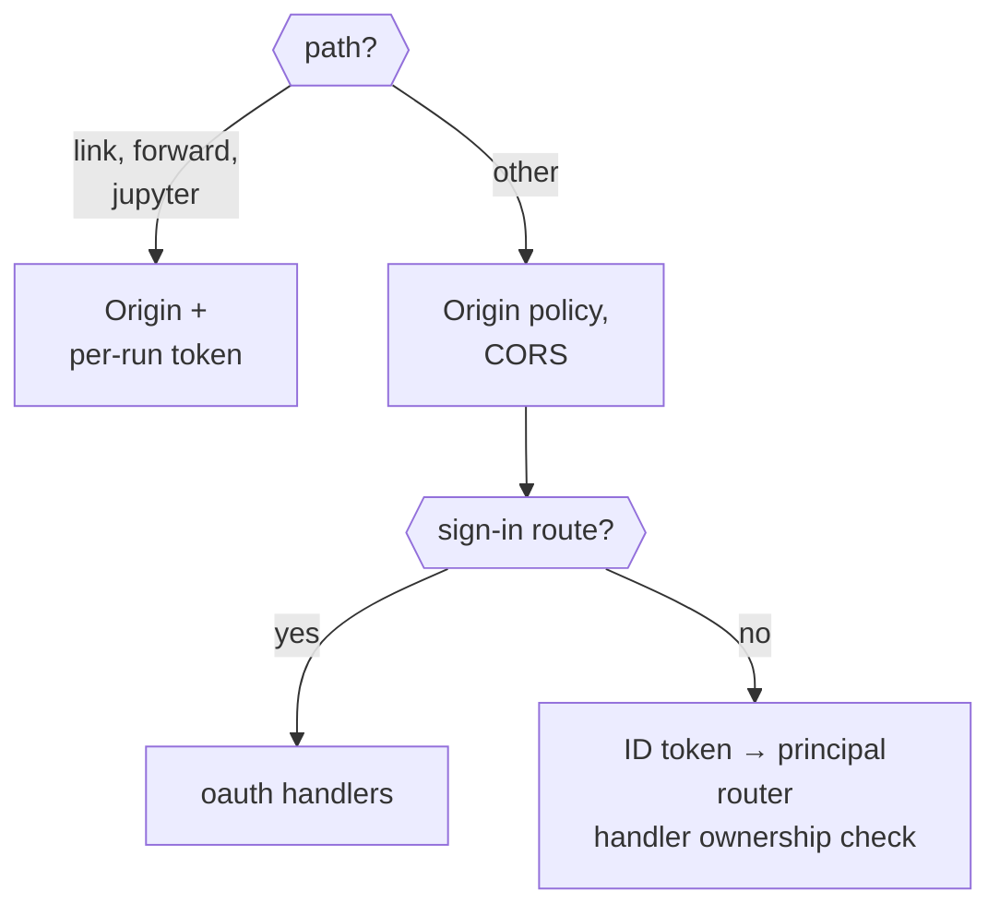
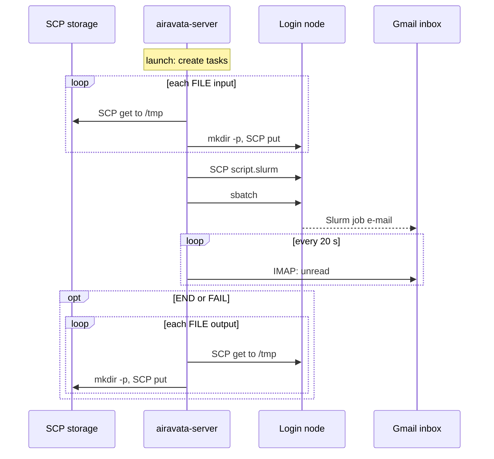

# Airavata architecture

Apache Airavata is Cybershuttle's server side. It signs users in through CILogon, keeps each
user's cluster access (SSH hosts and keys), and runs work on Slurm clusters as that user.

This page is for the administrator who hosts Airavata or audits an instance, and for its developers; it assumes
familiarity with Slurm, SSH and OAuth. [Architecture](/overview/architecture) places Airavata among the other
components.

Airavata is two Go programs, the **session server** (`cs serve`) and the **batch server** (`airavata-server`),
each serving one kind of work. They share no code, database or process, so either can be hosted without the other.

## Servers

| Work | Program | What it runs | Status |
|---|---|---|---|
| Interactive sessions | `cs serve` | A Slurm job whose [Linkspan](/batch/linkspan-architecture) agent serves Jupyter and forwarded ports back to a browser or editor for as long as the job lives | **Ongoing**: pre-release, no published binaries, `/api/v1` unstable |
| Batch processes | `airavata-server` | A Slurm job built from an application template: inputs are copied to the cluster, the job is submitted, and outputs are copied back when it ends | **Ongoing**: see [batch limitations](#limitations) |

A **session** is a durable definition of where and how to run interactively; each start of it is a **run**, one Slurm
job. A **process** is one batch execution of a **deployment**, which binds an application template to a cluster.

Neither server is reached from a cluster except by the link, the WebSocket that Linkspan dials out of a session job;
both reach clusters only over SSH to the login node. The session server listens on, connects to and stores:



The batch server, which learns job state from Slurm's mail:



## Responsibilities

| Area | Interactive sessions | Batch processes |
|---|---|---|
| Identity | CILogon ID token (RS256, issuer and audience pinned), validated on every request; relays browser (PKCE) and editor (device) sign-in | CILogon access token, introspected; catalogue reads need none; roles from the `user_roles` table; a bootstrap root token |
| Cluster access | Per-user SSH hosts parsed from a pasted `ssh` command; uploaded keys; passwords and MFA through a browser terminal | Per-user SSH keys named by cluster configurations; public-key authentication only |
| Submission | Discovery, `sbatch --test-only`, [preparation](../operating/airavata-sessions-and-runs.md#cluster-preparation), then `sbatch` with secrets in the environment | Renders a Jinja job script from the deployment, uploads it, runs `sbatch` in the working directory |
| Data | None; the job uses the cluster file system | Copies `FILE` inputs from SCP storage before submission and `FILE` outputs back after the job ends |
| Status | Polls `squeue` and `sacct` every 30 seconds; the link marks a run `READY` | Reads Slurm's job e-mail from a Gmail inbox every 20 seconds |
| Reachability | Proxies Jupyter and forwards ports over the link, or a Dev Tunnel | None |
| History | Freezes each ended run with its log tail, usage samples and Slurm accounting | Keeps every batch job status on the process record |

A session runs as its user, through that user's SSH configuration, key and Slurm account. A batch process runs as the
login user of its cluster configuration, with that configuration's key; a configuration can be shared with other users
and groups. Airavata's own service account never logs in to a cluster.

## Clients

The session server has two clients; each run records its client's platform name. [CS Batch](/batch/cs-batch) and
other clients call the batch API directly.

| Client | Uses |
|---|---|
| [CS Jupyter](/jupyter/architecture) | Platform `jupyterlab`. Browser sign-in; SSH hosts, keys and authentication; Dev Tunnels account; define, validate, start, stop and delete sessions; usage; run history; the Jupyter proxy |
| [CS Bridge](/vscode/architecture), experimental link only | Platform `vscode`. Device sign-in; define, stop, `attach` with `tunnelModes: ["link"]`; access; port forwards. It submits the job itself |

## Source

| | Interactive sessions | Batch processes |
|---|---|---|
| Repository | [`cyber-shuttle/cs-plane`](https://github.com/cyber-shuttle/cs-plane) | [`apache/airavata`](https://github.com/apache/airavata) |
| Language | Go 1.26; `pgx`, `gorilla/websocket`, `hashicorp/yamux`, `creack/pty`, `x/crypto` | Go 1.25; `cschleiden/go-workflows`, `gorm`, `pongo2`, `emersion/go-imap`, `x/crypto/ssh` |
| Storage | A Postgres schema the server owns, plus private files under `~/.cybershuttle/control` | A Postgres database (`public` schema) and a SQLite workflow store |
| License | Apache-2.0 | Apache-2.0 |

The commits these pages describe are recorded in [Compatibility](../operating/compatibility.md).

## Session server

`cs` is one binary; `cs serve` runs the HTTP API that the clients drive. Inside it, each **subsystem** (a package under
`subsystems/`) exports a route table, and
`internal/router` unions them. Routes are one-line adapters over service operations. Each operation takes the acting
**principal** (the signed-in user) as a parameter and checks ownership itself.

### Packages

A subsystem imports `internal/*` only, never another subsystem, so each can be read on its own. Shared code goes in
the lowest `internal/` package that can hold it.

| Package | Responsibility |
|---|---|
| `main` | CLI dispatch, flag and environment validation, composition root (`newServeComponents`) |
| `internal/router` | Route-table union; refuses duplicate method-and-path pairs; JSON 404 and 405 with `Allow` |
| `internal/security` | API errors and envelope, strict JSON decoding (64 KiB), the `Principal` context, the `Origins` policy, private files and locks, `SecretBox`, bounded HTTP clients, redaction, name predicates |
| `internal/db` | Postgres through `pgx`: schema creation, format check, `Locked` read-modify-write, transactions, unlocked reads |
| `internal/identity` | OIDC discovery and JWKS cache, RS256 ID-token validation, authorization-code, refresh and device grants |
| `internal/ssh` | Bounded `ssh` execution with a per-principal `-F` config, control-master paths, the interactive authentication PTY and WebSocket |
| `internal/slurm` | Discovery, `sbatch --test-only`, submission, framed status output (`scancel`, `squeue`, `sacct`), accounting |
| `internal/devtunnel` | Dev Tunnels management client (create, get, delete) and Microsoft and GitHub device authorization |
| `internal/testutil` | Test helpers, including a per-test Postgres schema |
| `subsystems/oauth` | The five sign-in routes, CORS and origin policy, bearer extraction, principal resolution, the `Protect` boundary |
| `subsystems/ssh` | SSH hosts and keys, config rendering, health, the SSH authentication route; tables `ssh_hosts`, `ssh_keys` |
| `subsystems/devtunnels` | Dev Tunnels account broker, sealed credential store, refresh |
| `subsystems/session` | Session state, preparation, Slurm and Dev Tunnel lifecycles, per-run tokens, link, forward and Jupyter proxy, reconciliation, logs, usage, run history; tables `sessions`, `runs` |

A cross-subsystem need is an interface that the consumer declares and `main.go` satisfies:

| Interface (declared in `session`) | Satisfied by |
|---|---|
| `RunnerProvider { Runner(Principal) ssh.Runner }` | `ssh.Configurations` |
| `DevtunnelCredentials { Credential(ctx, Principal) }` | `devtunnels.Service` |
| `DevtunnelManager { Create, Get, Delete }` | `devtunnel.NewClient(...)` |

The diagram shows which packages each subsystem imports; dotted edges are the interfaces above. `main.go`, the
composition root, imports every package.



### Request pipeline

Three routes under `/api/v1/sessions/{id}/` (`link`, `forward/{port}` and `jupyter/`) sit outside the bearer boundary
and take a per-run token instead, because Linkspan and Jupyter clients hold no ID token. Every other request passes the
origin policy; all but the sign-in routes then pass the ID-token check.



Linkspan, inside the session's job, dials `<public-url>/api/v1/sessions/{id}/link` and holds the WebSocket,
authenticated by the per-run link token. Every connection the server makes into the job is a yamux stream over that socket: usage polls, SSH server
starts, the Jupyter proxy and port forwards. When a run has no link, the server dials through its
[Dev Tunnel](../operating/airavata-sessions-and-runs.md#fallback-dial) instead.
[Sessions and runs](../operating/airavata-sessions-and-runs.md#communication-with-linkspan) has the stream protocol.

### Startup and shutdown

`main` runs the server in a context cancelled by `SIGINT` or `SIGTERM`. After the configuration checks in
[Airavata configuration](./airavata-configuration.md#startup-and-shutdown), `newServeComponents`, the composition
root, builds the components in dependency order:

1. `db.Open` with the `ssh` and `session` subsystems' `schema.sql`.
2. `ssh.NewControlManager`.
3. The SSH service: private hosts directory, recovery of interrupted key writes and deletions, and
   re-rendering every principal's SSH config from committed rows.
4. The Dev Tunnels service: loads or creates `devtunnels-account.key`.
5. The session service, which starts the 30-second reconciliation ticker and the 5-second usage and accounting
   ticker.
6. `router.New` over the oauth, ssh, session and devtunnels route tables, wrapped in the authentication
   boundary; the session service mounts the three token routes beside it.

`http.Server` then listens on the loopback address with a 10-second header timeout. After draining, the server
closes its components in reverse order: the session service waits for its background work, the Dev Tunnels broker
clears pending device codes, the control manager ends the SSH control masters it owns, and the database closes.

The state below is held only in memory and dropped by a restart; each Linkspan redials its link.

| State | Scope |
|---|---|
| Link registry | Process-local map of session to yamux session |
| Log tails, usage samples | Per run |
| Pending Dev Tunnels device authorizations | Memory, at most 256 |
| Host preparations in flight | Memory, keyed by config path and alias |
| OIDC discovery and JWKS | Memory cache, five minutes |

## Batch server

`airavata-server` is one binary. It serves a REST API on `SERVER_PORT` (default `9095`) and runs a workflow worker and a
mail monitor in the same process. Each **domain** under `api/` is a vertical slice. `internal/app` builds every
repository and service once; the HTTP handlers and the workflow worker share that one graph.

### Packages \{#batch-packages\}

Every domain has the same layers; its authorization rules are in `api/<domain>/service`.

| Package | Responsibility |
|---|---|
| `cmd/airavata-server` | Entry point: `migrate up` or `migrate status`, otherwise the server |
| `api/<domain>/controller` | HTTP handlers registered on a `net/http` mux |
| `api/<domain>/service` | Business rules and authorization guards |
| `api/<domain>/repository` | `gorm` queries |
| `api/<domain>/model`, `dto` | Persistent entities; request and response payloads |
| `internal/app` | Builds every repository and service, and the execution engine |
| `internal/server` | Registers every controller, `GET /health`, CORS and the authentication middleware |
| `internal/auth` | Bearer introspection against CILogon, the root token, role guards |
| `internal/config` | Environment configuration |
| `internal/db` | Connection pool, auto-migration, versioned migrations |
| `internal/orchestration` | Workflows and activities, job script rendering, SSH and SCP, the mail monitor |

| Domain | Resources |
|---|---|
| `iam` | Users, groups, group members |
| `credentials` | SSH keys |
| `compute` | Slurm clusters, partitions, cluster configurations (login user, SSH key, work root) and their sharing |
| `application` | Application templates (typed inputs and outputs) and deployments (a template on a cluster, with a Slurm run section and default job configuration) |
| `data` | SCP data storages, data products (a file on a storage) and their sharing |
| `process` | Processes, their tasks and statuses, and the launch action |

A request passes CORS, then the authentication middleware, which resolves a bearer token, when present, to a
principal; a request without one passes as anonymous and each service method decides. The
[batch trust boundaries](../planning/security-model.md#batch-trust-boundaries) give the rules.

### Orchestration

`POST /api/v1/processes/{id}/launch` turns a `BATCH_JOB` process into the tasks below and starts a
[go-workflows](https://github.com/cschleiden/go-workflows) workflow, whose state the worker keeps in a SQLite file.

| Task created at launch | Order | On failure |
|---|---|---|
| Input staging, one per `FILE` input | 0 | Retry, 3 retries |
| Job submission | 1 | Exit |
| Job monitoring | 3 | Retry, 10 retries |
| Output staging, one per `FILE` output | 4 | Retry, 3 retries |



1. **Launch.** The caller must own the process or be an admin; a process that already has staging or submission
   tasks is `409`. The working directory is `<process's baseWorkDir or configuration's work root>/<process ID>`.
2. **Submission workflow.** Input staging tasks run in order, then the submission activity renders the job script,
   uploads it as `<working directory>/script.slurm`, and runs `sbatch` there over SSH. The job ID is read from
   `Submitted batch job <id>`; output without it records `SUBMISSION_FAILED`.
3. **Status.** The job script sets `--mail-user` to `AIRAVATA_EMAIL_MONITOR_ADDRESS` and asks for every mail type.
   The mail monitor reads unread messages from that Gmail inbox, parses subjects of the form
   `Slurm Job_id=<id> Name=<process id> <event>, …`, and records the event as a batch job status on the process
   named by the job name.
4. **Completion workflow.** An `END` or `FAIL` status starts it: the monitoring activity runs, then output staging
   tasks copy each `FILE` output from `<working directory>/<output name>` to its data product's path.

The job script is rendered with [pongo2](https://github.com/flosch/pongo2) (Jinja syntax) and is what the cluster's
submit filter receives. A site recognises a batch run by its job name and `--mail-user` lines:

```bash
#!/bin/bash
#SBATCH --job-name=<process id>
#SBATCH --chdir=<working directory>
#SBATCH --output=<working directory>/<process id>.stdout
#SBATCH --error=<working directory>/<process id>.stderr
#SBATCH --time=<D-HH:MM:00 or HH:MM:00>
#SBATCH --mail-user=<AIRAVATA_EMAIL_MONITOR_ADDRESS>
#SBATCH --mail-type=BEGIN,END,FAIL,REQUEUE,INVALID_DEPEND,STAGE_OUT,TIME_LIMIT,TIME_LIMIT_90,TIME_LIMIT_80,TIME_LIMIT_50
#SBATCH --account=… --partition=… --nodes=… --ntasks=… --cpus-per-task=… --mem=… --gres=… …   # each only when set

echo "Airavata process <process id> starting on $(hostname) at $(date)"
cd '<working directory>' || exit 1

<the deployment's run section, rendered with the inputs and outputs>
airavata_status=$?

echo "Airavata process <process id> finished at $(date) with exit status ${airavata_status}"
exit ${airavata_status}
```

The job configuration is the process's own, or the deployment's default. In the run section, `inputs.<name>` holds
each input's values, a `FILE` input as a path under the working directory, and `outputs.<name>` each output's expected
path. A value containing a line break is refused before it reaches an `#SBATCH` line.

### Startup and shutdown \{#batch-startup-and-shutdown\}

The batch server starts with permissive defaults, among them the root token and a plain-HTTP listener. Settle the
[known gaps](../planning/security-model.md#batch-known-gaps) before exposing it.

[Airavata configuration](./airavata-configuration.md#batch-startup-and-shutdown) gives the startup steps, their output
and the drain on shutdown. In package terms, `internal/config` loads the environment, `internal/db` opens
Postgres, and `internal/app` builds the introspector, repositories and services once and starts the workflow worker;
the server then listens on `:<SERVER_PORT>` with a 10-second header timeout and a 120-second idle timeout, and
the mail monitor starts last.

### Limitations

Each limitation is a behaviour of the code at the documented commit, not a setting; weigh them before offering batch
runs to users.

| Limitation | In the code |
|---|---|
| Only `BATCH_JOB` processes run | Launching a `CLOUD_JOB` process returns it without creating tasks |
| Only `FILE` inputs and outputs are staged | `FILE_LIST` and `DIRECTORY` create no staging task, and SCP refuses directories |
| Staging passes through the server | Each file is downloaded to `/tmp` on the server, then uploaded to its destination |
| The working directory must already exist without a `FILE` input | Only input staging runs `mkdir -p`; the script upload does not |
| Status comes only from Slurm mail | The monitoring activity only logs; nothing polls `squeue` or `sacct`. Without an address and app password the monitor does not start |
| Output staging runs after `END` or `FAIL` only | It runs even for a failed job; `TIME_LIMIT` and the other events only record a status |
| Mail is matched by job name | The subject's job ID is not compared with the submitted one |
| No cancellation | `CancelBatchJob` is neither registered with the worker nor routed; `scancel` on the cluster is the only way to stop a run |
| A failed workflow start is not reported | `launch` discards the error from `LaunchBatchJobSubmission` and answers the process |
| SQLite is the only workflow backend | Any other `AIRAVATA_WORKFLOW_BACKEND_TYPE` stops startup; the default file is `/tmp/airavataorchestrator.sqlite` |
| Gmail only | The server gives the monitor no other endpoint, so it dials `imap.gmail.com:993` and signs in with a Google app password |

## Related pages

| Page | Covers |
|---|---|
| [Airavata configuration](./airavata-configuration.md) | Installing, configuring and verifying both programs; every subcommand and environment variable of `cs` and `airavata-server` |
| [Airavata sessions and runs](../operating/airavata-sessions-and-runs.md) | Session states, start sequence, cluster preparation, job script, reconciliation, Dev Tunnels, logs, usage, run history |
| [Airavata SSH hosts and keys](../operating/airavata-ssh-hosts-and-keys.md) | Session-side command parsing, config rendering, interactive authentication, health |
| [Security model](../planning/security-model.md) | Trust boundaries, secrets, redaction and known gaps of both programs |
| [Airavata HTTP API](../operating/airavata-http-api.md) | Every session and batch route, body, response and error code |
| [Airavata persistence](../operating/airavata-persistence.md) | Both servers' Postgres schemas, files on disk, what is lost on restart |
| [Airavata development](./airavata-development.md) | Build, test, lint, release |

Airavata also publishes its batch API as [`docs/openapi.yaml`](https://github.com/apache/airavata/blob/master/docs/openapi.yaml).
