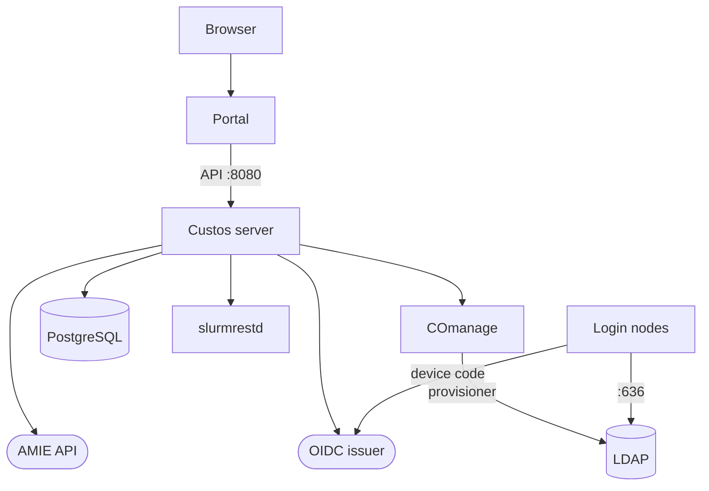

# Connecting Custos

This page takes a system administrator through running Apache Airavata Custos and connecting it to a Slurm cluster.
Custos is
Cybershuttle's security component and our view of what a control plane for HPC operators should look like: it turns allocation
decisions into cluster accounts, Slurm associations and usage charges; see
[Managing allocations](../planning/managing-allocations.md#implemented-functions).

:status[development] Every step is implemented on `master` of
[apache/airavata-custos](https://github.com/apache/airavata-custos) and exercised only in development deployments.
Once connected, Custos writes Slurm accounts and associations
and, on enrolled nodes, changes how `sshd` authenticates. Rehearse on a cluster where that is acceptable.

The first three rows are needed by every connection; each other row only by the connection it names.

| Prerequisite | For |
|---|---|
| A host with Go 1.25+, Node 22+ and `pnpm` | Building and running the server and portal |
| PostgreSQL (development uses 17) | Custos state; a second database for the signer |
| An OpenID Connect issuer: CILogon or the centre's own | Sign-in to the portal and API |
| ACCESS AMIE site code and API key | Allocations from ACCESS |
| COmanage Registry with the UnixCluster plugin, publishing to LDAP | POSIX accounts and groups |
| `slurmrestd` on `slurmdbd`, with JWT authentication | Slurm accounts, associations, usage |
| RHEL 9 or 10 login nodes; Ansible 2.14+ | Node enrolment |
| Vault or OpenBao with KV version 2 | The SSH certificate signer only |

## Components

A deployment spans these components:

| Component | Runs on |
|---|---|
| Custos server, with every connector compiled in | A service host |
| Portal (Next.js) | A service host, behind TLS |
| PostgreSQL | A database host |
| OIDC issuer | CILogon, or the centre's |
| COmanage Registry and LDAP | The centre |
| `slurmrestd` | The cluster's management host |
| PAM module and SSSD | Login nodes |
| SSH certificate signer (optional) | A service host, separate process |

The server's source is `cmd/server`, the portal's `web/`, the PAM module's `extensions/CILogon-SSH-PAM` with the
playbook `dev-ops/account-provisioning`, and the signer's `extensions/SSH-Certificate-Signer`.

The repository ships source only, with no container image or service unit. `dev-ops/compose` (loopback, password
`admin`, Keycloak `start-dev`, Vault without TLS), `dev-ops/local-amie` and `dev-ops/local-slurm` (Slurm 24.05.5) are
for development; `dev-ops/terraform/aws` deploys only Keycloak and Vault. The centre builds the production deployment.

The server speaks plain HTTP with no TLS option; put it and the portal behind a TLS proxy. The cluster never connects
to the server, and the optional signer talks only to Vault and its own database.

The diagram shows the connections between components; each arrow starts at the side that opens the connection.



A firewall needs these rules:

| From | To | For |
|---|---|---|
| Browser | Portal | Sign-in and administration |
| Portal | Server, port 8080 | Every API call, with the user's bearer token |
| Server | PostgreSQL | Custos state |
| Server | OIDC issuer | Discovery and keys; required to start |
| Server | AMIE API | Packets and replies |
| Server | COmanage Registry | People, groups, identifiers, cluster accounts |
| Server | `slurmrestd` | Accounts, associations, jobs |
| Login nodes | LDAP (636); CILogon (443) | Account lookup; device-code sign-in |
| Signer | Vault; PostgreSQL | CA keys; issuance records |

## Start the server and portal

1. Create a PostgreSQL database `custos` and a role that owns it. The server creates and migrates its tables at every
   start.
2. Register the portal with the OIDC issuer as a confidential client with the redirect URI
   `https://<portal host>/api/auth/callback/oidc`. The portal requests `openid email profile`; Custos needs the `sub`
   and `email` claims.
3. Write the [configuration file](#configuration-reference), starting from the repository's `config/custos.yaml`:

   - Set `enabled: false` on every connector for now; each needs a cluster record and credentials made later.
   - Set `core.auth.oidc.audience` to the `aud` of the token the portal forwards: the access token when it is a JWT,
     otherwise the ID token, whose audience is the portal's client ID.
4. Build and start the server, with the environment variable `CUSTOS_BOOTSTRAP_ADMIN_EMAIL` set to the first
   administrator's e-mail address; without it a new deployment has no administrator:

   ```bash
   go build -o custos ./cmd/server
   CUSTOS_BOOTSTRAP_ADMIN_EMAIL=admin@example.org CONFIG_PATH=/etc/custos/custos.yaml ./custos
   ```

   It logs JSON to standard output. A good start logs `database migrations applied successfully`,
   `connector is disabled` for each connector turned off, and `http server listening`; a failure logs
   `server exited with error` and exits.

   Run it under a supervisor of your own. On `SIGTERM` it drains HTTP requests for up to 15 seconds and connector
   workers for up to 30.
5. Set the [portal variables](#portal) in `web/.env.local`, starting from `web/.env.example`, then run `pnpm install`,
   `pnpm build` and `pnpm start`.
6. Sign in to the portal with the bootstrap address. Your identity is linked to the pending user, which becomes active
   with `super_admin`.

The API calls below need an administrator's bearer token, shown as `$TOKEN`: the token the portal forwards in step 3.
While you are signed in to the portal, `https://<portal host>/api/auth/session` returns it in the `accessToken` or
`idToken` field.

## Connect the cluster

Connect in this order: ACCESS creates the allocations and accounts that COmanage and Slurm provision; the signer is
independent. Each connection ends by setting the connector's keys, enabling it and restarting the server; the startup
log then shows `loading connector` with its name.

### Register the cluster

A cluster record's `name` is the Slurm cluster name, and a resource's `name` is a partition name, as AMIE packets
also name it. The portal cannot create clusters or resources; use the API.

1. Create the cluster, named as `ClusterName` in `slurm.conf`:

   ```bash
   curl -sS -X POST https://custos.example.org/compute-clusters \
     -H "Authorization: Bearer $TOKEN" -H 'Content-Type: application/json' \
     -d '{"name": "expanse"}'
   ```

   Export the returned `id` as `CUSTOS_CLUSTER_ID` and `AMIE_CLUSTER_ID`.
2. Create one resource per partition with `POST /compute-allocation-resources`: `name` (the partition),
   `resource_type` (the TRES limits apply to, such as `cpu` or `gres/gpu`), `resource_amount` (capacity in that TRES)
   and `compute_cluster_id`.
3. Give each resource a rate with `POST /compute-allocation-resource-rates` (`compute_allocation_resource_id`, `rate`
   in SUs per billing-unit hour, `start_time`, `end_time`), or in the portal under **Admin → Resources**. Jobs ending
   outside every rate period are not charged.

### Connect ACCESS

The `amie-processor` connector applies each AMIE packet and replies to ACCESS. `request_project_create` creates the
allocation, named by the packet's `GrantNumber`, which becomes the Slurm account name, and maps it to each resource in
`ResourceList` that exists on the cluster; others are skipped with a warning. A failed packet is retried twice, then
marked failed.

1. Register the cluster and every resource ACCESS will name.
2. Check the credentials from the server host; the response lists waiting packets:

   ```bash
   curl -sS -H "XA-SITE: $AMIE_SITE_CODE" -H "XA-API-KEY: $AMIE_API_KEY" \
     "$AMIE_BASE_URL/packets/$AMIE_SITE_CODE"
   ```

3. Set the [keys](#connector-keys), enable the connector and restart the server.
4. Follow packets under **Admin → AMIE**, or with `GET /connectors/amie/packets` and `GET /connectors/amie/stats`.

For rehearsal, `connectors/ACCESS/AMIE-Processor/mock-server` is a mock AMIE server that generates valid, invalid or
mixed packets.

### Connect COmanage and LDAP

When Custos creates a cluster account, the `comanage-identity-provisioner` connector gives the person a POSIX identity
in the registry, the registry's LDAP provisioner publishes it, and SSSD resolves it. Custos never writes to LDAP and
never deprovisions in COmanage; an administrator does.

| Step | Registry object |
|---|---|
| Find the person by stored COmanage ID, then e-mail, or create one | CoPerson |
| Read the `uidnumber` identifier | None; fails with `missing_uidnumber` if unassigned |
| Record the OIDC subject, after the user's first sign-in | Identifier of type `oidcsub` |
| Create a group named after the login name | CoGroup with `uid` and `gidnumber` (= `uidnumber`) |
| Add the person to it | CoGroupMember, as a member |
| Attach group and account to the UnixCluster | UnixClusterGroup; UnixClusterAccount with shell and home, manual sync |
| Cluster administrators only | Membership of `admin_group` |

The account is then marked provisioned, which the Slurm connector waits for. A login name is the prefix, a hyphen,
the first initial and the last name (`custos-jdoe`), at most 32 characters, with a numeric suffix from `2` on
collision.

1. In the registry, enable the Core API (`/api/co/<co id>/core/v1/people`) and REST API version 1 for an API user;
   create a UnixCluster; define identifier types `uid`, `gidnumber`, `oidcsub` and the one in `person_id_type`; turn on
   automatic `uidnumber` assignment; and, for cluster administrators, create a group the centre grants `sudo`.
2. Configure the registry's LDAP provisioner to write `posixAccount` entries and publish `oidcsub` as
   `voPersonExternalID`, which the PAM module searches. The repository contains no registry configuration.
3. Set the [keys](#connector-keys), enable the connector and restart the server.

### Connect Slurm

The `slurm-association-mapper` connector keeps Slurm in line with Custos:

| Custos change | Slurm effect |
|---|---|
| Allocation created | Account named after the allocation, with the PI's organisation, on the cluster |
| Resource attached | Account limits: `GrpTRES` from the amount, `GrpTRESMins` from the time |
| Membership active, or member override created | One user association per resource: partition = resource name, QoS `normal`, limits from the override |
| Membership inactive or deleted | The user's associations under the account removed |
| Allocation inactive or deleted | Every user association removed; the account kept |
| Allocation active again | Active members' associations rewritten |

A user association is written only once the member's COmanage account is provisioned. A reconciler runs at startup
and every `association_reconcile_interval`. It writes associations provisioned at least `association_provision_grace`
earlier, and removes unexpected user associations in Custos-managed accounts; see
[Reconciliation](../operating/running-custos.md#reconciliation).

| Cluster requirement | Why |
|---|---|
| `slurmrestd` on `slurmdbd`, reachable from the server | Every call uses `/slurmdb/` |
| `AuthAltTypes=auth/jwt` and a `jwt_key` in `slurm.conf` and `slurmdbd.conf` | The server authenticates with a JWT |
| A user with `AdminLevel=Administrator` | Writes accounts and associations |
| QoS `normal` allowed on the cluster | Every association uses it |
| `AccountingStorageEnforce` with `associations` and `limits` | Refuses removed users; applies limits |
| Cluster record `name` = `ClusterName` | Scopes account and association calls |

Without QoS `normal` and with `qos` enforced, jobs fail with "Invalid account or account/partition combination
specified".

1. Issue a token for the Slurm user, as root or `SlurmUser`, lasting until your next rotation. The server reads it
   once at startup and does not renew it:

   ```bash
   scontrol token username=custos lifespan=2592000
   ```

2. Check the endpoint from the server host (version `41` against Slurm 24.05 is the tested combination):

   ```bash
   curl -sS -H "X-SLURM-USER-NAME: custos" -H "X-SLURM-USER-TOKEN: $SLURM_TOKEN" \
     "https://slurm.example.org:6820/slurmdb/v0.0.41/associations?cluster=expanse"
   ```

3. Set the [keys](#connector-keys), enable the connector and restart the server.

### Charge usage

The `slurm-usage-monitor` connector reads jobs from `slurmdbd` every 30 seconds. It charges a finished job when the
job's account is an allocation on the cluster, its user a Custos cluster account and its partition a registered
resource. The charge is `billing` TRES × elapsed hours × the resource's rate at the job's end. Jobs with no `billing`
or no rate are skipped with a log line. The first poll after each start reads `slurmdbd`'s whole job history.

Without `TRESBillingWeights`, `billing` is the CPU count and GPU and memory go uncharged. Set weights per partition,
combined as the maximum with `PriorityFlags=MAX_TRES`:

```text
PriorityFlags=MAX_TRES
PartitionName=gpu Nodes=g[1-8] TRESBillingWeights="CPU=1.0,Mem=0.25G,GRES/gpu=16.0"
```

Then set the [keys](#connector-keys), enable the connector and restart the server.

### Enrol nodes

Enrolment changes the nodes themselves and replaces `/etc/pam.d/sshd`; try it on one login node before the rest. The
playbook in `dev-ops/account-provisioning` enrols RHEL 9 and 10 nodes: SSSD resolves accounts from the COmanage LDAP,
and `sshd` authenticates by CILogon device-code sign-in (the
[PAM module](../planning/managing-allocations.md#ssh-login-extensions)).

After sign-in the module searches
`(&(objectClass=posixAccount)(voPersonExternalID=<sub>))` and admits the user only if `uid` equals the login name.
Device-code login therefore works only after the user's first sign-in to Custos.

The playbook's tags enrol a node in stages:

| Tag | Changes on the node |
|---|---|
| `prereqs` | Installs `openldap-clients`; checks LDAP TLS, bind and search base |
| `sssd` | Installs SSSD and `oddjob-mkhomedir`; writes `/etc/sssd/sssd.conf` (LDAP identity, `auth_provider = none`, `ldap_tls_reqcert = demand`); runs `authselect select sssd with-mkhomedir`; sets `authlogin_nsswitch_use_ldap`; checks `getent passwd` |
| `pam` | Builds `/usr/lib64/security/pam_oauth2_device.so` at `pam_oauth2_device_version` (default `master`); writes `/etc/pam_oauth2_device/config.json` (`0600`, holds both secrets); replaces `/etc/pam.d/sshd`; adds an SELinux module; restarts `sshd` |
| `sshd` | Adds `/etc/ssh/sshd_config.d/99-pam-oauth2-device.conf`, turning on PAM, keyboard-interactive and password authentication; restarts `sshd` |

The new stack tries the device-code module as `sufficient`, then `password-auth`, so local passwords still work;
public-key authentication is unchanged. The `99-` file also sets `PasswordAuthentication yes`; where password login is
forbidden, review that line before applying the tag.

1. Register a confidential CILogon client for the device flow, separate from the portal's, with scopes
   `openid profile email org.cilogon.userinfo`.
2. Copy `inventory/hosts.example.yml` to `inventory/hosts.yml` and `group_vars/all.yml.example` to
   `group_vars/all.yml`; set the LDAP URI, search base, bind DN, CILogon client ID, SSSD domain and `test_username`.
3. Encrypt the secrets:

   ```bash
   ansible-vault encrypt_string 'ldap-password' --name 'vault_ldap_bind_password' >> group_vars/all.yml
   ansible-vault encrypt_string 'cilogon-secret' --name 'vault_cilogon_client_secret' >> group_vars/all.yml
   ```

4. Pin `pam_oauth2_device_version` to a tag or commit, and back up `/etc/pam.d/sshd` where it is customised.
5. Check LDAP, then enrol. On compute nodes, where accounts need only resolve, add `--tags prereqs,sssd` to the second
   command:

   ```bash
   ansible-playbook -i inventory/hosts.yml enroll-node.yml --tags prereqs --ask-vault-pass
   ansible-playbook -i inventory/hosts.yml enroll-node.yml --ask-vault-pass
   ```

6. Run `verify.yml` with the same inventory.

### Add the SSH certificate signer

The signer issues short-lived OpenSSH user certificates, an alternative to stored keys and to the PAM module. It is a
separate program with its own database and shares nothing with the Custos server.

| Aspect | Behaviour |
|---|---|
| Clients | Rows in `client_ssh_configs`: tenant, client, bcrypt secret, target host, lifetime, key types; no API creates them |
| CA | Vault `ssh-ca/data/<tenant>/<client>/current`, plus `next`; Ed25519 per tenant and client, made at first use |
| Signing | `POST /api/v1/sign` with client credentials and a user access token from `signer.auth.allowed_issuers` (default CILogon) |
| Principals | Match `^[a-z_][a-z0-9_-]{0,31}$`; validator `noop`, `ldap` or `comanage` checks them against the token subject |
| Revocation | `POST /api/v1/revoke` records it; no revocation list, so certificates stay valid until expiry |
| Rotation | `POST /api/v1/admin/rotate-ca` promotes `next`; nothing rotates on a schedule |

1. Enable a KV version 2 engine and give the signer a token with read and write on `ssh-ca/data/*`:

   ```bash
   vault secrets enable -path=ssh-ca kv-v2
   ```

2. Create a database `custos_signer`, copy `config.example.yaml` to `config.yaml`, and set the database, Vault address
   and token (or `DB_*`, `VAULT_ADDRESS`, `VAULT_TOKEN`), `allowed_issuers` and `principal_validator`. Leave
   `dev_mode.enabled` false; it turns off token validation.
3. Build, migrate and start; the signer listens on port 8084:

   ```bash
   cd extensions/SSH-Certificate-Signer
   go build -o custos-signer .
   ./custos-signer migrate --config config.yaml
   ./custos-signer serve --config config.yaml
   ```

4. Insert a client row with at least `tenant_id`, `client_id`, `client_secret`, `target_host` and
   `allowed_key_types`, hashing the secret with `htpasswd -nbBC 10 "" "<secret>" | cut -d: -f2`.
5. Trust the client's CA on each node; the repository has no `sshd` configuration for this. With `TrustedUserCAKeys`
   and no `AuthorizedPrincipalsFile`, `sshd` admits a certificate whose principal equals the login name:

   ```bash
   curl -sS -H "X-Client-Id: tenant1:webapp" -H "X-Client-Secret: $SECRET" \
     https://signer.example.org/api/v1/ca-public-key > /etc/ssh/custos_user_ca.pub
   echo 'TrustedUserCAKeys /etc/ssh/custos_user_ca.pub' > /etc/ssh/sshd_config.d/50-custos-ca.conf
   systemctl reload sshd
   ```

   Repeat after each rotation; until then, nodes refuse certificates signed with the new key.

## Onboard users and roles

Users arrive from ACCESS through AMIE packets, or an administrator creates them with `POST /users`. The flags on that
call decide what a user may do:

| Role or flag | Granted by | Gives |
|---|---|---|
| `super_admin` | `CUSTOS_BOOTSTRAP_ADMIN_EMAIL`, only while nobody holds it | Every privilege |
| `admin` | `portal_admin: true` in `POST /users` | Every privilege present when the role was created, except `core:privileges:grant` and `core:roles:manage` |
| Cluster administrator | `cluster_admin: true` in `POST /users` | A cluster account with access level `ADMIN`, in the COmanage `admin_group` |
| Researcher | Neither flag | A cluster account and, optionally, one allocation membership |

`POST /users` needs `core:users:write`; either flag also needs `core:roles:manage`. Its fields:

| Field | Meaning |
|---|---|
| `email` | Required |
| `first_name`, `last_name` | Generate the login name; without both, the part of `email` before `@` does |
| `username` | Login-name override, at most 32 characters |
| `allocation_id` | Researchers only; also selects the cluster |
| `compute_cluster_id` | The cluster, when no allocation is given |
| `organization_id` | Default: the system organisation |
| `portal_admin`, `cluster_admin` | The flags above |

Unless exactly one cluster is registered, give `allocation_id` or `compute_cluster_id` for a user who needs a cluster
account, or onboarding fails with "pick a cluster, N are registered".

```bash
curl -sS -X POST https://custos.example.org/users \
  -H "Authorization: Bearer $TOKEN" -H 'Content-Type: application/json' \
  -d '{"email": "jdoe@example.edu", "first_name": "Jane", "last_name": "Doe",
       "allocation_id": "<allocation id>"}'
```

The user starts pending. The first sign-in whose `email` claim matches activates the user and links the identity;
any other unlinked sign-in gets HTTP 401 `identity_not_linked`. `email_verified` is not checked. AMIE users are
activated the same way, with the address ACCESS supplied.

| Task | Call |
|---|---|
| Add a user to another allocation | `POST /compute-allocation-memberships` |
| Grant roles or privileges; effective at once | `POST /users/{id}/roles`, `POST /users/{id}/privileges` |
| List privileges | `GET /privileges/catalog`, or the repository's `docs/privileges.md` |

## Verify the connections

One check per connection, in order; a later row depends on the earlier ones.

| Connection | Check | Expected result |
|---|---|---|
| Server | `curl https://custos.example.org/healthz` | `{"status":"ok"}` |
| Database | Startup log | `database migrations applied successfully` |
| OIDC | `GET /me` with a user's token | The caller's profile; 401 `invalid_token` means issuer or audience mismatch |
| Connectors | Startup log | `loading connector` per enabled connector; no `skipping` for a configured one |
| ACCESS | `GET /connectors/amie/stats`, or **Admin → AMIE** | Packets processed, none failed |
| COmanage | `GET /audit/events` for the onboarding trace, or **Admin → Traces** | `ComanageClusterAccountAttached`; `ComanageProvisioningFailed` names the failed step |
| LDAP and SSSD | `getent passwd custos-jdoe` on a node | The entry, with the COmanage `uidnumber` |
| Slurm accounts | `sacctmgr show account <grant number>` | The account |
| Slurm associations | `sacctmgr show assoc where account=<grant number> format=cluster,account,user,partition,qos,grptres,grptresmins` | One row per member and partition, within the reconcile interval plus grace |
| Usage | `GET /compute-allocations/{id}/usages/total` after a job ends | The job's charge; `successfully polled SLURM usage` logged every 30 seconds |
| Node sign-in | `ssh custos-jdoe@login-node` | A CILogon device code, then a shell; a user without an LDAP entry is refused |
| Signer | `curl https://signer.example.org/api/v1/health`; sign a key and log in | `healthy` with database and Vault `up`; `ssh-keygen -L -f key-cert.pub` shows principal and validity |

## Configuration reference

The server reads one YAML file, `config/custos.yaml` under its working directory or the path in `CONFIG_PATH`, and
exits if it is missing. `${NAME}` is replaced by the environment variable `NAME`; an unset variable stays as the
literal `${NAME}`. Set every variable the file references, or remove the blocks you do not use.

### Server

| Key or variable | Default | Meaning |
|---|---|---|
| `core.database.url` | Required | `pgx` DSN, such as `postgres://custos:…@db.example.org:5432/custos?sslmode=verify-full` |
| `core.api.port` | `8080` | HTTP port |
| `core.log_level` | `info` | `debug`, `info`, `warn` or `error` |
| `core.auth.oidc.issuer` | Required | `/.well-known/openid-configuration` under this issuer URL gives the keys |
| `core.auth.oidc.audience` | Required | Expected `aud` of the bearer token |
| `core.auth.cache_ttl` | `30s` | Caller identity and privilege cache; at most `60s` |
| `CONFIG_PATH` | `config/custos.yaml` | Configuration file |
| `DB_MAX_OPEN_CONNS`, `DB_MAX_IDLE_CONNS` | `25`, `5` | Connection pool |
| `CUSTOS_BOOTSTRAP_ADMIN_EMAIL` | Unset | Address given `super_admin` at startup |
| `POSIX_USERNAME_PREFIX` | `custos` | Login-name prefix |
| `CUSTOS_TRACING_MODE` | Unset | `noop` turns off audit trace IDs |

### Connector keys

Each entry under `connectors` has any name, a `type` and `enabled`. A connector with incomplete credentials is skipped
with a log line; one that fails while loading stops the server. `temp-account` (routes for `VIRTUAL` users under
`/connectors/temp-account/`) and `analytics` (usage summaries and job lists under `/connectors/analytics/`) have no
settings.

`amie-processor`; the shipped file fills these from `AMIE_BASE_URL`, `AMIE_SITE_CODE`, `AMIE_API_KEY` and
`AMIE_CLUSTER_ID`:

| Key | Default | Meaning |
|---|---|---|
| `credentials.base_url` | Required | AMIE API base URL |
| `credentials.site_code`, `credentials.api_key` | Required | The centre's ACCESS site code and API key |
| `cluster.id` | Required | Cluster this AMIE site serves; one site, one cluster |
| `polling.poll_interval` | `30s` | Between polls |
| `polling.worker_interval` | `5s` | Between batches of up to 50 packets |
| `polling.poller_enabled` | `true` | `false` processes stored packets without fetching |
| `timeouts.connect_timeout`, `timeouts.read_timeout` | `5s`, `20s` | HTTP timeouts |

`comanage-identity-provisioner`; if any required key is missing, the whole configuration is read instead from
`COMANAGE_REGISTRY_URL`, `COMANAGE_CO_ID`, `COMANAGE_API_USER`, `COMANAGE_API_KEY`, `COMANAGE_PERSON_ID_TYPE`,
`COMANAGE_UNIX_CLUSTER_ID`, `COMANAGE_CLUSTER_ADMIN_GROUP` and `CUSTOS_CLUSTER_ID`:

| Key | Default | Meaning |
|---|---|---|
| `registry.url`, `registry.co_id` | Required | Registry base URL; numeric CO ID |
| `registry.api_user`, `registry.api_key` | Required | API user, sent with HTTP basic authentication |
| `unix_cluster.id` | Required | Numeric UnixCluster ID |
| `unix_cluster.person_id_type` | Required | Identifier type used to find and tag a CoPerson |
| `unix_cluster.admin_group` | Unset | Group for cluster administrators; an unexpanded `${…}` counts as unset |
| `provisioning.custos_cluster_id` | Required | Custos cluster `id`; other clusters' accounts are ignored |
| `provisioning.default_shell` | `/bin/bash` | Login shell |
| `provisioning.homedir_prefix` | `/home/` | Home directory prefix |
| `provisioning.http_timeout` | `30s` | Registry request timeout |

`slurm-association-mapper`; the shipped file fills `slurm_api` from `SLURM_API_URL`, `SLURM_API_VERSION`,
`SLURM_API_USERNAME` and `SLURM_TOKEN`, and an absent key falls back to `SLURM_API`, `SLURM_USER`, `SLURM_TOKEN` and
`SLURM_API_VERSION`:

| Key | Default | Meaning |
|---|---|---|
| `slurm_api.url` | Required | `slurmrestd` base URL |
| `slurm_api.version` | Required | Minor version only, such as `41`; paths are `/slurmdb/v0.0.<version>/` |
| `slurm_api.username`, `slurm_api.token` | Required | Slurm user and its JWT |
| `association_reconcile_interval` | `5m` | Between reconciler sweeps |
| `association_provision_grace` | `30s` | Wait after provisioning, for LDAP export and name caches |

`slurm-usage-monitor`:

| Key | Default | Meaning |
|---|---|---|
| `slurm_api.*` | Required | As for `slurm-association-mapper` |
| `cluster_id` | `SLURM_MONITOR_CLUSTER_ID`, else `slurm-cluster` | Custos cluster `id`; the shipped file uses `CUSTOS_CLUSTER_ID` |
| `usage_lookback` | `15m` | How far before the previous poll each poll re-reads, for jobs recorded late |

### Portal

| Variable in `web/.env.local` | Value |
|---|---|
| `NEXTAUTH_URL` | The portal's public URL |
| `NEXTAUTH_SECRET` | Output of `openssl rand -base64 32` |
| `CUSTOS_CORE_API_BASE_URL` | The server's URL as the portal host reaches it |
| `OIDC_ISSUER_URL`, `OIDC_CLIENT_ID`, `OIDC_CLIENT_SECRET` | The portal's OIDC client |
| `NEXT_PUBLIC_PORTAL_NAME`, `NEXT_PUBLIC_PORTAL_LOGO`, `NEXT_PUBLIC_PORTAL_FAVICON` | Optional branding |

[Running Custos](../operating/running-custos.md) covers monitoring, backups, upgrades, cutting off users and known
problems.
