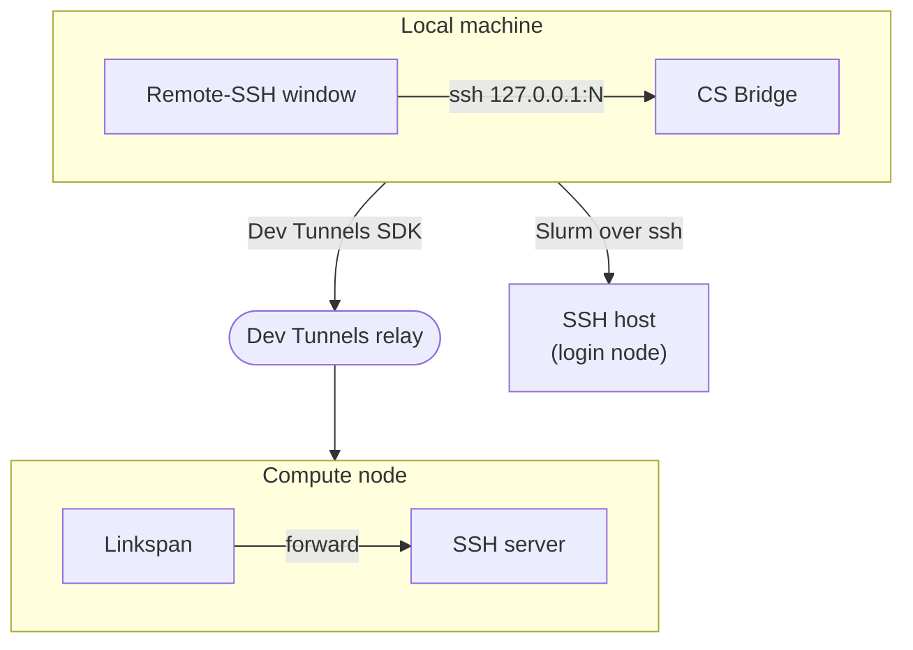
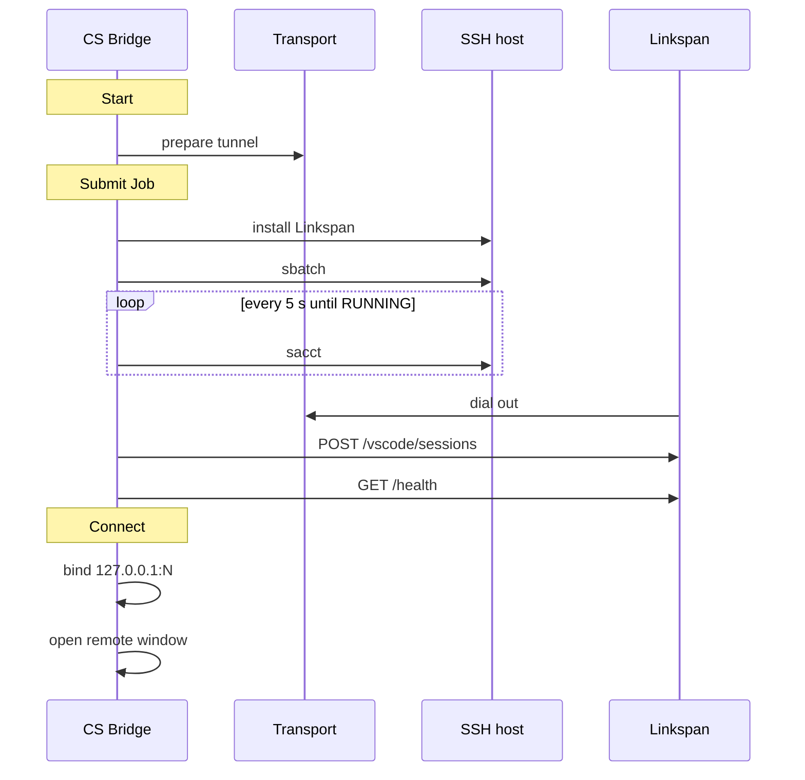
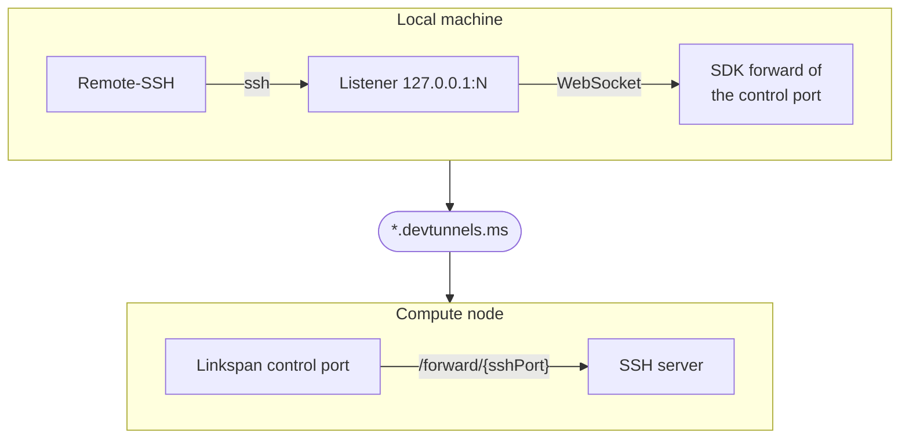

# Architecture

This page explains how CS Bridge works inside and why, for contributors who know the VS Code extension API and Slurm.
For what the extension offers a user, see [Overview](./index.md); shared terms are in the [Glossary](/overview/glossary).

CS Bridge is a Slurm session manager first and a tunnel client second. It submits a job over the user's own SSH
login, reaches [Linkspan](/batch/linkspan-architecture) in that job through a **transport** (a Microsoft Dev Tunnel by
default), and hands the final attach to Remote-SSH. Everything runs in the local extension host, including in a remote
window, so every window reads the same session files and runs the same local `ssh`.

| Property | Value |
|---|---|
| Repository | [cyber-shuttle/CS-Bridge](https://github.com/cyber-shuttle/CS-Bridge) |
| Marketplace | [`cybershuttle.csbridge`](https://marketplace.visualstudio.com/items?itemName=cybershuttle.csbridge) |
| Version documented | 0.2.3; requires Linkspan 0.22.0 or newer |
| Language | TypeScript 6; Preact 11 webviews; esbuild; Bun for installs, scripts and tests |
| Runs | Local extension host only (`extensionKind: ["ui"]`), activated `onStartupFinished` |
| Status | Pre-1.0; interfaces may change between releases |
| License | Apache-2.0 |

## How it works

The diagram shows the two network paths out of the local machine.



1. The user picks an **SSH host**, a login node named by a `Host` entry in `~/.ssh/config`, and fills a resource
   form. CS Bridge reads the choices with `sacctmgr` and `sinfo` over SSH and validates the job with
   `sbatch --test-only`.
2. **Start** prepares the transport and shows the job script. **Submit Job** installs or updates Linkspan in
   `~/.cybershuttle/bin` on the cluster and submits the script.
3. CS Bridge polls `sacct` until the job runs. It then calls Linkspan through the transport and asks for an SSH
   server that accepts the session's key.
4. **Connect** binds a local port; each connection to it rides a WebSocket to Linkspan's
   `/api/v1/forward/{sshPort}`. CS Bridge writes a per-session SSH host to the `ssh_config` in its extension
   storage, opens `vscode-remote://ssh-remote+<alias>/<home>/`, and Remote-SSH performs the final attach.

Two paths stay separate throughout. Slurm commands go over the user's SSH login to the SSH host. Requests to Linkspan
go through the transport, which Linkspan dials out to. A failure on one path says nothing about the other, so the
[status model](#status-model) treats an unreachable SSH host and a dead job differently. With the experimental `link`
transport, Linkspan dials Airavata's session server instead of hosting a Dev Tunnel ([Transports](#transports)).

## Status model

A session record holds one of eleven statuses, and every surface renders from it. Each status's meaning, and
the Slurm states or actions that set it:

| Status | Meaning |
|---|---|
| `not_started` | Validated and saved; no run yet |
| `submitting` | **Submit Job** in progress: `sinfo`, Linkspan install, `sbatch` |
| `queued` | Submitted; `sacct` reports `PENDING`, `REQUEUED`, `REQUEUE_FED`, `REQUEUE_HOLD`, `SUSPENDED` or `STOPPED` |
| `preparing` | `sacct` reports `RUNNING`, `CONFIGURING`, `COMPLETING`, `RESIZING`, `SIGNALING` or `STAGE_OUT`; waiting for Linkspan and its SSH server |
| `ready_to_connect` | SSH server up; no local forward bound |
| `connecting` | Local forward being built |
| `connected` | Local forward bound and per-session SSH host written; a window may or may not be open |
| `stopping` | A stop is in flight, or was handed off by a remote window |
| `stopped` | `COMPLETED`, `TIMEOUT` or `CANCELLED`; a successful **Stop**; or the walltime passed (immediately when this window holds no connected client, after 30 seconds' grace while one still looks connected) |
| `failed` | `FAILED`, `OUT_OF_MEMORY`, `BOOT_FAIL`, `NODE_FAIL`, `PREEMPTED`, `DEADLINE`, `REVOKED` or `SPECIAL_EXIT`; or a failed **Submit Job** or **Stop** |
| `unreachable` | An SSH `sacct` poll failed, or **Connect** failed before an SSH server was known; the next successful poll moves it to `queued` or `preparing` |

An unrecognised Slurm state holds the current status. A state missing from the table in `slurmParse.ts` therefore
strands a session until its walltime instead of tearing down a live job. A `stopping` session ignores `RUNNING` and
pending readings, because `scancel` and Slurm's accounting lag behind each other. The walltime counts as job end
without asking Slurm, because Slurm kills the job at `--time` even when the SSH host is unreachable. The 30 seconds'
grace covers a local clock ahead of the cluster's, and Slurm's `KillWait`.

`sessionMachine.ts` holds the predicates every surface shares:

| Predicate | Statuses |
|---|---|
| `isTerminal` | `stopped`, `failed` |
| `isDeletable` | terminal plus `not_started` |
| `isStoppable` | `submitting`, `queued`, `preparing`, `ready_to_connect`, `connecting`, `connected`, `unreachable` |
| `isReachable` | `ready_to_connect`, `connecting`, `connected` |

`SessionMonitor`, the per-session poll described under [Session lifecycle](#session-lifecycle), owns poll-driven transitions. `SessionProvider` owns user-action transitions and their dialogs,
except the remote window's **Stop**, which `RemoteSessionController` owns. All three write a status through
`setStatus` in `src/extensionStore.ts`, the single path that persists it and so reaches every window.

## Activation

Each window's extension host activates at `onStartupFinished` and runs these steps in order:

1. Migrate the extension storage to the current [schema](#persistence-and-cross-window-state), importing
   `~/.cybershuttle` from 0.2.2 and earlier, then load `sessions/*.json` and demote `connected` and `connecting` to
   `ready_to_connect`, because a reload drops the local forward.
2. Match the first workspace folder's authority `ssh-remote+<alias>` against every session's per-session alias. A match
   makes this a **remote window**: it starts writing a heartbeat for the session and the context key `csbridge.remote`
   is set.
3. Initialise `SshManager`: create the socket folder (not on Windows) and `ssh_keys` in extension storage (mode
   `0700`) and `ssh_config` there (mode `0600`), and make `~/.ssh/config` include `ssh_config` by quoted absolute path
   before its first `Host` or `Match` block, prepending the line when no effective one exists.
4. Create the Airavata client, the transports, the three view providers and the menu; register the commands.
5. In a local window, finish any persisted `stopping`, start a monitor for every session with a job that is not terminal,
   and reconnect each of those whose SSH server is known and whose transport is signed in without a prompt.
6. In a remote window start the `RemoteSessionController`; in a local one open a pending run summary.
7. On first install, show `Completed installing CS Bridge.` with **Open**.

## Session lifecycle

The diagram follows one run from **Start** to **Connect**; calls to Linkspan pass through the transport.



**Prepare.** `prepareLaunch` pins Linkspan's **control port**, its HTTP API port on the node, to `20000 + rand(12000)`
(Airavata assigns it for the link). It asks the transport for its launch arguments and token. The port is chosen before the
job exists because the Dev Tunnel must already carry it when Linkspan starts hosting; the cost is a small chance that
the port is taken on a shared node, and the session then fails. `buildSlurmScript` writes:

```bash title="Job script (Dev Tunnel)"
#!/bin/bash
#SBATCH --job-name=linkspan-session
#SBATCH --nodes=1
#SBATCH --ntasks=1
#SBATCH --cpus-per-task=<cores>
#SBATCH --mem=<memoryMb>M
#SBATCH --time=<D-HH:MM:00 or HH:MM:00>
#SBATCH --partition=<partition>
#SBATCH --account=<account>
#SBATCH --gres=gpu[:<type>]:<count>

# --- Set up log files using $HOME ---
LOG_DIR="$HOME/.cybershuttle/logs"
install -d -m 700 "$LOG_DIR"
exec > "$LOG_DIR/linkspan-session-$SLURM_JOB_ID.out" 2> "$LOG_DIR/linkspan-session-$SLURM_JOB_ID.err"

# The compute node has no logind, so the inherited /run/user/$UID (XDG_RUNTIME_DIR) is absent there;
# unset it (and TMPDIR) so the VS Code server Linkspan launches falls back to its node-local /tmp default.
unset XDG_RUNTIME_DIR TMPDIR

# --- Run Linkspan ---
LINKSPAN_BIN="$HOME/.cybershuttle/bin/linkspan"
"$LINKSPAN_BIN" --port <controlPort> --tunnel-enable --tunnel-mode devtunnel --tunnel-devtunnel-args '--id <devtunnel.id> --cluster <devtunnel.cluster>'
```

The script omits `--account` for `(no Slurm account)` and `--gres` when no GPU is requested. Memory is in megabytes
(`--mem=8192M`), and a walltime of a day or more takes the day form (`--time=1-00:00:00`), so the `#SBATCH` lines
match Airavata's for the same session. With the link, the last line ends
`--tunnel-mode link --tunnel-link-args '--url <url>'`. Validation at **Add** runs before any tunnel exists and pipes
the Dev Tunnel variant to `sbatch --test-only`.

**Install Linkspan.** One remote command prints the installed version (`linkspan --version`) and the latest GitHub
release, the tag that the `releases/latest` redirect names. `linkspanIsUpToDate` keeps the installed binary when it is
at least the latest release and at least `0.22.0` (`MINIMUM` in `src/modules/slurmLaunch.ts`); a failed check
reinstalls. A development build `X.Y.Z.<commit>` is kept while `X.Y.Z` is newer than the latest release, and replaced
once `X.Y.Z` ships. `installLinkspan` then:

1. maps `uname -m`: `x86_64` to `x86_64`, `aarch64` and `arm64` to `arm64`;
2. downloads `linkspan_Linux_<arch>.tar.gz` and extracts the binary to a staged file;
3. moves it into place at mode `0700`, so an interrupted download never replaces a working binary.

**Submit.** The script travels base64-encoded over the persistent shell's stdin. The token rides sbatch's environment, which `--export=ALL` passes into the job, so it appears in
no job script, file or command line on the cluster:

```bash
echo '<base64 script>' | base64 -d | LINKSPAN_TUNNEL_HOST_TOKEN='<token>' sbatch --export=ALL
```

The link uses `LINKSPAN_LINK_TOKEN` instead.

**Poll.** `SessionMonitor` runs one 5-second interval per session with a job, in every local window; a reentrancy
guard keeps a slow poll from overlapping the next. Until the job runs, the poll is `sacct` over SSH. Once it runs, the poll moves to the transport and stops querying the SSH host, so an expired SSH
login does not disturb a running session. Each poll does one of the following, by status:

| Status | Poll |
|---|---|
| `queued`, `unreachable`, or transport references missing | `sacct -j <jobId> -n -o State%20,ExitCode,Reason%40,ElapsedRaw --parsable2` over SSH, then `computeStatusTransition` |
| `preparing` | Over the transport: refresh the tunnel, `POST /vscode/sessions`, `GET /health`; success sets `ready_to_connect` |
| `ready_to_connect`, `connecting`, `connected` | `GET /usage` as health check and usage sample; `sacct` accounting at most every 30 seconds |

The first `RUNNING` reading anchors `startedAt` to Slurm's `ElapsedRaw`. `POST /vscode/sessions` carries the
session's public key and `ref: "ssh-<first 16 hex of sha256(key)>"`, the name Airavata gives the same key's
server, so a repeat from either returns the running server. `GET /usage` goes through the transport when this window
holds a connected client, else through Slurm on the node:
`srun --jobid=<id> --overlap --quiet --input none curl -sf --max-time 4 http://127.0.0.1:<controlPort>/api/v1/usage`.

A Linkspan call counts as healthy only when it returns the expected JSON body, not on HTTP status alone: once
Linkspan is gone, the Dev Tunnels edge still answers `200` with an HTML page (`src/modules/linkspanSupport.ts`).

In the transport-driven states, six consecutive failures trigger one `sacct` cross-check. Only a terminal Slurm state
ends the session, because a relay outage is not evidence that the job died. When a run
ends, `recordSessionRun` queries `sacct`, up to twice more at 3-second intervals until `MaxRSS` appears, and appends
the run to the runs file.

**Connect.** `connectTransport` ensures the SSH server, has the transport bind `127.0.0.1:N`, checks the session key,
writes the per-session SSH host and `remote.SSH.serverInstallPath`, and sets `connected`. Only then does the provider
open the window, or focus one already open. The same function reattaches sessions at activation and rebuilds a
half-open Dev Tunnel.

**Stop.** `stopSession` runs `scancel`; if that fails, `sacct` decides whether the job has already ended. A successful
stop drops the local forward, the per-session SSH host and the session key. Every stop releases the transport's run
and records the run. A job that ends on its own goes through the same teardown (`SessionMonitor.endSession`). The
remote window's **Stop** only sets `stopping` and reloads the window as local. A remote window runs no monitor and
reloads at once, so the local window's activation performs the stop.

## Transports

A transport is how CS Bridge reaches Linkspan's control port and the SSH server Linkspan starts behind it.
`src/modules/transport.ts` defines a `Transport` as a management and relay client pair, plus the launch and release of a run. `transportFor` picks one from the session record's `transport` field, and
no other code branches on it. **Start** writes that field from `csbridge.transport`, or `devtunnel` when experimental
features are off; before the first **Start** it is `devtunnel`.

| Aspect | `devtunnel` (default) | `link` **(experimental)** |
|---|---|---|
| Menu label | Microsoft DevTunnel, "Stable, relayed by Microsoft's network" | Cybershuttle Link, "Experimental, relayed by Cybershuttle" |
| Signed in | A Microsoft session exists without prompting | A Cybershuttle credential is in SecretStorage |
| Prepare, at **Start** | Delete the previous run's Dev Tunnel, create one, add the control port, return a host token | Define the Airavata session once, stop any live run, attach with `tunnelModes: ["link"]` |
| Job environment | `LINKSPAN_TUNNEL_HOST_TOKEN` | `LINKSPAN_LINK_TOKEN` |
| Release, at **Stop**, job end, preview **Close** or the next **Start** | Nothing | `POST sessions/{id}/stop` |
| Delete | Delete the Dev Tunnel | `POST sessions/{id}/stop`, then `DELETE sessions/{id}` |
| Needs | Microsoft account | A CILogon identity, a compute node that reaches Airavata |

Deleting a session removes the tunnels of both transports, since a record keeps whatever earlier runs of either left.

### Microsoft Dev Tunnel

CS Bridge uses the Dev Tunnels SDK in-process (API version `Version20230927preview`). It authenticates with
`vscode.authentication.getSession('microsoft', ['46da2f7e-b5ef-422a-88d4-2a7f9de6a0b2/.default'])`, prompting only
when an operation needs the token; the account stays in VS Code's keychain. The job receives only a host token scoped
to the run's tunnel.

The diagram traces one SSH connection from the remote window to the SSH server on the node.



- The Dev Tunnel carries only Linkspan's control port. Each SSH connection to the local listener opens a WebSocket to
  Linkspan's `/api/v1/forward/{sshPort}` through the SDK's local forward of that port.
- Linkspan's API is called at `https://<devtunnel.id>-<controlPort>.<devtunnel.cluster>.devtunnels.ms/api/v1` with
  `X-Tunnel-Authorization: tunnel <connect token>`.
- The local listener binds `127.0.0.1`, preferring the remote port number, else an ephemeral port.
- A 15-second keep-alive watches the connection. After four consecutive misses, about a minute, CS Bridge rebuilds
  the connection; if the rebuild fails, the session returns to `ready_to_connect`. The SDK's own reconnect does not
  cover this case, because a half-open relay keeps reporting `Connected`.
- A **Stop** leaves the Dev Tunnel in place; the next **Start** or a delete removes it. **Start** creates a new tunnel
  per run, so ports do not accumulate towards the service's limit of ten per tunnel.
- Microsoft's relay limits throughput to tens of Mbit/s.

### Cybershuttle link (experimental)

With the link, Linkspan dials a WebSocket to [Airavata's session server](/setting-up/airavata-architecture), and CS
Bridge reaches Linkspan through it. CS Bridge still submits the job itself over the user's SSH; the session server
records the session, attaches the link and carries the forwards.

`src/plane.ts` is the Airavata client; "plane" in its name and in `csbridge.plane.credential` refers to Airavata's
HTTP API. It is a plain `fetch` client with a 30-second timeout against the fixed base URL
`https://jupyterapi.cybershuttle.org/api/v1`, which no setting overrides. `src/modules/linkTunnel.ts` mirrors the Dev
Tunnels SDK's management and relay clients over Airavata, so the session-level functions in `transport.ts` run
on either transport.

| Step | Call |
|---|---|
| Sign in | `POST oauth/device` → `{deviceCode, userCode, verificationUriComplete, intervalSeconds}`; CS Bridge opens the URI and shows `Waiting for CyberShuttle sign-in with code <userCode>` |
| Wait | `POST oauth/device/poll {deviceCode}` every `intervalSeconds` → `{status: 'pending', intervalSeconds}` or `{status: 'complete', idToken, refreshToken, expiresInSeconds}` |
| Refresh | `POST oauth/refresh {refreshToken}` when less than 60 seconds of validity remain |
| Define | `POST sessions` with `idempotencyKey` (the local session ID), `alias`, `account`, `partition`, `rootFolder` (the home directory, else `$HOME`) and `resources {cores, memoryMb, wallMinutes, gpuType, gpuCount}` → `{id}`, stored as `planeId` |
| Attach | `POST sessions/{id}/stop`, since attach refuses a live session (a `404` defines the session again); then `POST sessions/{id}/attach {tunnelModes: ['link']}` → `{port, link: {url, token}}`; `port` becomes the control port |
| Access | `GET sessions/{id}/access` → the connect token (`jupyter.token`), held in memory. Answered only once the session is ready; CS Bridge waits while the error code is `session_access_unavailable` |
| Forward | A `127.0.0.1` listener per port; each connection opens `wss://jupyterapi.cybershuttle.org/api/v1/sessions/{id}/forward/{port}` with subprotocols `cybershuttle.v1` and `capability.<token>`. Linkspan's API goes through a forward of the control port |
| Stop, delete | `POST sessions/{id}/stop`; delete then sends `DELETE sessions/{id}` |

Requests carry `Authorization: Bearer <ID token>`. The credential `{idToken, refreshToken, expiresInSeconds, expiresAt}`
lives in SecretStorage under `csbridge.plane.credential`, and the account label is the ID token's `email` claim. A `401`
from any call, or a refresh refused with a status below 500, deletes the credential.

## Experimental features

`src/features.ts` names each feature and its stage; only `cybershuttle` exists, at `experimental`. `enabled(name)` is
true for a `stable` feature, and for an `experimental` one only while `csbridge.experimentalFeatures` is on. A gate
covers only entry points, the menu items and the transport choice at **Start**, so turning the setting off never
strands a running session.

| Step | Change |
|---|---|
| Start experimental | Add the feature as `'experimental'`, gate its entry points, tag its prose **(experimental)** |
| Graduate | Mark it `'stable'`, which turns every gate on, and drop the tags |
| Retire the flag | Delete the entry and inline each `enabled()` call naming it |

## SSH

### Connection

CS Bridge runs the OS `ssh` binary and no SSH library, so the user's `~/.ssh/config`, agent, jump hosts and the
site's MFA apply exactly as in a terminal. `SshManager` keeps one persistent `ssh … <alias> bash -l` per SSH host and
runs every remote command over it, so the user authenticates once per host, not once per command. `bash -l` gives the
commands the login shell's `PATH`, where sites put the Slurm binaries.

Each command is framed with `__CSE_<rid>__` markers that separate stdout, stderr and the exit code, and a per-host
serial queue keeps one command in flight. A dropped shell reconnects on the next command. Commands are single-line;
scripts are base64-encoded and piped to `bash`.

| Option | Value |
|---|---|
| ControlMaster (not on Windows) | `ControlMaster=auto`, `ControlPath=<socket folder>/<first 16 hex of sha256(alias)>`, `ControlPersist=600`. The socket folder is `csbridge-ssh` in `$XDG_RUNTIME_DIR` or the temp folder (mode `0700`), or a new `csbridge-*` temp folder when that one is not private to the user; the hash and the short folder keep the path under the 104-byte limit of a Unix socket |
| Background polls | `BatchMode=yes`, `ConnectTimeout=10`, no askpass: they ride an existing connection or fail fast, never raising an unseen prompt |
| User actions | `NumberOfPasswordPrompts=3` with askpass |
| Both | `ServerAliveInterval=15`, `ServerAliveCountMax=3` |

The persistent shell is the only multiplexing on Windows, whose OpenSSH has no Unix-socket ControlMaster. On other
systems the ControlMaster also lets the **Terminal** button and other windows reuse one authentication, kept for ten
minutes after its last user.

Password, passphrase and keyboard-interactive prompts go through `SSH_ASKPASS` with `SSH_ASKPASS_REQUIRE=force`.
Under OpenSSH for Windows, VS Code's Node runs `askpass.js` directly; elsewhere `askpass.sh` execs it. The helper
writes the prompt to a file in a temporary directory, which the extension polls every 200 ms, and waits up to 120
seconds for the response file. The **SSH Authentication — &lt;alias&gt;** panel shows the prompt as preformatted text
with clickable links, so a device-flow QR code renders. Enter submits; Escape cancels and kills the connection.

### Per-session SSH host

`csHostAlias(session)` is `<alias>-<last 6 characters of the session name>`, for example `delta-493119`; the session
name is its creation time in milliseconds. One function builds the `Host` line, the `ssh-remote+` authority and the
reverse lookup a remote window uses, so the three stay in lockstep. The alias never equals the bare SSH host used for
Slurm.

```text title="ssh_config in extension storage"

# CS-Bridge auto-generated for session 01923f6a-…
Host delta-493119
    HostName 127.0.0.1
    Port 41873
    User cs-ssh-user
    StrictHostKeyChecking no
    UserKnownHostsFile /dev/null
    IdentityFile "/home/jdoe/.config/Code/User/globalStorage/cybershuttle.csbridge/ssh_keys/id_cshost-01923f6a-…"
    ServerAliveInterval 15
    ServerAliveCountMax 3
    TCPKeepAlive yes
    Compression no
    ConnectTimeout 10
    IPQoS cs0
```

Linkspan's SSH server ignores the user name and accepts only the session's key. Host-key checking is off because
each server generates a new host key when it starts ([VS Code (SSH)](/batch/linkspan-http-api#vs-code-ssh)), so no
stable key exists to check against. The keep-alive options let a connection ride out a brief relay stall but give up
within about 45 seconds on a dead one, so Remote-SSH's replacement connection does not overlap it.

OpenSSH scopes an `Include` to the block above it and takes the first match. The file is therefore included before
the first `Host` or `Match` block of `~/.ssh/config`, so a per-session host wins over the user's own entries. Removal
matches the comment line, the `Host` line and the four-space-indented lines after it, so edit these blocks only
through CS Bridge.

## Persistence and cross-window state

Every open VS Code window runs its own extension host, so several windows share one set of files in VS Code's
extension storage (`globalStorageUri`). Sessions are one JSON record per ID under `sessions/`; IDs are UUIDv7, so they
sort by creation time.

- A `JsonDir` (`src/modules/store.ts`) holds each directory in memory, so reads are synchronous. Writes, and reloads
  of other windows' writes that a file watcher on `*/*.json` reports (`src/storage.ts`), run in order on that
  directory's queue, and the last write to a record wins. Disk wins except for in-memory connection state, so a field
  added to the session record reaches every window without further code.
- A window connected to a session rewrites its heartbeat, `windows/<window id>.json`, every 20 seconds until it
  closes; one older than 90 seconds counts as closed.
- No window is elected leader: every local window runs its own monitor.

`connectionInfo` persists only `sshPort` and `controlPort`; the run's tunnel is the record's `devtunnel {id, cluster}` or
`planeId`. Tokens and the local forward port stay in memory. Run history and usage live in `runs/<id>.json`
(`runStore.ts`): at most ten runs per session, deduplicated by SSH host and job ID, the last 20 usage samples, and the
current run's `sacct` statistics.

`schema.json` in extension storage holds one version. At activation, before any store reads, `migrate()`
(`src/modules/store.ts`) applies each step from the version it finds to `SCHEMA_VERSION`, recording the version after
each; the stores read only the current shape. Versions 0 and 1 lived in `~/.cybershuttle`; their steps
(`legacySteps`, `src/modules/schema.ts`) run under a lock, `migrate.lock` in extension storage.

| Version | Releases | Change |
|---|---|---|
| 0 | Up to 0.2.0; no `schema.json` | None |
| 1 | 0.2.1 and 0.2.2 | Fields renamed to Airavata's wire names (`alias`, `account`, `partition`, `rootFolder`, `resources`); `metrics/` moved to `runs/`; the SSH password and private key that records from before 0.1.4 could hold are deleted |
| 2 | 0.2.3 and later | `sessions/`, `runs/` and `ssh_keys/` copied from `~/.cybershuttle` into extension storage; the `Include` of `~/.cybershuttle/ssh_config` removed from `~/.ssh/config`; CS Bridge's entries deleted from `~/.cybershuttle`, and the folder too when nothing else is left in it. `ssh_config` is rebuilt on the next **Connect** |

Storage newer than the build is refused with an error, and the extension does not activate; downgrading after a
migration is unsupported. A change to a persisted shape bumps `SCHEMA_VERSION` and adds a step where `openStorage`
calls `migrate`. Steps are idempotent, so an interrupted one reruns cleanly.

## Source layout

The table maps the parts described above to their files.

| Path | Contents |
|---|---|
| `src/extension.ts` | Activation; registers everything |
| `src/{sessionProvider,sshHostProvider,statsProvider,summaryPanel}.ts` | One provider per view, and the summary panel |
| `src/webviewProvider.ts` | The nonce-gated CSP shell every view renders in, with the controls' theme CSS |
| `src/remoteSessionController.ts` | Remote windows only |
| `src/menu.ts`, `src/features.ts`, `src/logger.ts` | Menu, experimental-feature gates, output channel |
| `src/plane.ts` | The Airavata client |
| `src/storage.ts`, `src/extensionStore.ts`, `src/sessionRunSupport.ts`, `src/models.ts` | Extension storage, session store, run records from `sacct`, shared types |
| `src/modules/ssh*.ts` | SSH: `sshSupport`, `sshShell`, `sshHostsStore`, `sshCommandParser` |
| `src/modules/slurm*.ts` | Slurm: `slurmLaunch`, `slurmParse`, `slurmSupport` |
| `src/modules/{transport,tunnelSupport,linkTunnel,linkspanSupport}.ts` | Transports, Dev Tunnels, the link, Linkspan's HTTP API |
| `src/modules/session*.ts`, `runStore.ts`, `store.ts`, `schema.ts`, `fsSupport.ts` | Statuses (`sessionMachine`), launch, stop and monitor (`sessionSupport`), stores and their migrations (`store`), the import from `~/.cybershuttle` (`schema`) |
| `src/ui/` | Preact webviews, one esbuild bundle per view in `webviews/` |
| `src/ui/logic/`, `components/`, `platform/vscode.ts` | Pure tested logic; rendering; the only code that talks to the webview host |
| `resources/`, `scripts/` | Activity-bar icons; the `SSH_ASKPASS` helpers `askpass.js` and `askpass.sh` |

The testability seam is extraction, not injection. A module that imports `vscode` cannot load under the test runner,
so logic coupled to `vscode` moves into a `vscode`-free module and is tested there. `slurmLaunch` is the pattern: it
takes an injected `RemoteRunner` and `LogSink`, mutates only the in-memory session and leaves persistence to its
caller.

Webviews speak a small message protocol. A webview posts `{command: 'ready'}` and user intents (`addSession`,
`refreshSlurmDiscovery`, `prepareLaunchSession`, `launchSession`, `connectTunnel`, `stopSessionExecution`,
`deleteSession`, …). The provider answers with `{command: 'state', state}`, carrying the whole view state, and a view
renders only from it. Operation status is never kept in a component, where it would go stale while the component
stays mounted or after the webview reloads; only unsubmitted form inputs are local.

## Build and dependencies

`esbuild.js` copies the codicon font and runs two contexts:

| Context | Entry | Output |
|---|---|---|
| Extension | `src/extension.ts` | `out/extension.js`: CommonJS, `node22`, `vscode` external |
| Webviews | `src/ui/webviews/*.tsx` | `out/{sessions,hosts,stats,summary}.js`: IIFE, browser, `es2022`, Preact JSX |

`--production` minifies and drops source maps. esbuild never type-checks; `tsc` runs once per `tsconfig`, since
`src/ui` has its own with DOM libraries. `.vscodeignore` excludes `src/`, `docs/` and `node_modules/`, so the `.vsix`
ships the bundles in `out/`, `resources/`, `scripts/`, `package.json` and the root documents.

Runtime packages:

| Package | Use |
|---|---|
| `@microsoft/dev-tunnels-{management,connections,contracts}` | In-process Dev Tunnel management and client; no `devtunnel` CLI |
| `preact` | Webviews; buttons, drop-downs, icons and spinners are native HTML elements and codicons in VS Code's theme colours |
| `ssh-config` | SSH configuration parsing |
| `posix-getopt`, `shell-quote` | Command parsing |
| `uuidv7` | Session IDs |

Beyond the user-side [requirements](./index.md#requirements), CS Bridge relies on:

| Dependency | Use |
|---|---|
| `engines.vscode` `^1.101.0` | Minimum VS Code; its Node provides the built-in `WebSocket` that both transports forward over |
| OS OpenSSH | Every SSH connection and key |
| `vscode-remote://ssh-remote+…` handled by a Remote-SSH extension | The final attach; not declared as an extension dependency |
| `sinfo`, `sacctmgr`, `sbatch`, `sacct`, `srun`, `scancel`, `curl`, `tar`, `base64` | Run on the SSH host in a `bash -l` shell |
| Cluster architecture `x86_64`, `aarch64` or `arm64` | The Linkspan release archives |

Network access:

| From | To | For |
|---|---|---|
| Local machine | `login.microsoftonline.com` | Microsoft sign-in through VS Code |
| Local machine | `global.rel.tunnels.api.visualstudio.com`, `*.devtunnels.ms` | Dev Tunnels management and relay |
| SSH host | `github.com` | Linkspan version check and download |
| Compute node | `*.devtunnels.ms`, `*.rel.tunnels.api.visualstudio.com`, `tunnelsassetsprod.blob.core.windows.net` | Hosting the Dev Tunnel ([Linkspan README](https://github.com/cyber-shuttle/linkspan)) |
| Local machine | `jupyterapi.cybershuttle.org` | Airavata's HTTP API; `link` transport only |
| Compute node | The link URL Airavata returns at attach | `link` transport only |

## Tested clusters

The project README lists these ACCESS clusters as tested.

| Name | Hostname | Slurm | Architecture |
|---|---|---|---|
| Anvil | `anvil.rcac.purdue.edu` | 25.11 | x86_64 |
| Bridges-2 | `bridges2.psc.edu` | 22.05 | x86_64 |
| Delta | `login.delta.ncsa.illinois.edu` | 25.11 | x86_64 |
| DeltaAI | `dtai-login.delta.ncsa.illinois.edu` | 25.11 | aarch64 |
| Expanse | `login.expanse.sdsc.edu` | 23.02 | x86_64 |
| Stampede3 | `stampede3.tacc.utexas.edu` | 23.11 | x86_64 |

The only site-specific code is the Slurm account mapping through `/usr/local/etc/project.map`, which TACC's submit filter
requires.

## Related components

| Component | Relation |
|---|---|
| [Linkspan](/batch/linkspan-architecture) | Installed and launched in each job; called at `GET /api/v1/health`, `GET /api/v1/usage`, `POST /api/v1/vscode/sessions` and the `/api/v1/forward/{port}` WebSocket |
| [Airavata](/setting-up/airavata-architecture) | `link` transport only: CILogon device sign-in, session record, attach, access token and port forwards; the job is still submitted over the user's SSH |
| [CS Jupyter](/jupyter) | No direct interaction ([Architecture](/jupyter/architecture)) |
